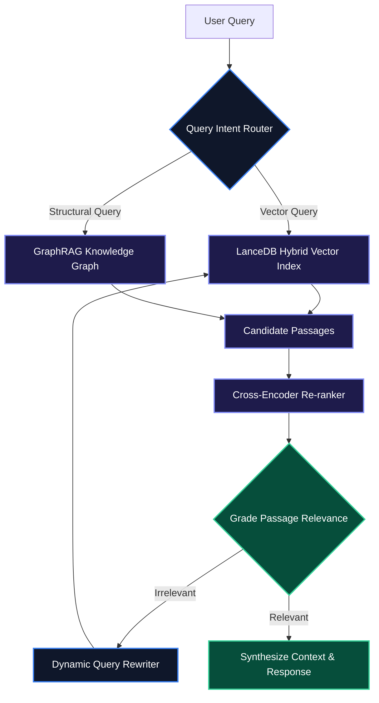

Naive Retrieval-Augmented Generation (RAG)—chunking text, generating embeddings, and retrieving the top-K vector matches via cosine similarity—frequently breaks down in enterprise environments. Complex queries require context across multiple documents, exact metadata filtering, multi-step reasoning, and verification against domain hallucination.

**Agentic RAG** transforms retrieval from a passive single-step lookup into an active, iterative reasoning system. In this article, we explore building an production-grade retrieval pipeline combining **LanceDB column-store vector search**, **Hybrid Sparse-Dense Search**, **Cross-Encoder Re-ranking**, and **GraphRAG relationships**.

> [!NOTE]
> Agentic RAG empowers the LLM to evaluate whether retrieved chunks actually contain the answer, reformulate search queries dynamically, or route to secondary data sources if confidence is low.

---

## 1. The Agentic Retrieval Architecture

Instead of dumping raw top-K results directly into the prompt context, the Agentic RAG pipeline subjects retrieved chunks to automated evaluation and dynamic re-ranking loops.



---

## 2. Setting Up Hybrid Search with LanceDB

**LanceDB** is an open-source, serverless column-store database optimized for high-throughput vector search. It handles dense embeddings (e.g., OpenAI `text-embedding-3`) alongside sparse keyword search (BM25) natively.

```python
import lancedb
from lancedb.pydantic import LanceModel, Vector
from lancedb.embeddings import EmbeddingFunctionRegistry

# Initialize LanceDB persistent directory
db = lancedb.connect("./data/lancedb_store")

# Register embedding provider
registry = EmbeddingFunctionRegistry.get_instance()
embedder = registry.get("openai").create(name="text-embedding-3-small")

class TechnicalDocument(LanceModel):
    id: str
    vector: Vector(embedder.ndims()) = embedder.VectorField()
    text: str = embedder.SourceField()
    category: str
    version: float

# Create table with automatic embedding generation
table = db.create_table("tech_docs", schema=TechnicalDocument, mode="overwrite")

# Insert payload documents
table.add([
    {
        "id": "doc_001",
        "text": "LanceDB uses zero-copy disk access and vectorized SIMD instructions for instant filtering.",
        "category": "database",
        "version": 2.0
    },
    {
        "id": "doc_002",
        "text": "GraphRAG extracts subject-predicate-object triples to reconstruct global document knowledge graphs.",
        "category": "ai-infra",
        "version": 1.5
    }
])

# Create Full-Text Search (FTS) index for BM25 hybrid search
table.create_fts_index("text", replace=True)
```

---

## 3. Implementing Hybrid Search & Cross-Encoder Re-ranking

Combining dense vector similarity with sparse keyword retrieval ensures both semantic understanding and exact keyword matching (e.g., specific error codes or product IDs).

```python
from sentence_transformers import CrossEncoder
import numpy as np

# Load lightweight cross-encoder model for re-ranking
reranker = CrossEncoder("cross-encoder/ms-marco-MiniLM-L-6-v2")

def hybrid_agentic_retrieval(query: str, top_k: int = 5) -> list[dict]:
    # 1. Perform Hybrid FTS + Vector Search in LanceDB
    results = table.search(query, query_type="hybrid") \
                   .where("version >= 1.0", prefilter=True) \
                   .limit(top_k * 3) \
                   .to_pandas()
                   
    if results.empty:
        return []

    passages = results["text"].tolist()
    
    # 2. Score query-passage pairs using Cross-Encoder
    pairs = [[query, passage] for passage in passages]
    scores = reranker.predict(pairs)
    
    # 3. Sort passages by re-ranking score
    results["rerank_score"] = scores
    sorted_df = results.sort_values(by="rerank_score", ascending=False).head(top_k)
    
    return sorted_df.to_dict(orient="records")

# Example Invocation
candidates = hybrid_agentic_retrieval("How does LanceDB achieve zero-copy disk access?")
print(f"Top Candidate Score: {candidates[0]['rerank_score']:.4f}")
```

---

## 4. Self-Correction & Relevance Grading Loop

An essential feature of Agentic RAG is the self-correction step. If candidate passages fail relevance thresholds, the system re-writes the prompt.

> [!TIP]
> Setting strict relevance thresholds prevents hallucination by forcing the model to explicitly admit when information is missing from the corpus.

```python
from pydantic import BaseModel, Field

class GradePassage(BaseModel):
    is_relevant: bool = Field(description="True if passage contains facts answering the query.")
    reasoning: str = Field(description="Brief explanation of why passage is relevant or irrelevant.")

def evaluate_retrieval_quality(query: str, passage: str) -> GradePassage:
    """
    Evaluates passage relevance using structured LLM outputs.
    """
    # Pseudocode for LLM structured output call
    # response = llm.with_structured_output(GradePassage).invoke(prompt)
    
    # Dummy verification logic
    has_keywords = any(word in passage.lower() for word in query.lower().split())
    return GradePassage(
        is_relevant=has_keywords,
        reasoning="Passage contains target query tokens." if has_keywords else "Missing context."
    )
```

---

## 5. Architectural Comparison Matrix

| Feature / Metric | Naive RAG | Advanced Hybrid RAG | Agentic RAG + GraphRAG |
| :--- | :--- | :--- | :--- |
| **Search Mechanism** | Vector Cosine Similarity | Dense + Sparse BM25 | Multi-Hop Graph + Hybrid Vector |
| **Retrieval Speed** | Fast (<50ms) | Moderate (100-200ms) | Dynamic (Adaptive) |
| **Handling Complex Queries** | Poor (Low Recall) | Moderate | Excellent (Iterative Refinement) |
| **Hallucination Prevention** | None (Raw Ingestion) | Basic Re-ranking | Active Relevance Verification |
| **Storage Engine** | In-Memory Vector Store | Cloud Vector DB | LanceDB Column-Store + Graph Triple Store |

> [!WARNING]
> High top-K values in naive RAG pollute the LLM context window ("lost-in-the-middle" effect). Always use a Cross-Encoder to trim candidate sets down to the 3-5 most pertinent chunks!

---

## Key Takeaways

- **Serverless Performance**: LanceDB provides fast hybrid search with zero-copy SIMD performance on local or S3 storage.
- **Hybrid Advantage**: Combining BM25 sparse keyword matching with dense embeddings prevents missing exact nomenclature and code identifiers.
- **Cross-Encoder Precision**: Re-ranking candidate chunks dramatically increases context quality over raw vector similarity.
- **Iterative Corrective Loops**: Agentic query rewriting turns failing retrieval lookups into successful multi-step search attempts.
