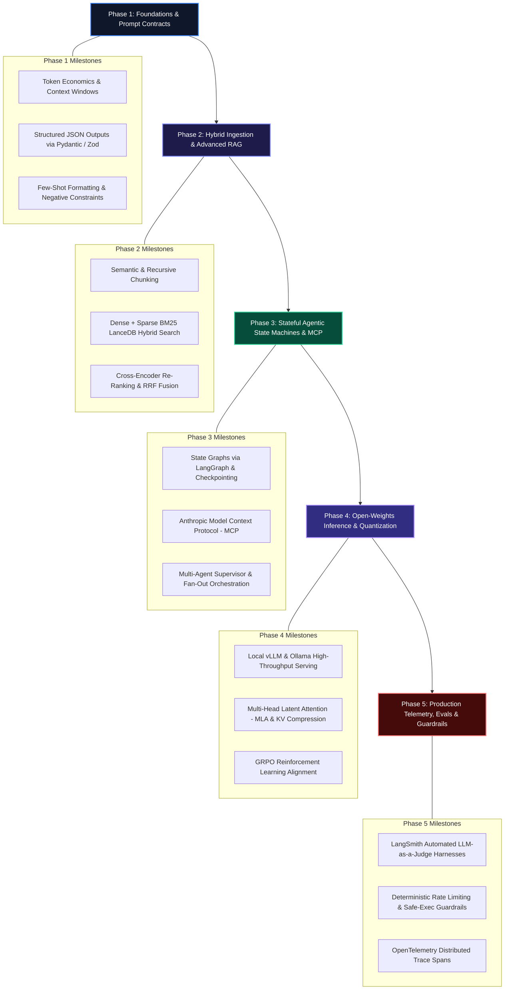

# The 2026 AI Engineer Roadmap: From Software Developer to AI Systems Architect

The AI landscape has bifurcated. On one side are foundational model researchers training multi-billion parameter architectures; on the other are **AI Engineers** who turn non-deterministic models into deterministic, fault-tolerant production software.

Most online roadmaps dump exhaustive lists of 50+ random Python libraries. This roadmap is different: it provides an **architectural mental model** structured around 5 concrete capability phases—designed specifically for experienced software engineers transitioning into production AI engineering.

> [!NOTE]
> AI Engineering is not about prompt tweaking or building toy wrappers. It is about systems engineering: managing latency budgets, enforcing strict JSON schemas, designing hybrid retrieval pipelines, orchestrating multi-agent state machines, and writing automated evaluation test suites.

---

## The 5-Phase AI Engineer Mental Model



---

## Phase 1: Foundation Models as Untrusted APIs & Typed Contracts

Before writing code, understand the fundamental mental shift: **an LLM is an un-sandboxed, non-deterministic HTTP endpoint**. Treat its output with the same defensive programming principles you apply to raw user input.

### Core Milestones:
1. **Token Mechanics & Context Budgets**: Understand BPE tokenization, Time-to-First-Token (TTFT), and token generation throughput.
2. **Deterministic Output Contracts**: Never parse unstructured markdown text in backend services. Use OpenAI Structured Outputs or Pydantic validation.
3. **Prompt Design Patterns**: Master Chain-of-Thought (CoT), few-shot framing, and negative constraints.

```typescript
import { z } from "zod";
import OpenAI from "openai";

const client = new OpenAI();

// Milestone: Strict Typed API Contract
export const EntityExtractionSchema = z.object({
  entityName: z.string(),
  category: z.enum(["DATABASE", "INFRASTRUCTURE", "FRAMEWORK"]),
  confidenceScore: z.number().min(0).max(1),
  tags: z.array(z.string()).min(1),
});

export type EntityExtraction = z.infer<typeof EntityExtractionSchema>;
```

📖 **Deep Dive Article**: [Advanced Prompt Engineering: Chain-of-Thought, ReAct, and Structured Output](/posts/prompt-engineering)

---

## Phase 2: Ingestion Pipelines, Hybrid Retrieval & Vector Databases

Naive cosine similarity vector lookups fail on technical nomenclature, error codes, and multi-hop queries. Production retrieval requires hybrid indexing combining dense semantic vectors with BM25 sparse keyword matching.

### Core Milestones:
1. **Semantic Document Chunking**: Moving past fixed-character chunking to boundary-aware semantic splitting.
2. **Hybrid Ingestion**: Pairing dense embedding models (`text-embedding-3-large`) with BM25 indices.
3. **Cross-Encoder Re-Ranking**: Trimming initial top-20 candidate retrieval pools down to the 3–5 highest-signal context chunks.

```python
from sentence_transformers import CrossEncoder

# Milestone: Cross-Encoder Joint Query-Passage Scoring
reranker = CrossEncoder("cross-encoder/ms-marco-MiniLM-L-6-v2")

def rerank_retrieved_candidates(query: str, raw_passages: list[str], top_k: int = 3) -> list[str]:
    pairs = [[query, p] for p in raw_passages]
    scores = reranker.predict(pairs)
    ranked = [p for _, p in sorted(zip(scores, raw_passages), reverse=True)]
    return ranked[:top_k]
```

📖 **Deep Dive Articles**:
- [Understanding Retrieval-Augmented Generation (RAG)](/posts/what-is-rag)
- [High-Performance Vector Databases: Pinecone vs Qdrant vs Pgvector](/posts/vector-databases)
- [Next-Gen Agentic RAG: Hybrid Search, GraphRAG, and Self-Correction](/posts/agentic-rag-lancedb)

---

## Phase 3: Autonomous AI Agents, Stateful Graphs & MCP Protocol

An agent is more than an unconstrained prompt loop. It is a deterministic state machine equipped with typed tool execution boundaries, memory checkpoints, and human-in-the-loop authorization gates.

### Core Milestones:
1. **Event-Driven Execution Loops**: Designing deterministic state machines with hard iteration bounds.
2. **Cyclical Orchestration with LangGraph**: Managing graph state persistence with durable MemorySaver checkpointers.
3. **Model Context Protocol (MCP)**: Connecting agents dynamically to external tools over standardized JSON-RPC transports.
4. **Specialized Multi-Agent Swarms**: Dividing responsibilities across Supervisor, Worker, and QA nodes.

```typescript
import { Annotation, StateGraph, END, START } from "@langchain/langgraph";

// Milestone: Stateful Graph State Definition
export const AgentGraphState = Annotation.Root({
  messages: Annotation<Array<{ role: string; content: string }>>({
    reducer: (curr, update) => curr.concat(update),
    default: () => [],
  }),
  currentStep: Annotation<string>({
    reducer: (_, update) => update,
    default: () => "init",
  }),
});
```

📖 **Deep Dive Articles**:
- [How I Built an Autonomous AI Agent with Next.js 16](/posts/how-i-built-an-ai-agent)
- [Building Autonomous Production Agents with LangGraph and Anthropic MCP](/posts/langgraph-mcp-agents)
- [5-Part Multi-Agent AI Framework Masterclass](/playlists/multi-agent-framework-masterclass)

---

## Phase 4: Open-Weights Serving, Reasoning Models & MLOps

While proprietary frontier models (GPT-4o, Claude 3.5) are ideal for general reasoning, cost and privacy requirements often demand self-hosting open-weights models (DeepSeek-R1, Llama 3.3, Qwen 2.5).

### Core Milestones:
1. **High-Throughput Inference with vLLM**: Continuous batching, PagedAttention, and tensor parallelism.
2. **Reasoning Architectures (DeepSeek-R1 & GRPO)**: Multi-head Latent Attention (MLA) for KV-cache compression and critic-free reinforcement learning.
3. **Quantization & Edge Serving**: Deploying AWQ/GGUF 4-bit and 8-bit quantized checkpoints.

```python
from vllm import LLM, SamplingParams

# Milestone: High-Throughput Tensor-Parallel Serving
engine = LLM(
    model="deepseek-ai/DeepSeek-R1-Distill-Qwen-14B",
    tensor_parallel_size=1,
    gpu_memory_utilization=0.90,
    max_model_len=16384,
)
```

📖 **Deep Dive Article**: [DeepSeek-R1 & GRPO: The Open-Weights Reasoning Architecture](/posts/deepseek-r1-grpo)

---

## Phase 5: Production Evals, Guardrails & Infrastructure SRE

Shipping to production requires continuous automated evaluation, rate-limiting circuit breakers, and OpenTelemetry observability.

### Core Milestones:
1. **Automated LLM-as-a-Judge**: Structured Pydantic scoring rubrics running inside GitHub Actions CI gates.
2. **Deterministic Safety Guardrails**: Namespace boundaries, memory ceilings, and Slack approval webhooks.
3. **Autonomous Infrastructure Remediation**: Self-healing controllers for Kubernetes pod crashes and GitOps drift.

```python
from pydantic import BaseModel, Field

# Milestone: Structured Judge Rubric
class EvaluationMetric(BaseModel):
    factual_score: float = Field(ge=0.0, le=1.0)
    hallucination_detected: bool
    explanation: str
```

📖 **Deep Dive Articles**:
- [LLM Evals in Production: Automated Benchmarking with LangSmith](/posts/production-llm-evals)
- [7-Part Autonomous AI DevOps & Infrastructure Agents Series](/playlists/autonomous-ai-devops-agents)

---

## Architecture Milestone Matrix

| Phase | Capability Level | Core Tooling | Primary Deliverable |
| :--- | :--- | :--- | :--- |
| **Phase 1** | Foundation | TypeScript, Python, Zod, Pydantic | Typed Structured Output API Client |
| **Phase 2** | Retrieval | LanceDB, Qdrant, Cross-Encoder | Production Hybrid RAG Pipeline |
| **Phase 3** | Autonomy | LangGraph, Anthropic MCP, Redis | Stateful Multi-Agent Execution Graph |
| **Phase 4** | Inference | vLLM, DeepSeek-R1, Ollama, PyTorch | Self-Hosted Open-Weights Cluster |
| **Phase 5** | Production | LangSmith, OpenTelemetry, K8s, CI/CD | Automated CI Evaluation & Guardrail Gate |

---

## Recommended Learning Sequence

To progress through this roadmap efficiently, follow our structured playlists:

1. **[AI Engineering From Zero Playlist](/playlists/ai-engineering-from-zero)**: Foundations, Prompting, and Vector Retrieval.
2. **[Multi-Agent Framework Masterclass](/playlists/multi-agent-framework-masterclass)**: 5-Part architectural deep dive into custom agent runtimes.
3. **[Fullstack Web & AI Series](/playlists/fullstack-web-and-ai)**: Next.js 16 App Router, React 19, and Generative UI Streaming.
4. **[Autonomous AI DevOps Agents Series](/playlists/autonomous-ai-devops-agents)**: Kubernetes self-healing, eBPF telemetry, and GitOps automation.
