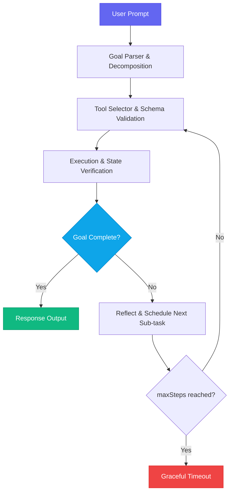

# How I Built an Autonomous AI Agent with Next.js 16

Six months ago, I shipped something I thought would take a week. It took five. Not because the LLM API was hard — it isn't. The hard part was everything *around* the model: the state management, the tool validation, the failure recovery, the iteration bounds. The part nobody writes about.

This is that article. A proper, production-minded walkthrough of building an autonomous AI agent from scratch using Next.js 16 App Router, TypeScript, and the OpenAI tool-calling API.

---

## What Makes an Agent Different from a Chatbot

Most tutorials conflate "chat with an AI" and "an AI agent." They're different animals.

A chatbot responds. An agent *acts* — it breaks a goal into sub-tasks, picks tools to accomplish each one, executes them, observes the results, and decides what to do next. It loops until the goal is complete or it gives up.

The three components that separate an agent from a chatbot:

- **Tool execution** — the model can call real functions (search, write file, query DB)
- **State persistence** — the agent remembers what it did across iterations
- **Goal evaluation** — the agent decides *when it's done*, not just when to stop talking

---

## 1. The Agent Architecture & Execution Loop



The key insight here is the **reflect step**. Rather than blindly re-running the same tool, the agent re-evaluates the full conversation history and decides what to do *next*, not just repeat what it just did.

---

## 2. Tool Execution Schema in TypeScript

Every tool the agent can use must be described with a strict JSON Schema so the model knows what arguments to provide. I use Zod for runtime validation on the server side.

```typescript
import { z } from "zod";

export interface AgentTool<TInput = Record<string, unknown>, TOutput = unknown> {
  name: string;
  description: string;
  inputSchema: z.ZodSchema<TInput>;
  execute: (args: TInput) => Promise<TOutput>;
}

// Example: a web search tool
export const searchTool: AgentTool<{ query: string }, { results: string[] }> = {
  name: "web_search",
  description: "Searches public documentation and code repositories for technical information.",
  inputSchema: z.object({ query: z.string().min(3).max(200) }),
  execute: async ({ query }) => {
    const response = await fetch(`/api/search?q=${encodeURIComponent(query)}`);
    if (!response.ok) throw new Error(`Search failed: ${response.statusText}`);
    return response.json();
  },
};

// Example: a file write tool
export const writeFileTool: AgentTool<{ path: string; content: string }, { success: boolean }> = {
  name: "write_file",
  description: "Writes content to a file in the agent's workspace.",
  inputSchema: z.object({
    path: z.string().regex(/^[\w\-./]+$/),
    content: z.string().max(50_000),
  }),
  execute: async ({ path, content }) => {
    const response = await fetch("/api/workspace/write", {
      method: "POST",
      headers: { "Content-Type": "application/json" },
      body: JSON.stringify({ path, content }),
    });
    return response.json();
  },
};
```

Notice that each tool validates its own inputs. This is not optional — without it, a hallucinated argument from the model will crash your execution loop silently.

---

## 3. The Execution Loop — The Heart of the Agent

The loop is implemented as a Next.js 16 Server Action. I use streaming so the UI can show real-time progress.

```typescript
"use server";

import OpenAI from "openai";
import { searchTool, writeFileTool } from "@/lib/agent/tools";
import { AgentState, AgentStep } from "@/lib/agent/types";

const client = new OpenAI();

const TOOL_REGISTRY = {
  web_search: searchTool,
  write_file: writeFileTool,
};

export async function runAgentLoop(
  goal: string,
  onStep: (step: AgentStep) => void,
  maxSteps = 10
): Promise<AgentState> {
  const messages: OpenAI.ChatCompletionMessageParam[] = [
    {
      role: "system",
      content: `You are an autonomous agent. Break the user's goal into sub-tasks.
Use tools to accomplish each sub-task. When the goal is fully complete, respond with:
{"status":"complete","summary":"<what you did>"}`,
    },
    { role: "user", content: goal },
  ];

  let stepCount = 0;

  while (stepCount < maxSteps) {
    stepCount++;

    const response = await client.chat.completions.create({
      model: "gpt-4o",
      messages,
      tools: Object.values(TOOL_REGISTRY).map((tool) => ({
        type: "function" as const,
        function: {
          name: tool.name,
          description: tool.description,
          parameters: tool.inputSchema,
        },
      })),
      tool_choice: "auto",
    });

    const choice = response.choices[0];

    // Goal complete
    if (choice.finish_reason === "stop") {
      return { status: "complete", steps: stepCount };
    }

    // Execute tool calls
    if (choice.finish_reason === "tool_calls" && choice.message.tool_calls) {
      messages.push(choice.message);

      for (const toolCall of choice.message.tool_calls) {
        const tool = TOOL_REGISTRY[toolCall.function.name as keyof typeof TOOL_REGISTRY];
        if (!tool) throw new Error(`Unknown tool: ${toolCall.function.name}`);

        const args = JSON.parse(toolCall.function.arguments);
        const validatedArgs = tool.inputSchema.parse(args); // throws if invalid
        const result = await tool.execute(validatedArgs as never);

        onStep({ tool: toolCall.function.name, args: validatedArgs, result, step: stepCount });

        messages.push({
          role: "tool",
          tool_call_id: toolCall.id,
          content: JSON.stringify(result),
        });
      }
    }
  }

  return { status: "max_steps_reached", steps: stepCount };
}
```

Three things I spent the most debugging time on here:

1. **`tool_choice: "auto"` vs `"required"`** — `"required"` forces a tool call every turn, which causes infinite loops. `"auto"` lets the model decide when it's done.
2. **Always push the assistant message before tool results** — the OpenAI API requires the assistant turn (with `tool_calls`) to appear in history before the corresponding tool result messages. Get this order wrong and you get a cryptic 400 error.
3. **Zod validation before execution** — a hallucinated `path` argument like `"../../../../etc/passwd"` should fail validation, not reach your file system.

---

## 4. Persistent Memory Between Sessions

A one-shot agent is impressive. An agent that remembers context from previous sessions is genuinely useful.

I store the message history in Redis using Upstash:

```typescript
import { Redis } from "@upstash/redis";

const redis = Redis.fromEnv();

export async function loadAgentHistory(sessionId: string) {
  const raw = await redis.get<string>(`agent:${sessionId}:history`);
  return raw ? JSON.parse(raw) : [];
}

export async function saveAgentHistory(
  sessionId: string,
  messages: OpenAI.ChatCompletionMessageParam[]
) {
  // Keep last 50 messages to stay within context limits
  const trimmed = messages.slice(-50);
  await redis.set(`agent:${sessionId}:history`, JSON.stringify(trimmed), {
    ex: 60 * 60 * 24 * 7, // 7 day TTL
  });
}
```

The key architectural decision here: trim history to the last 50 messages, not the last N tokens. Token counting per model version is painful to maintain. 50 messages is a pragmatic proxy that keeps costs manageable without losing meaningful context.

---

## 5. Video Walkthrough

youtube: 978939626

---

## 6. Failure Modes I Hit in Production

These cost me real hours. Saving you from the same:

- **Infinite tool loops** — The model calls the same tool repeatedly with slightly different arguments. Fix: deduplicate tool calls in the current loop iteration. If the same tool is called 3+ times with >80% argument similarity, force a `"stop"`.
- **JSON parse errors on tool arguments** — The model occasionally wraps arguments in markdown backticks. Fix: strip `` ``` `` fences before `JSON.parse`, or use `JSON.parse(arg.replace(/```json?/g, "").trim())`.
- **Context window overflow** — Long agent runs accumulate massive message histories. Fix: the 50-message trim above, plus summarization: periodically ask the model to summarize the last 20 messages into a single "context" message.
- **Tool timeouts leaving holes in history** — A tool that times out doesn't push its result message, corrupting the history. Fix: always push a tool result, even on failure: `content: JSON.stringify({ error: "timeout", retry: true })`.

---

## 7. Key Lessons Learned

> [!NOTE]
> Always set strict iteration bounds (`maxSteps = 10`) on agent loops to prevent infinite recursive tool execution. When the limit is reached, return a structured result — don't just throw an error.

> [!IMPORTANT]
> Validate every tool input with Zod *before* execution. LLMs hallucinate arguments. Runtime validation is your only reliable defense.

> [!TIP]
> Stream agent progress to the UI using React's `useOptimistic` hook and a Server Action callback. Users who can see each tool execution step have dramatically higher patience for long-running agents.

---

## Key Takeaways

- Agents = tools + state + evaluation loop. All three are required.
- Tool schemas must be strict — validate inputs before any execution.
- Persist message history externally (Redis) for multi-session agents.
- Build in graceful failure at every layer: tool timeouts, max steps, JSON parse errors.
- The reflect step is what separates intelligent agents from dumb loops.

The full source for this agent is the foundation of the AI Engineering from Zero series. Next up: making this agent understand and chunk long documents for RAG.
