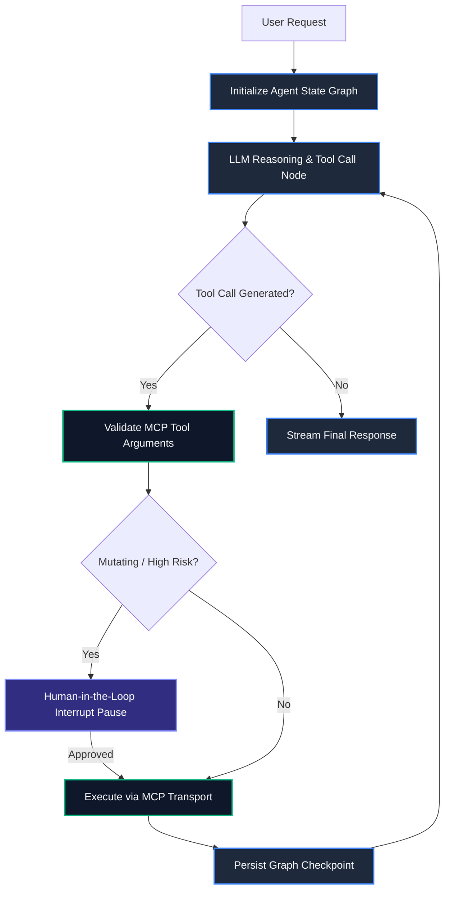

# Building Autonomous Production Agents with LangGraph and Anthropic MCP

Building AI agents that operate reliably in production requires moving beyond linear chains and unconstrained prompt loops. When language models are tasked with state-mutating actions—such as executing database migrations, calling billing endpoints, or writing files—production systems demand state persistence, deterministic routing, and standardized tool protocols.

By pairing **LangGraph** for stateful cyclical orchestration with **Anthropic's Model Context Protocol (MCP)** for decoupled tool communication, you gain a robust foundation for building resilient autonomous systems.

> [!NOTE]
> Standard linear chains crash when APIs return transient errors or unexpected JSON schemas. Graph-based architectures allow agents to inspect execution errors, loop dynamically to self-correct, and pause for human authorization before executing high-risk mutations.

---

## 1. System Architecture: LangGraph Meets MCP

The architecture decouples orchestration from tool execution:
1. **Orchestration Layer (LangGraph)**: Manages state immutability, conditional routing edges, memory checkpoint persistence, and human-in-the-loop interrupts.
2. **Tool Protocol Layer (MCP)**: Standardizes tool exposure, resource inspection, and schema discovery over Stdio or HTTP/SSE transports.



---

## 2. Defining State & Strict Tool Schemas with Zod

In LangGraph, state updates are passed immutably through graph nodes. We use **Zod** to validate tool payloads at the runtime boundary:

```typescript
import { Annotation } from "@langchain/langgraph";
import { z } from "zod";

// Strict tool input contract
export const DatabaseQuerySchema = z.object({
  query: z.string().min(1, "Query string is required"),
  targetTable: z.string(),
  isReadOnly: z.boolean().default(true),
  timeoutMs: z.number().default(5000),
});

export type DatabaseQuery = z.infer<typeof DatabaseQuerySchema>;

export interface AgentMessage {
  role: "user" | "assistant" | "system" | "tool";
  content: string;
  toolCallId?: string;
  name?: string;
}

// Graph State Definition with LangGraph Annotation
export const AgentStateAnnotation = Annotation.Root({
  messages: Annotation<AgentMessage[]>({
    reducer: (curr, update) => curr.concat(update),
    default: () => [],
  }),
  currentStep: Annotation<string>({
    reducer: (_, update) => update,
    default: () => "init",
  }),
  pendingTool: Annotation<DatabaseQuery | null>({
    reducer: (_, update) => update,
    default: () => null,
  }),
  isApproved: Annotation<boolean>({
    reducer: (_, update) => update,
    default: () => false,
  }),
});
```

---

## 3. Connecting to MCP Tool Servers via Stdio Transport

Anthropic's Model Context Protocol (MCP) decouples tool implementations from application code. Below is a production MCP client wrapper:

```typescript
import { Client } from "@modelcontextprotocol/sdk/client/index.js";
import { StdioClientTransport } from "@modelcontextprotocol/sdk/client/stdio.js";

export class MCPToolClient {
  private client: Client;
  private transport: StdioClientTransport;

  constructor(serverScriptPath: string) {
    this.transport = new StdioClientTransport({
      command: "node",
      args: [serverScriptPath],
    });

    this.client = new Client(
      { name: "SidhyaProductionAgent", version: "1.0.0" },
      { capabilities: { tools: {} } }
    );
  }

  public async init() {
    await this.client.connect(this.transport);
    const { tools } = await this.client.listTools();
    return tools;
  }

  public async executeTool(name: string, args: Record<string, unknown>) {
    const result = await this.client.callTool({
      name,
      arguments: args,
    });
    return result;
  }

  public async close() {
    await this.transport.close();
  }
}
```

---

## 4. Complete LangGraph Execution Loop with Anthropic & Checkpointing

Below is the complete state graph implementation binding **Claude 3.5 Sonnet** with runtime tool invocation and human approval interrupts:

```typescript
import { StateGraph, END, START, MemorySaver } from "@langchain/langgraph";
import { ChatAnthropic } from "@langchain/anthropic";
import { AgentStateAnnotation, DatabaseQuerySchema } from "./schema";
import { MCPToolClient } from "./mcpClient";

const model = new ChatAnthropic({
  model: "claude-3-5-sonnet-20241022",
  temperature: 0.1,
});

const mcpClient = new MCPToolClient("./dist/mcp-servers/postgres.js");

// Node 1: LLM Reasoning Node
async function agentReasoningNode(state: typeof AgentStateAnnotation.State) {
  const formattedMessages = state.messages.map((m) => ({
    role: m.role as "user" | "assistant",
    content: m.content,
  }));

  const response = await model.invoke(formattedMessages);
  const responseContent = typeof response.content === "string" ? response.content : JSON.stringify(response.content);

  // Check if model returned a structured tool call intent
  if (responseContent.includes("EXECUTE_QUERY:")) {
    const rawPayload = responseContent.split("EXECUTE_QUERY:")[1].trim();
    const parsed = DatabaseQuerySchema.parse(JSON.parse(rawPayload));
    
    return {
      messages: [{ role: "assistant" as const, content: responseContent }],
      pendingTool: parsed,
      currentStep: "tool_prepared",
    };
  }

  return {
    messages: [{ role: "assistant" as const, content: responseContent }],
    pendingTool: null,
    currentStep: "complete",
  };
}

// Node 2: MCP Tool Execution Node
async function toolExecutionNode(state: typeof AgentStateAnnotation.State) {
  const toolPayload = state.pendingTool;
  if (!toolPayload) {
    return { currentStep: "error" };
  }

  // Enforce Human-In-The-Loop gate on non-read-only queries
  if (!toolPayload.isReadOnly && !state.isApproved) {
    console.warn(`[Audit Gate] Mutating query on '${toolPayload.targetTable}' requires human approval.`);
    return { currentStep: "awaiting_human_approval" };
  }

  const result = await mcpClient.executeTool("query_database", toolPayload as unknown as Record<string, unknown>);

  return {
    messages: [
      {
        role: "tool" as const,
        name: "query_database",
        content: JSON.stringify(result),
      },
    ],
    pendingTool: null,
    isApproved: false,
    currentStep: "tool_finished",
  };
}

// Conditional Routing Logic
function routeAfterReasoning(state: typeof AgentStateAnnotation.State) {
  if (state.pendingTool !== null) {
    return "execute_tool";
  }
  return END;
}

// Assemble and compile the workflow with persistence
const workflow = new StateGraph(AgentStateAnnotation)
  .addNode("agent", agentReasoningNode)
  .addNode("execute_tool", toolExecutionNode)
  .addEdge(START, "agent")
  .addConditionalEdges("agent", routeAfterReasoning, {
    execute_tool: "execute_tool",
    [END]: END,
  })
  .addEdge("execute_tool", "agent");

export const productionAgent = workflow.compile({
  checkpointer: new MemorySaver(),
  interruptBefore: ["execute_tool"], // Allows pausing before mutating tools
});
```

---

## 5. Architectural Comparison Matrix

| Architecture Dimension | Unstructured Function Calling | LangGraph + Anthropic MCP |
| :--- | :--- | :--- |
| **State Persistence** | Ephemeral memory array | **Durable Checkpointing (Postgres / Redis)** |
| **Tool Decoupling** | Hardcoded per LLM SDK | **Standardized JSON-RPC Protocol (MCP)** |
| **Human-in-the-Loop** | Ad-hoc application flags | **Native Graph Interrupt Hooks (`interruptBefore`)** |
| **Failure Recovery** | Process crash on 500 error | **Cyclical Self-Correction & Retry Nodes** |
| **Sub-Graph Orchestration** | Manual thread stitching | **Native Sub-Agent Hierarchies** |

> [!WARNING]
> Never execute state-modifying operations (`DROP`, `DELETE`, `UPDATE`) in autonomous loops without setting an explicit `interruptBefore` breakpoint on the executing graph node.

---

## Key Takeaways

- **State Graph Determinism**: LangGraph provides explicit control over agent execution loops, preventing runaway recursion via conditional routing edges.
- **Protocol Standardization**: MCP allows tools to be authored once and consumed across heterogeneous LLM runtimes over Stdio or SSE.
- **Durable Checkpointing**: MemorySaver checkpointers ensure long-running agent workflows can be paused, inspected, and resumed after approval events.
- **Type-Safe Validation**: Enforce schema verification with Zod before payloads ever reach MCP transport layers.
