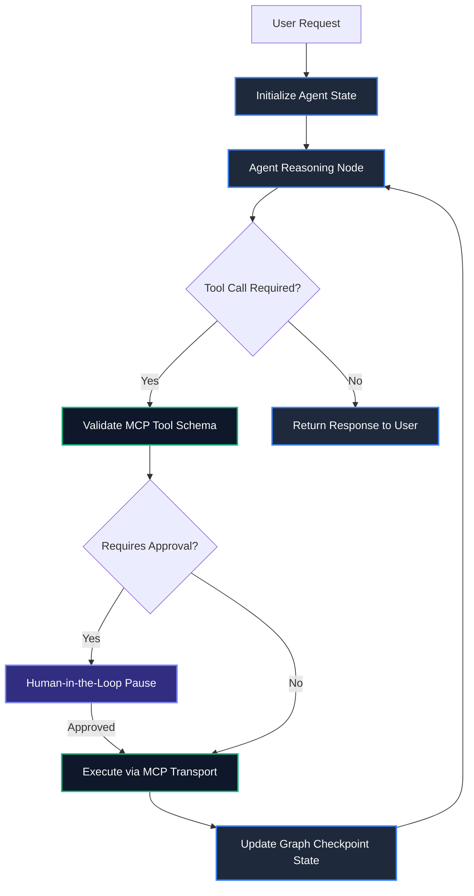

Building AI agents that operate reliably in enterprise production environments requires moving past simple linear chains and unconstrained prompt loops. As language models are tasked with taking real-world actions—such as modifying databases, executing code, or issuing API transactions—systems need strict state guarantees, deterministic routing, and standardized tool protocols.

In this guide, we dive deep into building production-ready autonomous agentic architectures by pairing **LangGraph 0.2+** for stateful cyclical orchestration with **Anthropic's Model Context Protocol (MCP)** for secure, decoupled tool integration.

> [!NOTE]
> Standard linear chains break down when models fail or encounter ambiguous API responses. Graph-based architectures allow agents to self-correct, loop dynamically, and request human feedback before taking irreversible actions.

---

## 1. System Architecture: LangGraph Meets MCP

The architecture separates concern into two distinct layers:
1. **Orchestration Layer (LangGraph)**: Maintains state, handles conditional branching, manages memory checkpoints, and controls execution cycles.
2. **Tool Protocol Layer (MCP)**: Exposes standardized, isolated server tools over JSON-RPC transports without embedding custom glue code inside the agent core.



---

## 2. Defining State & Strict Tool Schemas with Zod

In LangGraph, state is passed immutably between nodes. We use **Zod** to guarantee schema validation for inputs, internal state, and tool outputs.

```typescript
import { Annotation } from "@langchain/langgraph";
import { z } from "zod";

// Define strict payload validation schemas
export const CommandExecutionSchema = z.object({
  command: z.string().min(1, "Command cannot be empty"),
  environment: z.enum(["development", "staging", "production"]),
  timeoutMs: z.number().default(5000),
});

export type CommandExecution = z.infer<typeof CommandExecutionSchema>;

// Agent State Schema using LangGraph Annotation
export const AgentStateAnnotation = Annotation.Root({
  messages: Annotation<Array<{ role: string; content: string }>>({
    reducer: (x, y) => x.concat(y),
    default: () => [],
  }),
  currentStep: Annotation<string>({
    reducer: (x, y) => y ?? x,
    default: () => "initialization",
  }),
  pendingToolCalls: Annotation<CommandExecution[]>({
    reducer: (x, y) => y ?? x,
    default: () => [],
  }),
  isApproved: Annotation<boolean>({
    reducer: (x, y) => y ?? x,
    default: () => false,
  }),
});
```

---

## 3. Implementing the Model Context Protocol (MCP) Client

MCP decouples tool implementations from model code. Here is how to create a resilient MCP client wrapper that connects to an external tool server over Stdio or HTTP/SSE transports.

> [!TIP]
> MCP tools export standard OpenAPI/JSON Schema contracts. Your agent can dynamically discover tools at runtime rather than hardcoding function signatures.

```typescript
import { Client } from "@modelcontextprotocol/sdk/client/index.js";
import { StdioClientTransport } from "@modelcontextprotocol/sdk/client/stdio.js";

export async function createMCPToolClient() {
  const transport = new StdioClientTransport({
    command: "node",
    args: ["./mcp-servers/database-tools.js"],
  });

  const client = new Client(
    { name: "SidhyaBlogAgentClient", version: "1.0.0" },
    { capabilities: { tools: {} } }
  );

  await client.connect(transport);
  
  // Discover available tools from the server
  const { tools } = await client.listTools();
  console.log(`[MCP] Discovered ${tools.length} active tools.`);
  
  return { client, tools };
}
```

---

## 4. Building the LangGraph Execution Loop

Now we construct the state machine graph using `StateGraph`. We attach state persistence using a MemorySaver checkpointer.

```typescript
import { StateGraph, END, START, MemorySaver } from "@langchain/langgraph";
import { AgentStateAnnotation } from "./agentState";

async function agentNode(state: typeof AgentStateAnnotation.State) {
  console.log(`[Agent Node] Reasoning on step: ${state.currentStep}`);
  // LLM Call logic goes here...
  return {
    currentStep: "reasoning_completed",
  };
}

async function toolExecutionNode(state: typeof AgentStateAnnotation.State) {
  if (!state.isApproved) {
    console.warn("[Tool Node] Execution blocked: Pending human approval.");
    return { currentStep: "awaiting_approval" };
  }
  
  console.log("[Tool Node] Executing validated MCP tool payload...");
  return {
    pendingToolCalls: [],
    isApproved: false,
    currentStep: "tool_executed",
  };
}

// Router function for conditional edge transition
function shouldContinue(state: typeof AgentStateAnnotation.State) {
  if (state.pendingToolCalls.length > 0) {
    return "execute_tools";
  }
  return END;
}

// Assemble the compiled state graph
const workflow = new StateGraph(AgentStateAnnotation)
  .addNode("agent", agentNode)
  .addNode("execute_tools", toolExecutionNode)
  .addEdge(START, "agent")
  .addConditionalEdges("agent", shouldContinue, {
    execute_tools: "execute_tools",
    [END]: END,
  })
  .addEdge("execute_tools", "agent");

export const agentApp = workflow.compile({
  checkpointer: new MemorySaver(),
});
```

---

## 5. Architectural Tradeoffs & Comparison

When evaluating orchestration and tool invocation standards for production systems, consider the following comparison:

| Architecture Metric | Legacy Function Calling | LangGraph + MCP Protocol |
| :--- | :--- | :--- |
| **State Persistence** | Transient (In-Memory) | Durable Graph Checkpointing |
| **Tool Decoupling** | Hardcoded inside API wrappers | Standardized JSON-RPC Protocol |
| **Human-in-the-Loop** | Complex manual hooks | First-class Graph Interrupts |
| **Error Recovery** | Unhandled stack traces | Self-correcting retry loops |
| **Multi-Agent Scale** | High friction glue code | Native Sub-graph Delegation |

> [!WARNING]
> Never execute state-modifying MCP tools (such as `DROP TABLE` or `DELETE FILE`) without an explicit human-in-the-loop interruption checkpoint!

---

## Key Takeaways

- **State Graph Isolation**: LangGraph provides explicit control over agent states and prevents infinite looping through conditional routing edges.
- **Protocol Standardization**: Anthropic MCP enables seamless tool reuse across different LLMs without rewriting integration glue.
- **Durable Checkpoints**: State checkpointers allow agents to resume safely after unexpected runtime crashes or human approval pauses.
- **Strict Validation**: Always validate model-generated tool arguments with Zod or Pydantic schemas prior to transport invocation.
