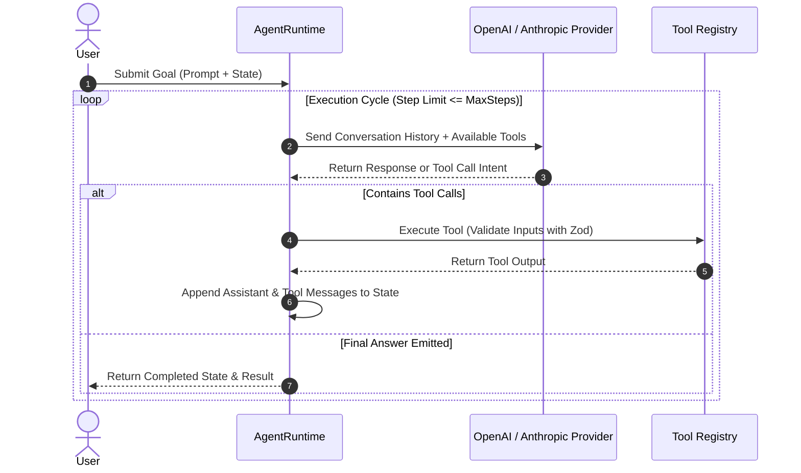

> [!NOTE]
> **5-Part Masterclass Navigation**:
> - **Part 1: Core Event Loop & State Machine** (You are here)
> - [Part 2: Hybrid Memory & Context Pruning](/posts/multi-agent-framework-part-2-memory-systems)
> - [Part 3: Multi-Agent Teams & Orchestration](/posts/multi-agent-framework-part-3-orchestration)
> - [Part 4: Model Context Protocol (MCP) Integration](/posts/multi-agent-framework-part-4-mcp-protocol)
> - [Part 5: Production Evals, Retries & Telemetry](/posts/multi-agent-framework-part-5-resilience-evals)

---

# Why Build a Custom Agent Runtime?

When building agentic applications, the initial impulse is often to pull in monolithic framework abstractions like LangChain or AutoGen. While convenient for rapid prototyping, production applications quickly hit architectural limitations:

1. **Opaque Prompt Formatting**: Hidden prompt templates and implicit middleware make debugging non-deterministic hallucinations difficult.
2. **Unhandled Edge-Case Loops**: A malformed tool argument or rate limit error can lock execution in an un-bounded retry cycle.
3. **Auditability & Determinism**: Production systems require strict lifecycle transitions, hard step limits, and structured state logging.

In this **5-part series**, we construct an event-driven Multi-Agent Framework from scratch in TypeScript—with zero framework lock-in.

---

## High-Level Architecture

The core agent runtime operates as a deterministic state machine: it receives user goals, submits context to an LLM provider with typed tool schemas, executes tool calls safely, and iterates until termination conditions are satisfied.



---

## 1. Designing the Deterministic State Machine

Every agent execution loop must track its lifecycle using typed states and strict message interfaces:

```typescript
import { z } from "zod";

export type AgentStatus =
  | "IDLE"
  | "THINKING"
  | "EXECUTING_TOOL"
  | "COMPLETED"
  | "FAILED"
  | "MAX_STEPS_EXCEEDED";

export interface ToolCallRequest {
  id: string;
  name: string;
  arguments: Record<string, unknown>;
}

export interface ToolResult {
  toolCallId: string;
  output: unknown;
  isError: boolean;
}

export interface AgentMessage {
  role: "system" | "user" | "assistant" | "tool";
  content: string;
  toolCalls?: ToolCallRequest[];
  toolCallId?: string;
}

export interface AgentState {
  runId: string;
  status: AgentStatus;
  stepCount: number;
  maxSteps: number;
  messages: AgentMessage[];
  lastError?: string;
}

export interface ToolDefinition<TInput = Record<string, unknown>> {
  name: string;
  description: string;
  schema: z.ZodSchema<TInput>;
  execute: (args: TInput) => Promise<unknown>;
}
```

---

## 2. Implementing the Core Agent Runtime Loop

Below is the production `AgentRuntime` engine using the official OpenAI SDK with schema validation and iteration bounds:

```typescript
import OpenAI from "openai";
import { AgentState, AgentMessage, ToolDefinition, ToolCallRequest } from "./types";

export class AgentRuntime {
  private client: OpenAI;
  private tools: Map<string, ToolDefinition> = new Map();

  constructor(
    private maxSteps: number = 10,
    private model: string = "gpt-4o"
  ) {
    this.client = new OpenAI();
  }

  public registerTool(tool: ToolDefinition<any>): void {
    this.tools.set(tool.name, tool);
  }

  public async run(userPrompt: string, systemPrompt?: string): Promise<AgentState> {
    const state: AgentState = {
      runId: `run_${Date.now()}`,
      status: "THINKING",
      stepCount: 0,
      maxSteps: this.maxSteps,
      messages: [
        ...(systemPrompt ? [{ role: "system" as const, content: systemPrompt }] : []),
        { role: "user" as const, content: userPrompt },
      ],
    };

    while (state.stepCount < state.maxSteps && state.status !== "COMPLETED" && state.status !== "FAILED") {
      state.stepCount++;

      try {
        // Step 1: Format tools into OpenAI JSON schema format
        const openAITools = Array.from(this.tools.values()).map((t) => ({
          type: "function" as const,
          function: {
            name: t.name,
            description: t.description,
            parameters: (t.schema as any)._def ? undefined : {}, // Serialized schema
          },
        }));

        // Step 2: Query LLM Provider
        const completion = await this.client.chat.completions.create({
          model: this.model,
          messages: state.messages.map((m) => ({
            role: m.role,
            content: m.content,
            ...(m.toolCallId ? { tool_call_id: m.toolCallId } : {}),
          })),
          tools: openAITools.length > 0 ? openAITools : undefined,
          tool_choice: openAITools.length > 0 ? "auto" : undefined,
        });

        const choice = completion.choices[0];
        const message = choice.message;

        // Step 3: Handle Tool Calls
        if (message.tool_calls && message.tool_calls.length > 0) {
          state.status = "EXECUTING_TOOL";
          
          state.messages.push({
            role: "assistant",
            content: message.content || "",
            toolCalls: message.tool_calls.map((tc) => ({
              id: tc.id,
              name: tc.function.name,
              arguments: JSON.parse(tc.function.arguments),
            })),
          });

          for (const tc of message.tool_calls) {
            const tool = this.tools.get(tc.function.name);
            if (!tool) {
              state.messages.push({
                role: "tool",
                content: JSON.stringify({ error: `Tool ${tc.function.name} not found` }),
                toolCallId: tc.id,
              });
              continue;
            }

            try {
              const rawArgs = JSON.parse(tc.function.arguments);
              const validatedArgs = tool.schema.parse(rawArgs);
              const output = await tool.execute(validatedArgs);

              state.messages.push({
                role: "tool",
                content: JSON.stringify(output),
                toolCallId: tc.id,
              });
            } catch (err: any) {
              state.messages.push({
                role: "tool",
                content: JSON.stringify({ error: err.message || "Execution error" }),
                toolCallId: tc.id,
              });
            }
          }
          state.status = "THINKING";
        } else {
          // Final Text Completion
          state.messages.push({
            role: "assistant",
            content: message.content || "",
          });
          state.status = "COMPLETED";
        }
      } catch (err: any) {
        state.status = "FAILED";
        state.lastError = err.message || String(err);
      }
    }

    if (state.stepCount >= state.maxSteps && state.status !== "COMPLETED") {
      state.status = "MAX_STEPS_EXCEEDED";
    }

    return state;
  }
}
```

---

## 3. Tool Registration & Execution Example

Here is how to bind type-safe tools with Zod:

```typescript
import { z } from "zod";
import { AgentRuntime } from "./AgentRuntime";

const runtime = new AgentRuntime(5);

runtime.registerTool({
  name: "calculate_vpc_cidr",
  description: "Calculates available IP subnets for a given CIDR block.",
  schema: z.object({
    cidr: z.string().regex(/^\d{1,3}\.\d{1,3}\.\d{1,3}\.\d{1,3}\/\d{1,2}$/),
    requiredSubnets: z.number().int().positive(),
  }),
  execute: async ({ cidr, requiredSubnets }) => {
    return {
      baseCidr: cidr,
      allocatedSubnets: [`10.0.1.0/24`, `10.0.2.0/24`].slice(0, requiredSubnets),
    };
  },
});
```

---

## Key Takeaways

- **Explicit Lifecycle States**: State tracking (`THINKING`, `EXECUTING_TOOL`, `MAX_STEPS_EXCEEDED`) ensures unhandled errors or infinite tool calls are captured deterministically.
- **Runtime Argument Validation**: Always parse tool arguments using Zod before invoking underlying business logic.
- **Zero-Dependency Core**: Constructing the event loop directly against LLM SDKs eliminates framework overhead and makes prompt history fully transparent.

**[Continue to Part 2: Hybrid Memory & Context Pruning →](/posts/multi-agent-framework-part-2-memory-systems)**
