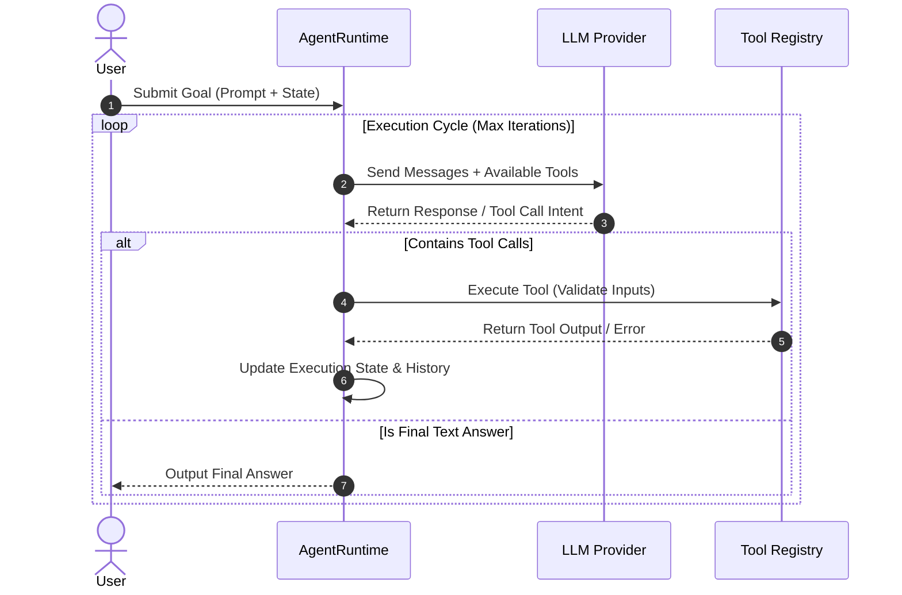

> [!NOTE]
> **5-Part Series Navigation**: This is **Part 1** of our continuous journey *Building a Multi-Agent AI Framework from Scratch*.
> - **Part 1: Core Event Loop & State Machine** (You are here)
> - [Part 2: Hybrid Memory & Context Pruning](/posts/multi-agent-framework-part-2-memory-systems)
> - [Part 3: Multi-Agent Teams & Orchestration](/posts/multi-agent-framework-part-3-orchestration)
> - [Part 4: Model Context Protocol (MCP) Integration](/posts/multi-agent-framework-part-4-mcp-protocol)
> - [Part 5: Production Evals, Retries & Telemetry](/posts/multi-agent-framework-part-5-resilience-evals)

---

# Introduction: The Case for a Custom Agent Runtime

When software engineers start building AI agent applications, the initial impulse is often to reach for high-level framework abstractions like LangChain or AutoGen. While these libraries are fantastic for quick prototypes, production applications quickly run into fundamental limitations:

1. **Implicit Hidden Magic**: Heavy abstractions abstract away prompt formatting and state updates, making runtime debugging unpredictable.
2. **Brittle Exception Recovery**: Infinite tool call loops, unhandled JSON schema validation errors, or API rate limits can freeze agent execution.
3. **Lack of Determinism**: Production systems require strict state transitions, step limits, and inspectable audit logs.

In this **5-part continuous series**, we will build a production-grade, event-driven Multi-Agent Framework from scratch in TypeScript—completely dependency-free.

---

## High-Level Architecture Overview

Before writing code, let's understand how the core agent event loop processes user queries, evaluates tool calls, and transitions through deterministic execution states.



---

## Designing the Deterministic State Machine

Every agent execution loop must track its current lifecycle step using a typed state object. Here is our core type definition:

```typescript
export type AgentStatus =
  | "IDLE"
  | "THINKING"
  | "EXECUTING_TOOL"
  | "COMPLETED"
  | "FAILED"
  | "MAX_STEPS_EXCEEDED";

export interface ToolCallRequest {
  id: string;
  name: string;
  arguments: Record<string, unknown>;
}

export interface ToolResult {
  toolCallId: string;
  output: unknown;
  isError: boolean;
}

export interface AgentMessage {
  role: "system" | "user" | "assistant" | "tool";
  content: string;
  toolCalls?: ToolCallRequest[];
  toolCallId?: string;
}

export interface AgentState {
  runId: string;
  status: AgentStatus;
  stepCount: number;
  maxSteps: number;
  messages: AgentMessage[];
  lastError?: string;
}
```

---

## Implementing the Core Agent Runtime Loop

Now, let's implement the `AgentRuntime` engine. The engine manages the loop, invokes tools safely, and prevents infinite execution loops.

```typescript
import { AgentState, AgentMessage, ToolCallRequest } from "./types";

export interface ToolDefinition {
  name: string;
  description: string;
  parameters: Record<string, unknown>;
  execute: (args: Record<string, unknown>) => Promise<unknown>;
}

export class AgentRuntime {
  private tools: Map<string, ToolDefinition> = new Map();

  constructor(private maxSteps: number = 10) {}

  public registerTool(tool: ToolDefinition): void {
    this.tools.set(tool.name, tool);
  }

  public async run(userPrompt: string, systemPrompt?: string): Promise<AgentState> {
    const state: AgentState = {
      runId: `run_${Date.now()}`,
      status: "THINKING",
      stepCount: 0,
      maxSteps: this.maxSteps,
      messages: [
        ...(systemPrompt ? [{ role: "system" as const, content: systemPrompt }] : []),
        { role: "user", content: userPrompt },
      ],
    };

    while (state.stepCount < state.maxSteps && state.status !== "COMPLETED" && state.status !== "FAILED") {
      state.stepCount++;

      try {
        // Step 1: Query the LLM provider (mocked for runtime illustration)
        const response = await this.mockLLMCompletion(state.messages);

        // Step 2: Handle Tool Invocations
        if (response.toolCalls && response.toolCalls.length > 0) {
          state.status = "EXECUTING_TOOL";
          state.messages.push({
            role: "assistant",
            content: response.content || "",
            toolCalls: response.toolCalls,
          });

          for (const call of response.toolCalls) {
            const toolResult = await this.executeTool(call);
            state.messages.push({
              role: "tool",
              content: JSON.stringify(toolResult.output),
              toolCallId: call.id,
            });
          }
          state.status = "THINKING";
        } else {
          // Final Text Answer Reached
          state.messages.push({ role: "assistant", content: response.content });
          state.status = "COMPLETED";
        }
      } catch (err: unknown) {
        state.status = "FAILED";
        state.lastError = err instanceof Error ? err.message : String(err);
      }
    }

    if (state.stepCount >= state.maxSteps && state.status !== "COMPLETED") {
      state.status = "MAX_STEPS_EXCEEDED";
    }

    return state;
  }

  private async executeTool(call: ToolCallRequest) {
    const tool = this.tools.get(call.name);
    if (!tool) {
      return { toolCallId: call.id, output: `Error: Tool '${call.name}' not found`, isError: true };
    }
    try {
      const output = await tool.execute(call.arguments);
      return { toolCallId: call.id, output, isError: false };
    } catch (err: unknown) {
      const errorMessage = err instanceof Error ? err.message : String(err);
      return { toolCallId: call.id, output: `Execution Error: ${errorMessage}`, isError: true };
    }
  }

  private async mockLLMCompletion(messages: AgentMessage[]) {
    // Demonstration mock returning final response
    const lastMsg = messages[messages.length - 1];
    return {
      content: `Processed request successfully for prompt: "${lastMsg.content.slice(0, 30)}..."`,
      toolCalls: undefined,
    };
  }
}
```

---

> [!TIP]
> **Key Takeaway**: A production agent runtime must treat LLM responses as un-trusted input. Always validate tool arguments against schemas before passing them to tool execution functions.

---

## What's Coming Next in Part 2?

Now that we have established a deterministic, step-counted event loop state machine, our agent faces a major challenge: **Context Window Bloat**. As tool calls accumulate, message history grows rapidly, leading to expensive API costs and context truncation crashes.

In **[Part 2: Hybrid Memory & Context Pruning](/posts/multi-agent-framework-part-2-memory-systems)**, we will build:
1. Short-term sliding window memory management.
2. Vector-indexed long-term episodic memory using LanceDB.
3. An automatic Context Pruner that dynamically compresses old tool outputs while preserving core instructions!

👉 **[Continue to Part 2: Hybrid Memory & Context Pruning →](/posts/multi-agent-framework-part-2-memory-systems)**
