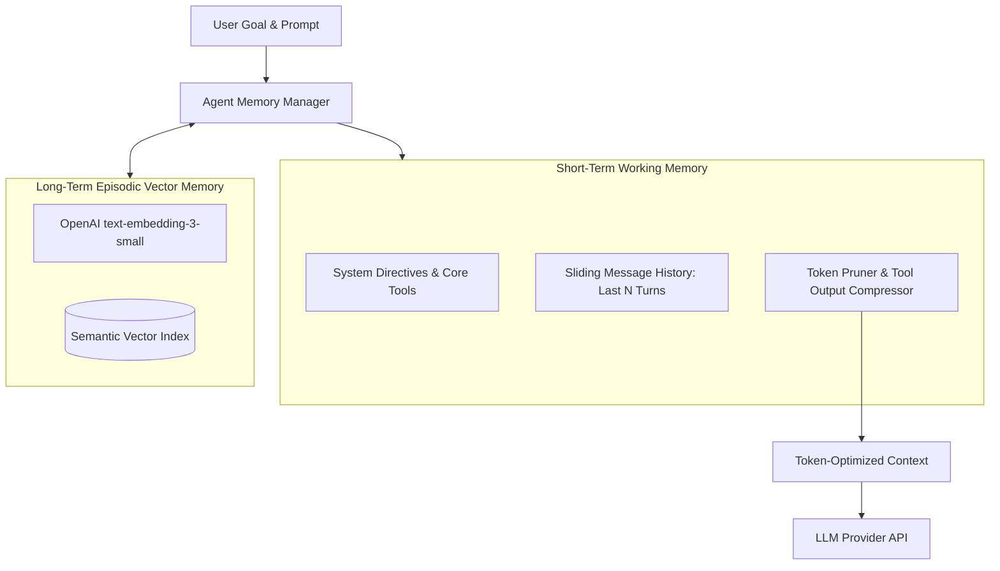

> [!NOTE]
> **5-Part Masterclass Navigation**:
> - [Part 1: Core Event Loop & State Machine](/posts/multi-agent-framework-part-1-architecture)
> - **Part 2: Hybrid Memory & Context Pruning** (You are here)
> - [Part 3: Multi-Agent Teams & Orchestration](/posts/multi-agent-framework-part-3-orchestration)
> - [Part 4: Model Context Protocol (MCP) Integration](/posts/multi-agent-framework-part-4-mcp-protocol)
> - [Part 5: Production Evals, Retries & Telemetry](/posts/multi-agent-framework-part-5-resilience-evals)

---

# Context Window Management in Long-Running Agents

In [Part 1](/posts/multi-agent-framework-part-1-architecture), we built the core `AgentRuntime` state machine. However, prolonged autonomous runs quickly hit **context window saturation**:

- **Quadratic Cost Growth**: Accumulating raw JSON payloads from hundreds of tool executions rapidly inflates input token costs.
- **Degraded Reasoning**: When intermediate tool noise overwhelms prompt context, models suffer from the "lost-in-the-middle" effect and forget initial system constraints.

To sustain multi-step autonomy, production agents require a **Hybrid Memory Architecture** separating short-term working context from persistent episodic vector storage.

---

## Memory Hierarchy Architecture



---

## 1. Implementing the Dynamic Token Pruner

The `TokenPruner` preserves system instructions and recent conversation turns while compressing intermediate tool outputs that exceed token budgets:

```typescript
import { AgentMessage } from "./types";

export interface PrunerOptions {
  maxTokenBudget: number;
  preserveLastNMessages: number;
}

export class TokenPruner {
  constructor(private options: PrunerOptions = { maxTokenBudget: 6000, preserveLastNMessages: 6 }) {}

  public estimateTokens(text: string): number {
    // Fast heuristic estimation (~4 chars per token)
    return Math.ceil(text.length / 4);
  }

  public prune(messages: AgentMessage[]): AgentMessage[] {
    const systemMessages = messages.filter((m) => m.role === "system");
    const conversationMessages = messages.filter((m) => m.role !== "system");

    if (conversationMessages.length <= this.options.preserveLastNMessages) {
      return messages;
    }

    const recentTurns = conversationMessages.slice(-this.options.preserveLastNMessages);
    const olderHistory = conversationMessages.slice(0, -this.options.preserveLastNMessages);

    let usedTokens = systemMessages.reduce((acc, m) => acc + this.estimateTokens(m.content), 0);
    usedTokens += recentTurns.reduce((acc, m) => acc + this.estimateTokens(m.content), 0);

    const retainedOldMessages: AgentMessage[] = [];

    for (let i = olderHistory.length - 1; i >= 0; i--) {
      const msg = olderHistory[i];
      const tokenCost = this.estimateTokens(msg.content);

      if (usedTokens + tokenCost <= this.options.maxTokenBudget) {
        retainedOldMessages.unshift(msg);
        usedTokens += tokenCost;
      } else if (msg.role === "tool") {
        // Compress verbose tool JSON payloads into concise summaries
        const compressed = `[Output Truncated: ${msg.content.slice(0, 120)}...]`;
        const compressedCost = this.estimateTokens(compressed);

        if (usedTokens + compressedCost <= this.options.maxTokenBudget) {
          retainedOldMessages.unshift({ ...msg, content: compressed });
          usedTokens += compressedCost;
        }
      }
    }

    return [...systemMessages, ...retainedOldMessages, ...recentTurns];
  }
}
```

---

## 2. Long-Term Episodic Memory with OpenAI Embeddings

For persistent cross-session memory, we embed and query past task executions using dense vector search:

```typescript
import OpenAI from "openai";

export interface EpisodicMemoryRecord {
  id: string;
  sessionId: string;
  taskGoal: string;
  summary: string;
  embedding: number[];
  timestamp: number;
}

export class EpisodicMemoryStore {
  private client: OpenAI;
  private records: EpisodicMemoryRecord[] = [];

  constructor() {
    this.client = new OpenAI();
  }

  private async generateEmbedding(text: string): Promise<number[]> {
    const response = await this.client.embeddings.create({
      model: "text-embedding-3-small",
      input: text,
    });
    return response.data[0].embedding;
  }

  public async saveEpisode(sessionId: string, taskGoal: string, summary: string): Promise<void> {
    const embedding = await this.generateEmbedding(`${taskGoal}\n${summary}`);
    this.records.push({
      id: `mem_${Date.now()}`,
      sessionId,
      taskGoal,
      summary,
      embedding,
      timestamp: Date.now(),
    });
  }

  public async searchRelevantContext(query: string, topK: number = 3): Promise<string[]> {
    const queryVector = await this.generateEmbedding(query);

    const scored = this.records.map((rec) => ({
      summary: rec.summary,
      similarity: this.cosineSimilarity(queryVector, rec.embedding),
    }));

    scored.sort((a, b) => b.similarity - a.similarity);
    return scored.slice(0, topK).map((r) => r.summary);
  }

  private cosineSimilarity(vecA: number[], vecB: number[]): number {
    let dot = 0;
    let normA = 0;
    let normB = 0;
    for (let i = 0; i < vecA.length; i++) {
      dot += vecA[i] * vecB[i];
      normA += vecA[i] * vecA[i];
      normB += vecB[i] * vecB[i];
    }
    return dot / (Math.sqrt(normA) * Math.sqrt(normB) + 1e-8);
  }
}
```

---

## 3. Production Best Practices

> [!IMPORTANT]
> **Isolate Working Context from Injected Memory**: Never blindly inject raw episodic vector search hits into the system prompt. Always label injected context explicitly under a `### Prior Historical Context` markdown header to prevent prompt injection and model confusion.

---

## Key Takeaways

- **Token Budget Ceilings**: Strict pruner limits prevent runaway token accumulation during multi-turn agent execution loops.
- **Graceful Payload Compression**: Truncating older intermediate tool payloads while preserving the most recent turns maintains prompt coherence.
- **Episodic Vector Separation**: Using OpenAI `text-embedding-3-small` embeddings allows past run lessons to be queried semantically without bloating active working memory.

**[Continue to Part 3: Multi-Agent Teams & Orchestration →](/posts/multi-agent-framework-part-3-orchestration)**
