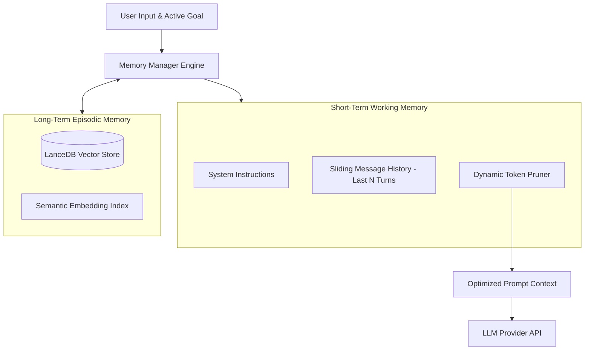

> [!NOTE]
> **5-Part Series Navigation**: This is **Part 2** of our continuous journey *Building a Multi-Agent AI Framework from Scratch*.
> - [Part 1: Core Event Loop & State Machine](/posts/multi-agent-framework-part-1-architecture)
> - **Part 2: Hybrid Memory & Context Pruning** (You are here)
> - [Part 3: Multi-Agent Teams & Orchestration](/posts/multi-agent-framework-part-3-orchestration)
> - [Part 4: Model Context Protocol (MCP) Integration](/posts/multi-agent-framework-part-4-mcp-protocol)
> - [Part 5: Production Evals, Retries & Telemetry](/posts/multi-agent-framework-part-5-resilience-evals)

---

# Recapping Part 1 & The Problem of Memory Bloat

In **[Part 1](/posts/multi-agent-framework-part-1-architecture)**, we constructed our core `AgentRuntime` event loop and state machine. While our agent can execute tools and iterate deterministically, prolonged autonomous runs reveal a critical production bottleneck: **Context Window Saturation**.

Every tool output, raw JSON response, and intermediate thought string accumulates in the `messages` array. Left unchecked:
- LLM API costs scale quadratically with context length.
- Latency increases significantly (Time-to-First-Token degrades).
- Older critical instructions get pushed past the context window edge.

In this guide, we will design a **Hybrid Memory System** combining short-term working context, semantic vector retrieval (long-term memory), and an automatic **Token Pruner**.

---

## Memory Hierarchy Architecture



---

## Step 1: Implementing the Token Pruner Engine

The `TokenPruner` measures the token consumption of active messages and safely truncates intermediate tool outputs while retaining System Prompts and recent turn messages.

```typescript
import { AgentMessage } from "./types";

export interface PrunerOptions {
  maxTokenBudget: number;
  systemMessageReserveTokens: number;
  preserveLastNMessages: number;
}

export class TokenPruner {
  constructor(private options: PrunerOptions) {}

  /**
   * Fast token estimation fallback (1 token ≈ 4 characters)
   */
  public estimateTokens(text: string): number {
    return Math.ceil(text.length / 4);
  }

  public prune(messages: AgentMessage[]): AgentMessage[] {
    const systemMessages = messages.filter((m) => m.role === "system");
    const nonSystemMessages = messages.filter((m) => m.role !== "system");

    if (nonSystemMessages.length <= this.options.preserveLastNMessages) {
      return messages;
    }

    const recentMessages = nonSystemMessages.slice(-this.options.preserveLastNMessages);
    const candidateMessages = nonSystemMessages.slice(0, -this.options.preserveLastNMessages);

    // Calculate currently used tokens
    let usedTokens = systemMessages.reduce(
      (acc, m) => acc + this.estimateTokens(m.content),
      0
    );
    usedTokens += recentMessages.reduce(
      (acc, m) => acc + this.estimateTokens(m.content),
      0
    );

    const prunedCandidates: AgentMessage[] = [];

    // Select older candidate messages that fit within remaining token budget
    for (let i = candidateMessages.length - 1; i >= 0; i--) {
      const msg = candidateMessages[i];
      const tokens = this.estimateTokens(msg.content);

      if (usedTokens + tokens <= this.options.maxTokenBudget) {
        prunedCandidates.unshift(msg);
        usedTokens += tokens;
      } else if (msg.role === "tool") {
        // Compress tool outputs instead of complete deletion
        const compressedContent = `[Tool Output Summarized: ${msg.content.slice(0, 100)}...]`;
        const compressedTokens = this.estimateTokens(compressedContent);

        if (usedTokens + compressedTokens <= this.options.maxTokenBudget) {
          prunedCandidates.unshift({ ...msg, content: compressedContent });
          usedTokens += compressedTokens;
        }
      }
    }

    return [...systemMessages, ...prunedCandidates, ...recentMessages];
  }
}
```

---

## Step 2: Long-Term Memory Retrieval with Vector Indexing

Short-term memory only retains current turn context. For persistent long-term knowledge across user sessions, we implement a `VectorMemoryStore` adapter:

```typescript
export interface MemoryRecord {
  id: string;
  sessionId: string;
  content: string;
  embedding: number[];
  timestamp: number;
}

export class VectorMemoryStore {
  private records: MemoryRecord[] = [];

  public async saveEpisodicMemory(sessionId: string, content: string): Promise<void> {
    const embedding = await this.mockEmbedText(content);
    this.records.push({
      id: `mem_${Date.now()}_${Math.random().toString(36).substring(2, 7)}`,
      sessionId,
      content,
      embedding,
      timestamp: Date.now(),
    });
  }

  public async searchRelevantMemories(query: string, topK: number = 3): Promise<string[]> {
    const queryEmbedding = await this.mockEmbedText(query);

    // Compute Cosine Similarity
    const scored = this.records.map((rec) => ({
      content: rec.content,
      score: this.cosineSimilarity(queryEmbedding, rec.embedding),
    }));

    scored.sort((a, b) => b.score - a.score);
    return scored.slice(0, topK).map((item) => item.content);
  }

  private cosineSimilarity(vecA: number[], vecB: number[]): number {
    const dotProduct = vecA.reduce((sum, val, i) => sum + val * vecB[i], 0);
    const magA = Math.sqrt(vecA.reduce((sum, val) => sum + val * val, 0));
    const magB = Math.sqrt(vecB.reduce((sum, val) => sum + val * val, 0));
    if (magA === 0 || magB === 0) return 0;
    return dotProduct / (magA * magB);
  }

  private async mockEmbedText(text: string): Promise<number[]> {
    // Generate deterministic 8-dimensional mock embedding vector
    const vector = new Array(8).fill(0);
    for (let i = 0; i < text.length; i++) {
      vector[i % 8] += text.charCodeAt(i) / 255;
    }
    return vector;
  }
}
```

---

> [!IMPORTANT]
> **Production Best Practice**: Always separate working memory (active execution history) from long-term memory (vector index). Feeding raw search hits directly into System Prompts creates prompt injection vectors if retrieved memories contain un-sanitized user strings.

---

## What's Coming Next in Part 3?

With deterministic state control (Part 1) and hybrid memory management (Part 2) implemented, a single isolated agent still struggles when tasked with complex multi-domain goals (e.g. searching codebase docs, running unit tests, and drafting documentation simultaneously).

In **[Part 3: Multi-Agent Teams & Orchestration](/posts/multi-agent-framework-part-3-orchestration)**, we will build:
1. **Supervisor Routing Pattern**: A lead agent delegating sub-tasks to specialized sub-agents.
2. **Parallel Worker Fan-Out**: Running multiple worker agents concurrently.
3. **Dynamic Handoff Protocol**: Handoff state transfer between specialized agent workers!

👉 **[Continue to Part 3: Multi-Agent Teams & Orchestration →](/posts/multi-agent-framework-part-3-orchestration)**
