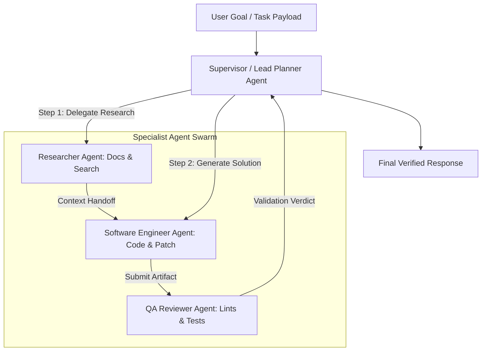

> [!NOTE]
> **5-Part Masterclass Navigation**:
> - [Part 1: Core Event Loop & State Machine](/posts/multi-agent-framework-part-1-architecture)
> - [Part 2: Hybrid Memory & Context Pruning](/posts/multi-agent-framework-part-2-memory-systems)
> - **Part 3: Multi-Agent Teams & Orchestration** (You are here)
> - [Part 4: Model Context Protocol (MCP) Integration](/posts/multi-agent-framework-part-4-mcp-protocol)
> - [Part 5: Production Evals, Retries & Telemetry](/posts/multi-agent-framework-part-5-resilience-evals)

---

# Why Single-Agent Systems Break Down

In [Part 1](/posts/multi-agent-framework-part-1-architecture) and [Part 2](/posts/multi-agent-framework-part-2-memory-systems), we developed a resilient single-agent runtime with token pruning and vector memory. However, forcing a single monolithic system prompt to handle broad, multi-domain responsibilities—such as documentation research, SQL synthesis, and test verification—leads to prompt confusion, high hallucination rates, and tool selection errors.

To solve multi-step problems reliably, systems must partition responsibility across **Specialized Agent Teams**.

---

## Multi-Agent Supervisor Architecture



---

## 1. Specialist Worker Contracts in TypeScript

Each specialist worker in our framework encapsulates a domain system prompt, a restricted subset of tools, and an independent execution runtime:

```typescript
import { AgentRuntime } from "./AgentRuntime";
import { AgentState, ToolDefinition } from "./types";

export interface AgentWorkerConfig {
  id: string;
  name: string;
  role: string;
  systemPrompt: string;
  tools: ToolDefinition<any>[];
}

export class AgentWorker {
  public id: string;
  public name: string;
  private runtime: AgentRuntime;
  private config: AgentWorkerConfig;

  constructor(config: AgentWorkerConfig) {
    this.id = config.id;
    this.name = config.name;
    this.config = config;
    this.runtime = new AgentRuntime(6);

    for (const tool of config.tools) {
      this.runtime.registerTool(tool);
    }
  }

  public async executeSubtask(taskPrompt: string): Promise<AgentState> {
    return this.runtime.run(taskPrompt, this.config.systemPrompt);
  }
}
```

---

## 2. Implementing the Swarm Orchestrator

The `SwarmOrchestrator` coordinates sequential pipelines, concurrent worker fan-outs, and explicit state transfers:

```typescript
import { AgentWorker } from "./AgentWorker";
import { AgentState } from "./types";

export class SwarmOrchestrator {
  private workers: Map<string, AgentWorker> = new Map();

  public registerWorker(worker: AgentWorker): void {
    this.workers.set(worker.id, worker);
  }

  /**
   * Sequential Pipeline Execution with Context Handoff
   */
  public async executePipeline(
    pipeline: string[],
    initialTask: string
  ): Promise<Record<string, AgentState>> {
    const stageResults: Record<string, AgentState> = {};
    let activePrompt = initialTask;

    for (const agentId of pipeline) {
      const worker = this.workers.get(agentId);
      if (!worker) {
        throw new Error(`Orchestrator: Worker '${agentId}' not registered.`);
      }

      console.log(`[Swarm Orchestrator] Invoking stage: ${worker.name}...`);
      const state = await worker.executeSubtask(activePrompt);
      stageResults[agentId] = state;

      // Extract output to feed into next agent stage
      const lastMessage = state.messages[state.messages.length - 1];
      if (lastMessage && lastMessage.content) {
        activePrompt = `### Output from ${worker.name}:\n${lastMessage.content}\n\n### Next Directive:\nProcess and finalize the next step.`;
      }
    }

    return stageResults;
  }

  /**
   * Parallel Fan-Out Execution
   */
  public async executeParallelFanOut(
    agentIds: string[],
    tasks: Record<string, string>
  ): Promise<Record<string, AgentState>> {
    const promises = agentIds.map(async (id) => {
      const worker = this.workers.get(id);
      if (!worker) throw new Error(`Worker '${id}' not found`);
      const task = tasks[id] || "Process stage input";
      const result = await worker.executeSubtask(task);
      return { id, result };
    });

    const results = await Promise.all(promises);
    const outputMap: Record<string, AgentState> = {};
    for (const item of results) {
      outputMap[item.id] = item.result;
    }
    return outputMap;
  }
}
```

---

## 3. Production Multi-Agent Tradeoff Matrix

| Orchestration Pattern | Best For | Failure Mode Risk | Complexity |
| :--- | :--- | :--- | :--- |
| **Sequential Pipeline** | Deterministic workflows (Lint → Build → Deploy) | Single worker failure blocks entire pipeline | Low |
| **Supervisor Router** | Dynamic routing across diverse domains | Supervisor routing hallucination | Medium |
| **Parallel Fan-Out** | Independent evaluations, multi-query search | API rate limiting spikes | Medium |
| **Collaborative Swarm** | Complex creative problem solving | Runaway token consumption & endless debates | High |

> [!WARNING]
> When executing parallel agent workers, always pass immutable copies of state to prevent race conditions during message history updates.

---

## Key Takeaways

- **Domain Separation**: Specialized agents with constrained toolsets outperform monolithic agents on multi-step reasoning benchmarks.
- **Context Handoff Contracts**: Formatting upstream outputs as structured Markdown headers prevents context contamination during agent-to-agent transfers.
- **Controlled Concurrency**: Fan-out worker patterns accelerate independent sub-task processing while keeping execution isolated.

**[Continue to Part 4: Model Context Protocol (MCP) Integration →](/posts/multi-agent-framework-part-4-mcp-protocol)**
