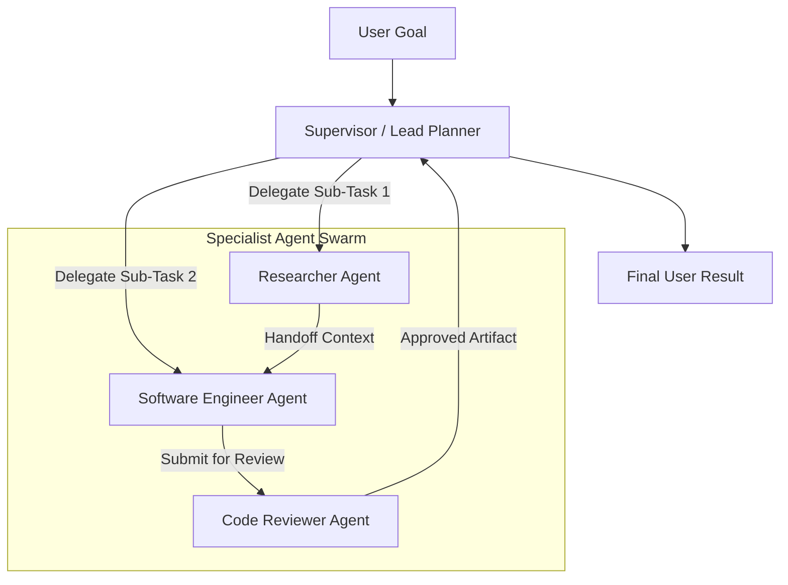

> [!NOTE]
> **5-Part Series Navigation**: This is **Part 3** of our continuous journey *Building a Multi-Agent AI Framework from Scratch*.
> - [Part 1: Core Event Loop & State Machine](/posts/multi-agent-framework-part-1-architecture)
> - [Part 2: Hybrid Memory & Context Pruning](/posts/multi-agent-framework-part-2-memory-systems)
> - **Part 3: Multi-Agent Teams & Orchestration** (You are here)
> - [Part 4: Model Context Protocol (MCP) Integration](/posts/multi-agent-framework-part-4-mcp-protocol)
> - [Part 5: Production Evals, Retries & Telemetry](/posts/multi-agent-framework-part-5-resilience-evals)

---

# Why Single-Agent Systems Scale Poorly

In **[Part 1](/posts/multi-agent-framework-part-1-architecture)** and **[Part 2](/posts/multi-agent-framework-part-2-memory-systems)**, we constructed a robust single-agent runtime with context pruning and vector memory. However, forcing a single monolithic prompt to handle research, code synthesis, shell execution, and QA validation leads to **prompt confusion** and **tool overload**.

To build complex production software systems, we must break down tasks across **Specialized Agent Teams**.

In this guide, we will implement three core multi-agent orchestration architectures:
1. **Supervisor Routing Pattern**: A orchestrator agent analyzing requests and delegating to domain workers.
2. **Parallel Fan-out Worker Swarms**: Executing independent tasks concurrently.
3. **Explicit Agent Handoff Protocol**: Directly transferring control and state between agents.

---

## Multi-Agent Supervisor Architecture



---

## Step 1: Defining Worker & Supervisor Contracts

Every specialist agent in our framework encapsulates a domain system prompt, a restricted subset of tools, and an identifier.

```typescript
import { AgentRuntime, ToolDefinition } from "./runtime";
import { AgentState } from "./types";

export interface AgentWorkerConfig {
  id: string;
  name: string;
  roleDescription: string;
  systemPrompt: string;
  tools: ToolDefinition[];
}

export interface HandoffPayload {
  targetAgentId: string;
  taskDescription: string;
  contextData: Record<string, unknown>;
}

export class AgentWorker {
  public id: string;
  public name: string;
  private runtime: AgentRuntime;
  private config: AgentWorkerConfig;

  constructor(config: AgentWorkerConfig) {
    this.id = config.id;
    this.name = config.name;
    this.config = config;
    this.runtime = new AgentRuntime(8);

    for (const tool of config.tools) {
      this.runtime.registerTool(tool);
    }
  }

  public async executeTask(taskPrompt: string): Promise<AgentState> {
    return this.runtime.run(taskPrompt, this.config.systemPrompt);
  }
}
```

---

## Step 2: Implementing the Swarm Orchestrator

The `SwarmOrchestrator` manages agent registration, routes delegating instructions from the Supervisor, and executes parallel or sequential worker execution loops.

```typescript
export class SwarmOrchestrator {
  private workers: Map<string, AgentWorker> = new Map();

  public registerWorker(worker: AgentWorker): void {
    this.workers.set(worker.id, worker);
  }

  /**
   * Sequential Pipeline Execution
   */
  public async runPipeline(
    pipelineOrder: string[],
    initialGoal: string
  ): Promise<Record<string, AgentState>> {
    const results: Record<string, AgentState> = {};
    let currentInput = initialGoal;

    for (const agentId of pipelineOrder) {
      const worker = this.workers.get(agentId);
      if (!worker) {
        throw new Error(`Orchestrator Error: Worker agent '${agentId}' not found.`);
      }

      console.log(`[Swarm] Executing Worker: ${worker.name}...`);
      const state = await worker.executeTask(currentInput);
      results[agentId] = state;

      // Extract output to pass to next agent in pipeline
      const lastMessage = state.messages[state.messages.length - 1];
      if (lastMessage && lastMessage.content) {
        currentInput = `Context from previous step (${worker.name}):\n${lastMessage.content}\n\nTask: Continue processing goal.`;
      }
    }

    return results;
  }

  /**
   * Parallel Fan-Out Execution
   */
  public async runParallel(
    agentIds: string[],
    taskMap: Record<string, string>
  ): Promise<Record<string, AgentState>> {
    const promises = agentIds.map(async (id) => {
      const worker = this.workers.get(id);
      if (!worker) throw new Error(`Worker '${id}' not registered.`);
      const task = taskMap[id] || "Process input task";
      const state = await worker.executeTask(task);
      return { id, state };
    });

    const executionResults = await Promise.all(promises);
    const resultMap: Record<string, AgentState> = {};
    for (const res of executionResults) {
      resultMap[res.id] = res.state;
    }
    return resultMap;
  }
}
```

---

> [!WARNING]
> **Production Gotcha**: When orchestrating parallel agent swarms, avoid shared mutable state in agent runtimes. Always pass immutable copies of message history to prevent race conditions during state updates.

---

## What's Coming Next in Part 4?

Now that our agents can collaborate in multi-agent swarms, how do they safely interface with external cloud services, local databases, and third-party tools without writing custom API adapter code for every new integration?

In **[Part 4: Model Context Protocol (MCP) Integration](/posts/multi-agent-framework-part-4-mcp-protocol)**, we will integrate Anthropic's **Model Context Protocol (MCP)** standard to dynamically discover, connect, and stream tools across local and remote MCP servers!

👉 **[Continue to Part 4: Model Context Protocol (MCP) Integration →](/posts/multi-agent-framework-part-4-mcp-protocol)**
