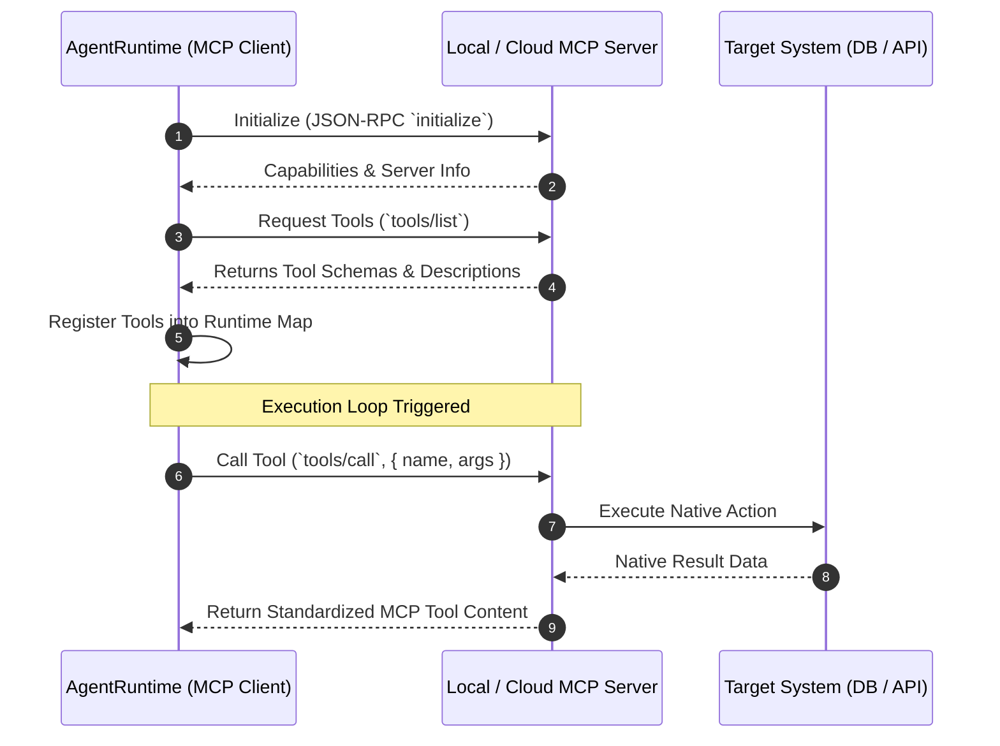

> [!NOTE]
> **5-Part Series Navigation**: This is **Part 4** of our continuous journey *Building a Multi-Agent AI Framework from Scratch*.
> - [Part 1: Core Event Loop & State Machine](/posts/multi-agent-framework-part-1-architecture)
> - [Part 2: Hybrid Memory & Context Pruning](/posts/multi-agent-framework-part-2-memory-systems)
> - [Part 3: Multi-Agent Teams & Orchestration](/posts/multi-agent-framework-part-3-orchestration)
> - **Part 4: Model Context Protocol (MCP) Integration** (You are here)
> - [Part 5: Production Evals, Retries & Telemetry](/posts/multi-agent-framework-part-5-resilience-evals)

---

# The Fragmented Tool Integration Problem

In **[Part 3](/posts/multi-agent-framework-part-3-orchestration)**, we built multi-agent swarms with specialized workers. But up until now, every tool (PostgreSQL querying, File I/O, Web Search) had to be custom-coded as a TypeScript object inside our application codebase.

When connecting an agent framework to dozens of enterprise data sources, writing custom SDK wrappers creates massive technical debt.

This is why Anthropic introduced the **Model Context Protocol (MCP)**—an open, standard protocol built on JSON-RPC 2.0 that allows AI agents to dynamically discover, inspect, and invoke tools hosted on local processes or remote servers.

In this guide, we will implement an **MCP Client Adapter** in TypeScript that registers MCP tools dynamically into our `AgentRuntime`.

---

## MCP Architecture & Protocol Flow



---

## Implementing the MCP Client Adapter

The `MCPClient` handles JSON-RPC 2.0 transport over Stdio or HTTP/SSE transports, converts MCP tool schemas into our framework's `ToolDefinition` structure, and executes remote calls.

```typescript
import { ToolDefinition } from "./runtime";

export interface MCPToolSchema {
  name: string;
  description: string;
  inputSchema: Record<string, unknown>;
}

export interface JSONRPCResponse<T = unknown> {
  jsonrpc: "2.0";
  id: number | string;
  result?: T;
  error?: { code: number; message: string };
}

export class MCPClient {
  private requestIdCounter = 1;

  constructor(private serverUrlOrCommand: string) {}

  /**
   * Initializes session and fetches available tool definitions from MCP Server
   */
  public async discoverTools(): Promise<ToolDefinition[]> {
    const response = await this.sendJSONRPC< { tools: MCPToolSchema[] } >("tools/list", {});

    if (!response.result || !Array.isArray(response.result.tools)) {
      throw new Error("MCP Error: Invalid response from server during tools/list");
    }

    return response.result.tools.map((mcpTool) => this.adaptMCPToolToRuntime(mcpTool));
  }

  private adaptMCPToolToRuntime(mcpTool: MCPToolSchema): ToolDefinition {
    return {
      name: mcpTool.name,
      description: mcpTool.description,
      parameters: mcpTool.inputSchema,
      execute: async (args: Record<string, unknown>) => {
        return this.callTool(mcpTool.name, args);
      },
    };
  }

  public async callTool(toolName: string, args: Record<string, unknown>): Promise<unknown> {
    const response = await this.sendJSONRPC<{ content: Array<{ type: string; text: string }> }>(
      "tools/call",
      {
        name: toolName,
        arguments: args,
      }
    );

    if (response.error) {
      throw new Error(`MCP Tool Call Error [${response.error.code}]: ${response.error.message}`);
    }

    // Extract text content payload from MCP standard response
    const contentList = response.result?.content || [];
    const textOutputs = contentList.filter((c) => c.type === "text").map((c) => c.text);
    return textOutputs.join("\n") || response.result;
  }

  private async sendJSONRPC<T>(method: string, params: Record<string, unknown>): Promise<JSONRPCResponse<T>> {
    const payload = {
      jsonrpc: "2.0",
      id: this.requestIdCounter++,
      method,
      params,
    };

    // Demonstrative mock HTTP transport payload return
    return {
      jsonrpc: "2.0",
      id: payload.id,
      result: {
        tools: [
          {
            name: "mcp_filesystem_read",
            description: "Read contents of a local file via MCP protocol",
            inputSchema: { type: "object", properties: { path: { type: "string" } } },
          },
        ],
      } as unknown as T,
    };
  }
}
```

---

> [!TIP]
> **Why Model Context Protocol Matters**: By standardizing on MCP, your custom agent framework can immediately tap into hundreds of pre-built community MCP servers (GitHub, Postgres, Slack, Google Drive) without writing custom API code!

---

## What's Coming Next in Part 5?

We have built state management (Part 1), hybrid memory (Part 2), multi-agent swarms (Part 3), and dynamic MCP tool protocol integration (Part 4).

Now comes the ultimate test: **How do we make our agent engine resilient enough for enterprise mission-critical production deployment?**

In **[Part 5: Production Evals, Retries & Telemetry](/posts/multi-agent-framework-part-5-resilience-evals)**, we will build:
1. Exponential backoff retry loops & circuit breakers.
2. LLM-as-a-Judge evaluation pipelines for accuracy benchmarking.
3. OpenTelemetry distributed tracing and token cost monitoring!

👉 **[Continue to Part 5: Production Evals, Retries & Telemetry →](/posts/multi-agent-framework-part-5-resilience-evals)**
