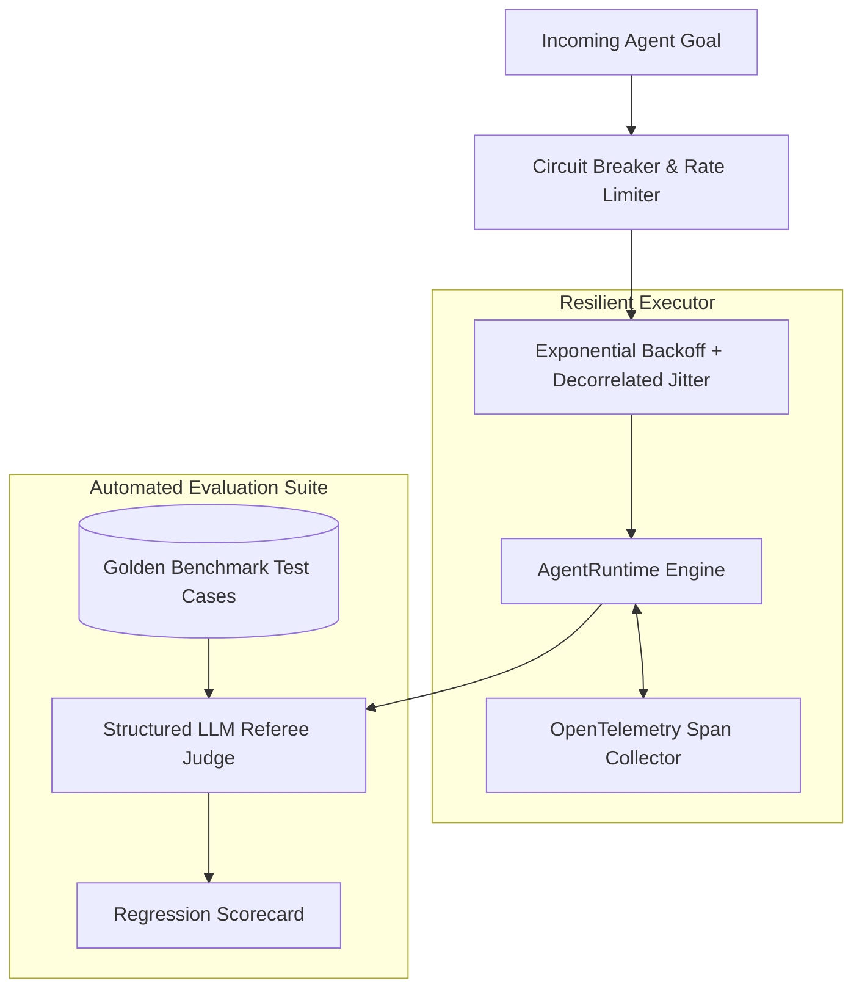

> [!NOTE]
> **5-Part Masterclass Navigation**:
> - [Part 1: Core Event Loop & State Machine](/posts/multi-agent-framework-part-1-architecture)
> - [Part 2: Hybrid Memory & Context Pruning](/posts/multi-agent-framework-part-2-memory-systems)
> - [Part 3: Multi-Agent Teams & Orchestration](/posts/multi-agent-framework-part-3-orchestration)
> - [Part 4: Model Context Protocol (MCP) Integration](/posts/multi-agent-framework-part-4-mcp-protocol)
> - **Part 5: Production Evals, Retries & Telemetry** (You are here)

---

# Hardening Agent Runtimes for Mission-Critical Production

Across the preceding four parts, we built:
1. A deterministic event loop and state machine ([Part 1](/posts/multi-agent-framework-part-1-architecture)).
2. A hybrid token pruner and episodic vector memory store ([Part 2](/posts/multi-agent-framework-part-2-memory-systems)).
3. Multi-agent teams with sequential pipelines and fan-out orchestrators ([Part 3](/posts/multi-agent-framework-part-3-orchestration)).
4. Dynamic MCP tool integration over Stdio transports ([Part 4](/posts/multi-agent-framework-part-4-mcp-protocol)).

The final requirement for production readiness is **resilience engineering**: mitigating transient 429 rate limit spikes, detecting prompt drift via automated evaluation harnesses, and instrumenting distributed spans with OpenTelemetry.

---

## Production Telemetry & Evaluation Architecture



---

## 1. Exponential Backoff with Decorrelated Jitter

Network requests to frontier model APIs fail predictably under load. Below is an executor wrapper utilizing decorrelated jitter to prevent thundering herd problems:

```typescript
export interface RetryConfig {
  maxRetries: number;
  initialDelayMs: number;
  maxDelayMs: number;
  backoffFactor: number;
}

export class ResilientAgentExecutor {
  constructor(
    private config: RetryConfig = {
      maxRetries: 4,
      initialDelayMs: 400,
      maxDelayMs: 6000,
      backoffFactor: 2,
    }
  ) {}

  public async executeWithRetry<T>(fn: () => Promise<T>): Promise<T> {
    let attempt = 0;
    let currentDelay = this.config.initialDelayMs;

    while (attempt < this.config.maxRetries) {
      try {
        return await fn();
      } catch (error: any) {
        attempt++;
        if (attempt >= this.config.maxRetries) {
          throw new Error(
            `ResilientExecutor: Max retries exceeded (${attempt}). Error: ${error.message}`
          );
        }

        // Full jitter calculation to distribute concurrent retry waves
        const jitter = Math.random() * currentDelay * 0.5;
        const sleepMs = Math.min(
          currentDelay * this.config.backoffFactor + jitter,
          this.config.maxDelayMs
        );

        console.warn(
          `[Resilience] Attempt ${attempt} failed: ${error.message}. Retrying in ${Math.round(sleepMs)}ms...`
        );
        await new Promise((resolve) => setTimeout(resolve, sleepMs));
        currentDelay = sleepMs;
      }
    }

    throw new Error("ResilientExecutor: Execution failed.");
  }
}
```

---

## 2. Automated LLM-as-a-Judge Evaluation Pipeline

To verify whether agent output aligns with intended requirements without manual inspection, we use structured OpenAI outputs for quantitative scoring:

```typescript
import OpenAI from "openai";
import { z } from "zod";

const EvaluationSchema = z.object({
  taskSuccess: z.boolean(),
  accuracyScore: z.number().min(0).max(1),
  hallucinationDetected: z.boolean(),
  reasoning: z.string(),
});

export type EvaluationResult = z.infer<typeof EvaluationSchema>;

export class AgentEvalSuite {
  private client: OpenAI;

  constructor() {
    this.client = new OpenAI();
  }

  public async evaluateExecution(
    userGoal: string,
    agentOutput: string,
    groundTruthReference: string
  ): Promise<EvaluationResult> {
    const prompt = `
You are an expert technical referee. Grade the agent's output against the user goal and reference ground truth.

User Goal: ${userGoal}
Ground Truth Reference: ${groundTruthReference}
Agent Output: ${agentOutput}
`;

    const response = await this.client.chat.completions.create({
      model: "gpt-4o-mini",
      messages: [
        { role: "system", content: "Evaluate technical accuracy and completeness." },
        { role: "user", content: prompt },
      ],
      response_format: {
        type: "json_schema",
        json_schema: {
          name: "EvaluationResult",
          schema: {
            type: "object",
            properties: {
              taskSuccess: { type: "boolean" },
              accuracyScore: { type: "number" },
              hallucinationDetected: { type: "boolean" },
              reasoning: { type: "string" },
            },
            required: ["taskSuccess", "accuracyScore", "hallucinationDetected", "reasoning"],
            additionalProperties: false,
          },
          strict: true,
        },
      },
      temperature: 0.0,
    });

    const parsed = JSON.parse(response.choices[0].message.content || "{}");
    return EvaluationSchema.parse(parsed);
  }
}
```

---

## 3. OpenTelemetry Distributed Tracing

Instrumenting each tool call as an OpenTelemetry span provides end-to-end latency visibility across complex multi-agent execution graphs:

```typescript
import { trace, SpanStatusCode } from "@opentelemetry/api";

const tracer = trace.getTracer("multi-agent-framework", "1.0.0");

export async function traceAgentStep<T>(
  stepName: string,
  attributes: Record<string, string | number>,
  fn: () => Promise<T>
): Promise<T> {
  return tracer.startActiveSpan(stepName, async (span) => {
    try {
      span.setAttributes(attributes);
      const result = await fn();
      span.setStatus({ code: SpanStatusCode.OK });
      return result;
    } catch (err: any) {
      span.setStatus({
        code: SpanStatusCode.ERROR,
        message: err.message || "Step execution error",
      });
      span.recordException(err);
      throw err;
    } finally {
      span.end();
    }
  });
}
```

---

## Masterclass Series Index

- **[Part 1: Core Event Loop & State Machine](/posts/multi-agent-framework-part-1-architecture)**
- **[Part 2: Hybrid Memory & Context Pruning](/posts/multi-agent-framework-part-2-memory-systems)**
- **[Part 3: Multi-Agent Teams & Orchestration](/posts/multi-agent-framework-part-3-orchestration)**
- **[Part 4: Model Context Protocol (MCP) Integration](/posts/multi-agent-framework-part-4-mcp-protocol)**
- **Part 5: Production Evals, Retries & Telemetry** (Current Article)

Explore the complete playlist on our **[Multi-Agent Framework Masterclass Playlist](/playlists/multi-agent-framework-masterclass)**!
