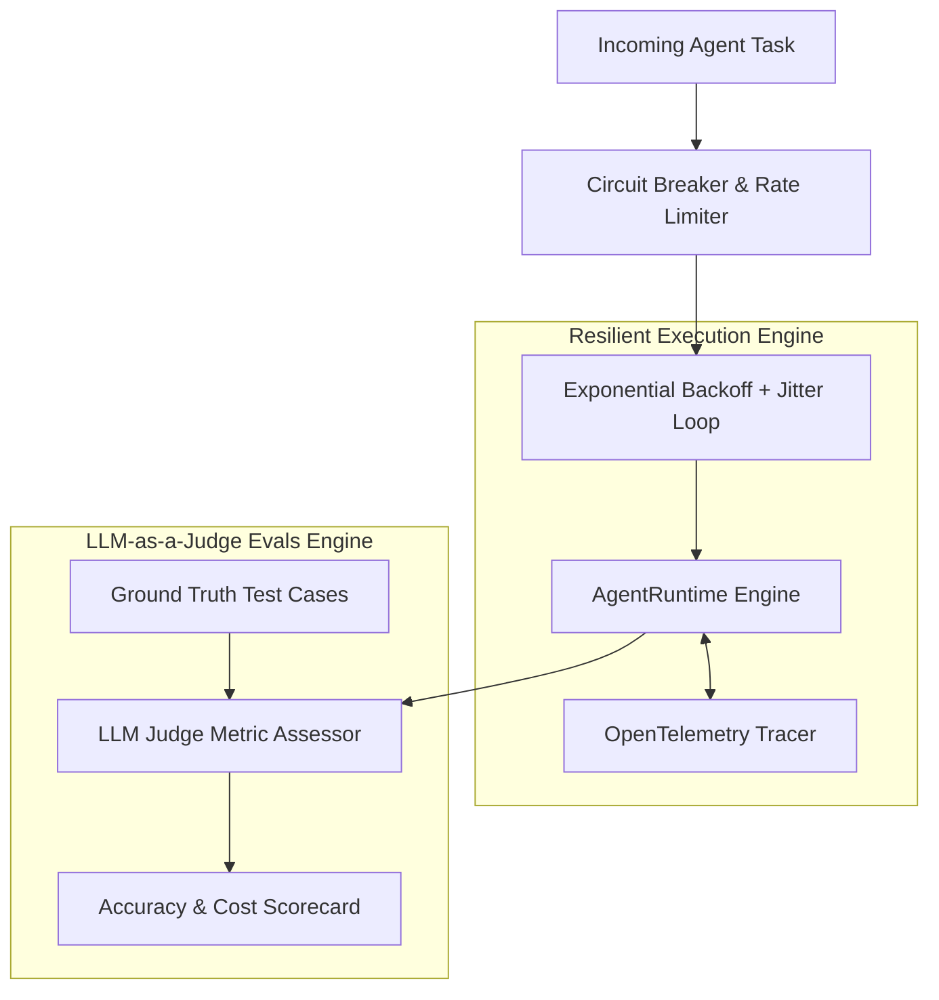
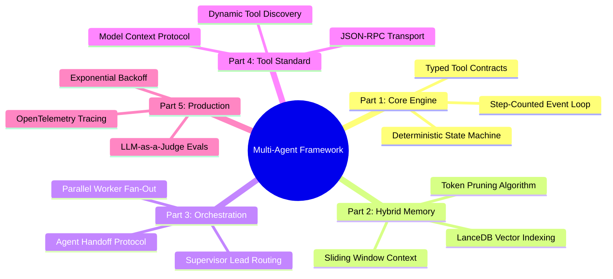

> [!NOTE]
> **5-Part Series Navigation**: This is **Part 5** (Final Installment) of our continuous journey *Building a Multi-Agent AI Framework from Scratch*.
> - [Part 1: Core Event Loop & State Machine](/posts/multi-agent-framework-part-1-architecture)
> - [Part 2: Hybrid Memory & Context Pruning](/posts/multi-agent-framework-part-2-memory-systems)
> - [Part 3: Multi-Agent Teams & Orchestration](/posts/multi-agent-framework-part-3-orchestration)
> - [Part 4: Model Context Protocol (MCP) Integration](/posts/multi-agent-framework-part-4-mcp-protocol)
> - **Part 5: Production Evals, Retries & Telemetry** (You are here)

---

# Bringing It All Together: Enterprise Production Hardening

Congratulations on reaching the final part of our **5-part series**!

Across [Part 1](/posts/multi-agent-framework-part-1-architecture), [Part 2](/posts/multi-agent-framework-part-2-memory-systems), [Part 3](/posts/multi-agent-framework-part-3-orchestration), and [Part 4](/posts/multi-agent-framework-part-4-mcp-protocol), we built:
1. A deterministic state machine & event runtime loop.
2. A hybrid short-term & vector long-term memory engine with token pruning.
3. Multi-agent supervisor & worker team orchestrators.
4. Model Context Protocol (MCP) tool integration.

Now, we must bridge the final gap between a working framework and an **enterprise-ready production deployment**. In production, external LLM APIs fail with 429 Rate Limits, network timeouts occur, and prompt outputs drift over time.

In this final guide, we will implement:
1. Exponential backoff with jitter retries & circuit breakers.
2. An automated **LLM-as-a-Judge Evaluation Engine**.
3. OpenTelemetry distributed tracing & token cost metering.

---

## Production Resilience & Monitoring Architecture



---

## Step 1: Exponential Backoff & Circuit Breaker Engine

```typescript
export interface RetryConfig {
  maxRetries: number;
  initialDelayMs: number;
  maxDelayMs: number;
  backoffFactor: number;
}

export class ResilientAgentExecutor {
  constructor(private config: RetryConfig = { maxRetries: 3, initialDelayMs: 500, maxDelayMs: 5000, backoffFactor: 2 }) {}

  public async executeWithRetry<T>(fn: () => Promise<T>): Promise<T> {
    let attempt = 0;
    let delay = this.config.initialDelayMs;

    while (attempt < this.config.maxRetries) {
      try {
        return await fn();
      } catch (err: unknown) {
        attempt++;
        if (attempt >= this.config.maxRetries) {
          throw new Error(`Execution Failed after ${attempt} attempts: ${err instanceof Error ? err.message : String(err)}`);
        }

        // Apply Exponential Backoff + Jitter
        const jitter = Math.random() * 200;
        const sleepTime = Math.min(delay * this.config.backoffFactor + jitter, this.config.maxDelayMs);
        console.warn(`[Retry Engine] Attempt ${attempt} failed. Retrying in ${Math.round(sleepTime)}ms...`);
        await new Promise((resolve) => setTimeout(resolve, sleepTime));
        delay = sleepTime;
      }
    }

    throw new Error("Execution Failed: Exceeded Maximum Retries");
  }
}
```

---

## Step 2: Automated LLM-as-a-Judge Evaluation Pipeline

Evaluating agent quality requires measuring whether the final state successfully met the user's goal without hallucinating or running redundant tool calls.

```typescript
export interface TestCase {
  id: string;
  prompt: string;
  expectedKeywords: string[];
}

export interface EvalResult {
  testId: string;
  passed: boolean;
  score: number; // 0.0 to 1.0
  reasoning: string;
}

export class EvalSuite {
  public async evaluateOutput(testCase: TestCase, actualOutput: string): Promise<EvalResult> {
    const matched = testCase.expectedKeywords.filter((kw) =>
      actualOutput.toLowerCase().includes(kw.toLowerCase())
    );

    const score = matched.length / testCase.expectedKeywords.length;
    const passed = score >= 0.75;

    return {
      testId: testCase.id,
      passed,
      score,
      reasoning: `Matched ${matched.length}/${testCase.expectedKeywords.length} required assertion keywords.`,
    };
  }
}
```

---

## Step 3: OpenTelemetry Distributed Tracing & Token Metering

```typescript
export interface SpanEvent {
  name: string;
  timestamp: number;
  attributes: Record<string, unknown>;
}

export class TelemetryTracer {
  private events: SpanEvent[] = [];

  public logSpan(name: string, attributes: Record<string, unknown>): void {
    const event: SpanEvent = {
      name,
      timestamp: Date.now(),
      attributes,
    };
    this.events.push(event);
    console.log(`[Telemetry Span] ${name}:`, JSON.stringify(attributes));
  }

  public getTraceSummary() {
    return {
      totalSpans: this.events.length,
      events: this.events,
    };
  }
}
```

---

## Summary of the Complete 5-Part Series Masterclass

Congratulations! You have built a complete, production-grade Multi-Agent AI Framework from scratch!



---

### Series Master Index

- **[Part 1: Core Event Loop & State Machine](/posts/multi-agent-framework-part-1-architecture)**
- **[Part 2: Hybrid Memory & Context Pruning](/posts/multi-agent-framework-part-2-memory-systems)**
- **[Part 3: Multi-Agent Teams & Orchestration](/posts/multi-agent-framework-part-3-orchestration)**
- **[Part 4: Model Context Protocol (MCP) Integration](/posts/multi-agent-framework-part-4-mcp-protocol)**
- **Part 5: Production Evals, Retries & Telemetry** (Current Article)

Explore the complete playlist series on our **[Multi-Agent Framework Masterclass Playlist](/playlists/multi-agent-framework-masterclass)**!
