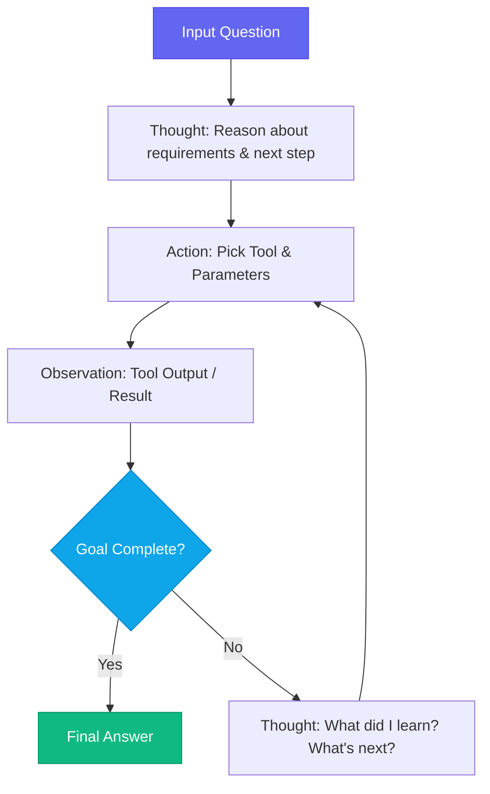

# Advanced Prompt Engineering: Chain-of-Thought, ReAct, and Structured Output

Every engineer who's shipped an LLM-powered feature has a moment. The demo worked perfectly. The system prompt was clean. Then a real user typed something slightly unexpected and the model returned a half-formed JSON object wrapped in an apology. That's the gap between "prompting" and "prompt engineering."

This guide covers the patterns that actually hold up under production traffic — the ones I've stress-tested across GPT-4o, Claude 3.5, and Gemini 1.5 Pro.

---

## Why Prompt Engineering Is a Discipline, Not a Trick

The common mistake is treating prompts as static configuration. In production, a prompt is closer to a contract: it specifies inputs, constraints, output format, and failure modes. When the contract is vague, the model improvises. When it improvises, your downstream parser breaks.

The three pillars of robust prompt design:

- **Reasoning structure** — how you ask the model to think before it answers
- **Output constraints** — what you ask the model to produce and exactly how
- **Negative specifications** — explicitly telling the model what *not* to do

All three are required. Two out of three is why your production system occasionally halluculates a markdown header inside your JSON response.

---

## 1. Chain-of-Thought (CoT) Prompting

Chain-of-thought prompting forces the model to externalize its reasoning before committing to an answer. This dramatically improves accuracy on multi-step tasks by giving the model scratch space to work through logic.

The pattern:

```python
SYSTEM = """
You are a senior software engineer specializing in TypeScript and distributed systems.

When answering any technical question, follow this exact reasoning structure:

1. UNDERSTAND: Restate what the user is asking in one sentence.
2. CONSTRAINTS: List any technical constraints you're working within.
3. APPROACH: Explain your solution strategy in 2-3 sentences.
4. ANSWER: Provide the actual code, configuration, or explanation.
5. CAVEATS: Note any edge cases or limitations of your answer.

Always complete all 5 steps before giving your final answer.
"""

USER = "How do I implement optimistic updates with React's useOptimistic hook when the server action fails?"
```

The step structure does something critical: it prevents the model from pattern-matching to a common answer. By forcing it to articulate constraints first, you get answers that acknowledge the *specific* technical context rather than the average of its training data.

**When to use CoT:** Complex reasoning tasks, multi-step logic, code generation where correctness matters more than speed.

**When to skip it:** Simple lookups, classification tasks, structured data extraction where schema adherence matters more than reasoning.

---

## 2. The ReAct (Reasoning + Acting) Pattern

ReAct is the prompting backbone of most production AI agents. It structures the model's output into alternating Thought → Action → Observation cycles.



Here's how to implement the ReAct prompt structure in Python with the OpenAI API:

```python
import json
import openai

REACT_SYSTEM_PROMPT = """
You are a research agent. To answer a question, use this exact format:

Thought: [What do you know? What do you need to find out?]
Action: [Tool name and arguments as JSON, e.g. {"tool": "search", "query": "Next.js 16 turbopack docs"}]
Observation: [You will receive tool output here]
... (repeat Thought/Action/Observation as needed)
Final Answer: [Your complete, grounded answer]

IMPORTANT:
- Never skip the Thought step.
- Never make up Observations — wait for real tool output.
- If you reach Final Answer, stop immediately.
"""

def run_react_agent(question: str, tools: dict, max_iterations: int = 8) -> str:
    messages = [
        {"role": "system", "content": REACT_SYSTEM_PROMPT},
        {"role": "user", "content": question},
    ]
    
    for _ in range(max_iterations):
        response = openai.chat.completions.create(
            model="gpt-4o",
            messages=messages,
            stop=["Observation:"],  # Stop before hallucinating tool output
        )
        
        assistant_text = response.choices[0].message.content
        messages.append({"role": "assistant", "content": assistant_text})
        
        if "Final Answer:" in assistant_text:
            return assistant_text.split("Final Answer:")[-1].strip()
        
        # Parse the Action and execute the real tool
        action_line = [l for l in assistant_text.split("\n") if l.startswith("Action:")]
        if action_line:
            action_json = action_line[0].replace("Action:", "").strip()
            action = json.loads(action_json)
            tool_name = action.pop("tool")
            
            observation = tools[tool_name](**action)
            messages.append({
                "role": "user",
                "content": f"Observation: {observation}"
            })
    
    return "Agent reached maximum iterations without completing the task."
```

The `stop=["Observation:"]` parameter is the key trick here. Without it, the model will generate its own fake tool output and you'll never know. By stopping before that token, you force it to wait for real execution results.

---

## 3. Enforcing Deterministic JSON Output

Getting consistent JSON from an LLM is one of the most practically valuable prompt engineering skills. Here's what I've learned from shipping this in production across multiple models.

### Approach A: Schema + Negative Constraints (Works 85% of the time)

```python
EXTRACTION_PROMPT = """
Extract key entities from the input text. Return ONLY a valid JSON object.

Rules:
- Do NOT include Markdown backticks or code fences
- Do NOT add any commentary, explanation, or text before/after the JSON
- Do NOT include keys not listed in the schema
- Use null for missing optional fields, never omit them

JSON Schema (strict):
{
  "name": string,            // Full name if present, else null
  "role": string,            // Job title or role if present, else null  
  "confidence": number,      // Float between 0.0 and 1.0
  "tags": string[]           // Array of relevant keywords, minimum 1
}

Input Text: "Asutosh Sidhya is an AI engineer specializing in Next.js and LangGraph."
"""
```

### Approach B: OpenAI Structured Outputs (Works 99.9% of the time)

When you need guaranteed schema adherence, use the `response_format` API with a JSON Schema:

```python
from pydantic import BaseModel
import openai

class EntityExtraction(BaseModel):
    name: str | None
    role: str | None
    confidence: float
    tags: list[str]

client = openai.OpenAI()

response = client.beta.chat.completions.parse(
    model="gpt-4o-2024-08-06",
    messages=[
        {"role": "system", "content": "Extract entity information from the text."},
        {"role": "user", "content": "Asutosh Sidhya is an AI engineer specializing in Next.js and LangGraph."}
    ],
    response_format=EntityExtraction,
)

entity = response.choices[0].message.parsed
print(entity.name)       # "Asutosh Sidhya"
print(entity.confidence) # 0.97
print(entity.tags)       # ["AI", "Next.js", "LangGraph"]
```

Use Approach A when you need cross-model compatibility (works with Anthropic Claude and Google Gemini). Use Approach B when you're locked to OpenAI and need absolute reliability.

---

## 4. Few-Shot Prompting for Format Adherence

Few-shot examples are the most underutilized tool in most engineers' prompt toolbox. They communicate format expectations far more reliably than instructions alone.

```python
FEW_SHOT_CLASSIFIER = """
Classify the sentiment of a customer support ticket as one of: positive, negative, neutral.
Respond with ONLY the label — no explanation, no punctuation.

Examples:
Ticket: "Your product is absolutely amazing, saved me hours!"
Label: positive

Ticket: "I've been waiting 3 weeks and my order never arrived."
Label: negative

Ticket: "Can you confirm what payment methods are accepted?"
Label: neutral

Now classify this ticket:
Ticket: "{ticket_text}"
Label:"""
```

Three rules for effective few-shot examples:

1. **Include at least one example of each class/format** — the model will extrapolate from what you show it
2. **Make edge cases explicit** — if a neutral ticket could be mistaken for negative, show one
3. **Keep examples realistic** — toy examples drawn from training data patterns underperform on real-world inputs

---

## 5. Prompt Versioning and Evaluation

The most overlooked production practice: treat prompts like code.

```python
import hashlib
import json
from datetime import datetime

class PromptVersion:
    def __init__(self, template: str, model: str, version: str):
        self.template = template
        self.model = model
        self.version = version
        self.hash = hashlib.md5(template.encode()).hexdigest()[:8]
    
    def format(self, **kwargs) -> str:
        return self.template.format(**kwargs)
    
    def to_dict(self) -> dict:
        return {
            "version": self.version,
            "model": self.model,
            "hash": self.hash,
            "timestamp": datetime.utcnow().isoformat(),
        }

# Log every prompt invocation with its version
def log_prompt_call(prompt_version: PromptVersion, input_vars: dict, output: str):
    record = {
        **prompt_version.to_dict(),
        "input": input_vars,
        "output": output,
        "output_length": len(output),
    }
    # Send to your observability platform (Langfuse, Helicone, etc.)
    print(json.dumps(record))
```

This lets you run A/B tests across prompt versions, catch regressions when the model API updates, and attribute production failures to specific prompt changes.

---

## Key Takeaways

> [!TIP]
> Always provide **negative constraints** ("Do NOT include headers", "Do NOT add commentary") alongside positive instructions. LLMs optimize for helpfulness by default — explicit negatives override that tendency.

> [!NOTE]
> Use `stop` sequences to prevent the model from hallucinating tool outputs in ReAct loops. The most common agent bug is the model generating fake `Observation:` content instead of waiting for real execution.

> [!IMPORTANT]
> For any production endpoint requiring structured output, use OpenAI's `response_format` with Pydantic models. Manual JSON parsing with error handling adds 200+ lines of defensive code you don't need to write.

**The hierarchy of reliability:** Structured Outputs API > Few-shot + Schema + Negatives > Schema alone > "Return JSON" instructions alone.

In the next post, we'll use these patterns to build the retrieval pipeline for a production RAG system.
