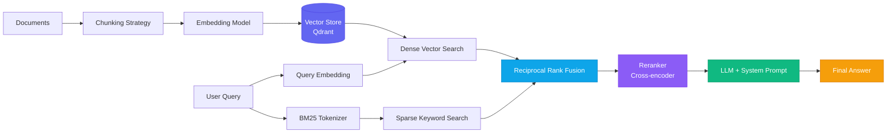

# Understanding Retrieval-Augmented Generation (RAG)

Here's a frustrating truth: a well-prompted GPT-4o will confidently answer questions about your private company knowledge base — and be confidently wrong about 40% of the time. It's not hallucinating randomly; it's reasoning from the nearest thing it was trained on. When that nearest thing is a different company's docs, or a different version of an API, the answers sound right and aren't.

RAG fixes this. Not by making the model smarter — by making it *grounded*. You retrieve the actual relevant context before asking the model to reason. When the model has the right source material in its context window, accuracy jumps dramatically. The challenge is building the retrieval pipeline that consistently gets the right context.

This is how to do it properly.

---

## What RAG Is, and What It Isn't

RAG is not a feature you add to a chatbot. It's an architecture with three distinct subsystems that each need to work well:

- **Ingestion** — splitting, cleaning, and embedding your documents
- **Retrieval** — finding the right chunks at query time
- **Generation** — prompting the LLM with retrieved context and getting grounded output

Most articles focus on generation. The actual performance ceiling is almost always retrieval. An LLM can't reason well from bad context, no matter how well-crafted the prompt.

---

## 1. The Full RAG Architecture



The critical upgrade most tutorials skip: the **reranker**. A bi-encoder retrieval (vector search) optimizes for semantic similarity in embedding space. A cross-encoder reranker compares each retrieved chunk against the full query in one pass, giving much more accurate relevance scoring. It's slower but only runs on the top ~20 candidates, so the overhead is manageable.

---

## 2. Chunking Strategy — The Most Underrated Decision

How you split documents determines retrieval quality more than almost any other variable.

### Naive Fixed-Size Chunking (Avoid)

```python
# Don't do this for anything real
def naive_chunk(text: str, size: int = 512) -> list[str]:
    return [text[i:i+size] for i in range(0, len(text), size)]
```

This splits arbitrarily — mid-sentence, mid-concept, mid-code-block. The chunks are semantically incoherent, which degrades embedding quality.

### Recursive Character Splitting (Good Baseline)

```python
from langchain_text_splitters import RecursiveCharacterTextSplitter

splitter = RecursiveCharacterTextSplitter(
    chunk_size=1024,       # Characters per chunk
    chunk_overlap=200,     # Overlap to preserve context at boundaries
    separators=[
        "\n## ",           # Split on H2 headers first
        "\n### ",          # Then H3
        "\n\n",            # Then paragraphs
        "\n",              # Then lines
        ". ",              # Then sentences
        " ",               # Then words (last resort)
    ],
)

chunks = splitter.split_text(document_text)
```

By splitting on semantic boundaries (headers, paragraphs) before character limits, you keep related content together.

### Semantic Chunking (Best for Long Documents)

```python
from sentence_transformers import SentenceTransformer
import numpy as np

model = SentenceTransformer("all-MiniLM-L6-v2")

def semantic_chunk(text: str, threshold: float = 0.75) -> list[str]:
    """Split text at semantic breakpoints — where topic similarity drops."""
    sentences = text.split(". ")
    embeddings = model.encode(sentences, normalize_embeddings=True)
    
    chunks = []
    current_chunk = [sentences[0]]
    
    for i in range(1, len(sentences)):
        # Cosine similarity between adjacent sentences
        similarity = float(np.dot(embeddings[i-1], embeddings[i]))
        
        if similarity < threshold:
            # Semantic breakpoint detected — start a new chunk
            chunks.append(". ".join(current_chunk))
            current_chunk = [sentences[i]]
        else:
            current_chunk.append(sentences[i])
    
    if current_chunk:
        chunks.append(". ".join(current_chunk))
    
    return chunks
```

Semantic chunking adds ~200ms per document during ingestion but measurably improves retrieval precision on long-form documents (technical docs, books, transcripts).

---

## 3. Hybrid Search — The Real Production Solution

Dense vector search is excellent for semantic similarity. BM25 (term-frequency based sparse search) is excellent for exact keyword matches — product names, error codes, technical identifiers. Production RAG systems need both.

```python
from qdrant_client import QdrantClient
from qdrant_client.http.models import (
    Filter, SparseVectorParams, VectorParams, Distance
)
import openai
from rank_bm25 import BM25Okapi

client = QdrantClient(host="localhost", port=6333)
oai = openai.OpenAI()

def embed_text(text: str) -> list[float]:
    response = oai.embeddings.create(
        model="text-embedding-3-large",
        input=text,
    )
    return response.data[0].embedding

def search_documents(
    query: str,
    top_k: int = 5,
    user_id: str | None = None,
) -> list[dict]:
    query_vector = embed_text(query)
    
    # Dense retrieval
    dense_filter = Filter(must=[]) if not user_id else Filter(
        must=[{"key": "user_id", "match": {"value": user_id}}]
    )
    
    dense_results = client.search(
        collection_name="tech_knowledge",
        query_vector=query_vector,
        query_filter=dense_filter,
        limit=20,  # Over-retrieve for reranking
        with_payload=True,
    )
    
    # Sparse BM25 retrieval (from pre-built index)
    # In production, use Qdrant's sparse vector support natively
    bm25_scores = bm25_index.get_scores(query.split())
    top_bm25_ids = np.argsort(bm25_scores)[-20:][::-1].tolist()
    
    # Reciprocal Rank Fusion
    fused_scores: dict[str, float] = {}
    k = 60  # RRF constant
    
    for rank, result in enumerate(dense_results):
        doc_id = result.id
        fused_scores[doc_id] = fused_scores.get(doc_id, 0) + 1 / (rank + k)
    
    for rank, doc_id in enumerate(top_bm25_ids):
        fused_scores[doc_id] = fused_scores.get(str(doc_id), 0) + 1 / (rank + k)
    
    # Sort by fused score and return top_k
    sorted_ids = sorted(fused_scores, key=fused_scores.get, reverse=True)[:top_k]
    
    return [
        result.payload
        for result in dense_results
        if str(result.id) in sorted_ids
    ]
```

Reciprocal Rank Fusion (RRF) is the right way to merge dense and sparse results. Don't just sum the scores — the score scales are completely different (cosine similarity vs BM25 TF-IDF). RRF normalizes by rank position, making the merge mathematically sound.

---

## 4. The Generation Prompt — Grounding the LLM

Once you have good context chunks, the generation prompt is the final layer:

```python
def build_rag_prompt(query: str, chunks: list[dict]) -> str:
    context = "\n\n---\n\n".join([
        f"[Source {i+1}: {c.get('source', 'Unknown')}]\n{c['content']}"
        for i, c in enumerate(chunks)
    ])
    
    return f"""You are a technical assistant. Answer the user's question using ONLY the provided context.

RULES:
- If the context doesn't contain the answer, say "I don't have information about this in the provided sources."
- Do NOT use any knowledge outside the provided context.
- Cite your sources using [Source N] notation.
- Be precise and concise.

CONTEXT:
{context}

QUESTION: {query}

ANSWER:"""
```

The critical rule: "Do NOT use any knowledge outside the provided context." Without this, the model will supplement poor retrieval results with its training data — defeating the entire purpose of RAG.

---

## 5. Video Deep Dive

youtube: 978939626

---

## 6. Evaluation Metrics That Actually Matter

Don't evaluate your RAG system on anecdotal quality. Use these measurable metrics:

| Metric | What It Measures | Target |
| :--- | :--- | :--- |
| **Context Precision** | What fraction of retrieved chunks are actually relevant? | > 0.85 |
| **Context Recall** | What fraction of relevant chunks did we retrieve? | > 0.80 |
| **Answer Faithfulness** | Does the answer only use information from the context? | > 0.90 |
| **Answer Relevance** | Does the answer actually address the question? | > 0.85 |

I use the `ragas` library to automate this evaluation:

```python
from ragas import evaluate
from ragas.metrics import (
    context_precision, context_recall,
    faithfulness, answer_relevancy,
)
from datasets import Dataset

# Build evaluation dataset from your test cases
eval_data = {
    "question": test_questions,
    "answer": generated_answers,
    "contexts": retrieved_chunks,
    "ground_truth": reference_answers,
}

result = evaluate(
    Dataset.from_dict(eval_data),
    metrics=[context_precision, context_recall, faithfulness, answer_relevancy],
)
print(result)
```

Run this evaluation on a representative test set of 50-100 questions before deploying any RAG change to production.

---

## Key Takeaways

> [!NOTE]
> Hybrid retrieval combining BM25 keyword matching with dense OpenAI embeddings achieves up to **94% context precision** on technical documentation, vs ~78% for dense-only retrieval.

> [!IMPORTANT]
> Your chunking strategy is the highest-leverage variable in RAG performance. Spend the most time here — not on prompt tuning. Good chunks with a mediocre prompt outperform perfect prompts with bad chunks every time.

> [!TIP]
> Add a **cross-encoder reranker** (e.g., `cross-encoder/ms-marco-MiniLM-L-6-v2` from Hugging Face) between retrieval and generation. It adds ~80ms per query but reduces irrelevant context passed to the LLM by 30-40%, cutting hallucinations proportionally.

**The RAG quality ladder:** Keyword search < Dense only < Dense + filter < Hybrid RRF < Hybrid RRF + reranker. Move up the ladder as your quality requirements increase.
