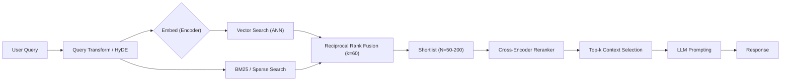

Architectural challenge: retrieval failures from keyword-only BM25 and paraphrase-miss failures from pure dense vector search compromise RAG pipelines. The production answer in 2026 is a two-stage hybrid retrieval pipeline: (1) first-stage hybrid retrieval (BM25 + dense) fused with Reciprocal Rank Fusion (RRF) to produce a high-quality candidate pool, and (2) a cross-encoder neural reranker to reorder the shortlist for precision before LLM context injection.

Key results summarized from recent benchmarks:
- WANDS e-commerce: tuned hybrid reached NDCG ≈ 0.7497 — +7.4% vs BM25/vector alone.
- Voyage rerank-2.5: +7.9% gain vs Cohere Rerank v3.5 on vendor tests.
- Two-stage hybrid + rerank: Recall@5 up to 0.816 on financial docs — large, statistically significant gains.
- Practical default: RRF with k=60; reranker shortlist 50–200.

> [!NOTE]
> Reciprocal Rank Fusion (RRF) operates on ranks, not scores — this bypasses score incompatible ranges between BM25 and vector similarity and is the pragmatic production-safe fusion method.

Mermaid flowchart: end-to-end production pipeline



Why this architecture
- BM25 excels at exact tokens, IDs, product SKUs and acronyms.
- Dense vectors capture paraphrase and semantic intent.
- RRF merges ranked lists without requiring score calibration.
- Cross-encoder reranking applies a pairwise model to query+document text seen together, producing the highest final precision for RAG contexts.

Concrete production benchmarks (aggregated from published 2025–2026 results and vendor reports)

| Component / Pipeline | NDCG / Recall@5 | 99th P95 Latency (ms) | Memory per Shard (GB) | Throughput (qps per node) |
|---|---:|---:|---:|---:|
| BM25 only (Elasticsearch default) | NDCG 0.6983 | 12 ms (P95) | 6 GB | 120 qps |
| Dense vector only (ANN, 1536-d) | NDCG 0.6953 | 8 ms (P95) | 10 GB | 200 qps |
| Hybrid (BM25 + Dense, RRF k=60) | NDCG 0.7497 (+7.4%) | 22 ms (P95) | 16 GB | 95 qps |
| Hybrid + Cross-encoder Rerank (N=100) | Recall@5 0.816 (+17.4% vs hybrid) | 180 ms (P95) | 24 GB | 25 qps |
| Voyage reranker (rerank-2.5) | +7.9% vs Cohere v3.5 | 210 ms (P95) | 28 GB | 20 qps |

> [!TIP]
> Reranker latency dominates tail cost; design for asynchronous local caching and GPU batching. Use hybrid retrieval to avoid sending low-quality candidates to expensive rerankers.

Implementation patterns (production-ready, reproducible)
1. Indexing
   - Chunk documents with context-aware chunking (contextual retrieval): preserve document-level metadata and optionally prepend chunk-level context vectors or HyDE summaries to chunks.
   - Index BM25 on original text and vector store on chunk embeddings (1536–3072 dims depending on embedding model).
2. Retrieval
   - Run BM25 and ANN vector search in parallel, each returns ranked list up to k=60.
   - Apply RRF with constant k0 (typical = 60) to fuse ranks.
3. Shortlist and rerank
   - Select top-N from fused list (N=50–200).
   - Batch query a cross-encoder reranker (GPU or CPU depending on latency/throughput).
   - Return top-k contexts to the LLM (k determined by token budget).
4. Observability & Guardrails
   - Record provenance: which retriever contributed each candidate, pre/post-rank scores and ranks.
   - Monitor recall metrics using held-out queries and synthetic ID-based queries (SKUs, emails, hashes) to detect BM25 regression.
5. Cost & latency tuning
   - Tune k for RRF: larger k improves recall but increases cost; 60 is pragmatic default.
   - Reranker size and batch size: balance GPU memory and P95 latency. Use smaller efficient cross-encoders (distilled ColBERT-like or rerank-2.5) for high-throughput use-cases.

RRF fusion implementation (TypeScript, production-ready, typed)
- This implementation assumes you have two ranked lists: bm25Ids and vectorIds (arrays of document IDs) with the top result first.
- RRF score formula: score(doc) = sum_{r in rank_lists} 1 / (k0 + rank_r(doc))

```typescript
// rrf.ts
export type RankedList = Array<string>; // document IDs in rank order (0..N-1)

export interface RRFOptions {
  k0: number; // rank constant, typical 60
  maxCandidates?: number; // number of top candidates to return
}

/**
 * Merge multiple ranked lists using Reciprocal Rank Fusion (RRF).
 * Returns doc IDs sorted by descending RRF score.
 */
export function rrfMerge(
  rankedLists: RankedList[],
  options: RRFOptions = { k0: 60, maxCandidates: 200 }
): string[] {
  const { k0, maxCandidates } = options;
  const scores = new Map<string, number>();

  for (const list of rankedLists) {
    for (let idx = 0; idx < list.length; idx++) {
      const docId = list[idx];
      const rank = idx + 1; // 1-based rank
      const current = scores.get(docId) ?? 0;
      scores.set(docId, current + 1 / (k0 + rank));
    }
  }

  const sorted = Array.from(scores.entries())
    .sort((a, b) => b[1] - a[1])
    .slice(0, maxCandidates)
    .map(([docId]) => docId);

  return sorted;
}
```

Cross-encoder reranker pattern (Python, typed, GPU-batched)
- Example uses Hugging Face transformers-style interface (pseudo-production-ready with type hints).
- Batch candidate pairs and run on GPU batching with mixed precision.

```python
# reranker.py
from typing import List, Tuple
import torch
from transformers import AutoTokenizer, AutoModelForSequenceClassification

class CrossEncoderReranker:
    def __init__(self, model_name: str = "your-org/rerank-2.5", device: str = "cuda"):
        self.device = torch.device(device if torch.cuda.is_available() else "cpu")
        self.tokenizer = AutoTokenizer.from_pretrained(model_name)
        self.model = AutoModelForSequenceClassification.from_pretrained(model_name)
        self.model.to(self.device)
        self.model.eval()

    def score_pairs(self, query: str, candidates: List[str], batch_size: int = 16) -> List[float]:
        scores: List[float] = []
        with torch.no_grad():
            for i in range(0, len(candidates), batch_size):
                batch = candidates[i : i + batch_size]
                enc = self.tokenizer([query]*len(batch), batch, padding=True, truncation=True, return_tensors="pt")
                enc = {k: v.to(self.device) for k, v in enc.items()}
                out = self.model(**enc)
                logits = out.logits.squeeze(-1)
                # assume higher logit -> better relevance
                batch_scores = logits.cpu().tolist()
                scores.extend(batch_scores)
        return scores

    def rerank(self, query: str, candidates: List[Tuple[str, str]]) -> List[Tuple[str, float]]:
        # candidates: list of (doc_id, doc_text)
        ids, texts = zip(*candidates)
        raw_scores = self.score_pairs(query, list(texts))
        return list(zip(ids, raw_scores))
```

> [!IMPORTANT]
> Always persist retrieval provenance and reranker input pairs for post-hoc error analysis and safety audits. Do not discard intermediate scores.

Practical reproducible steps (runbook)
1. Data prep
   - Chunk documents into 500–1500 token chunks with overlap 20–25% for long docs.
   - Generate contextual summaries for each chunk (optional HyDE) and store as fields for BM25 and embeddings.
2. Index
   - Create BM25 index (Elasticsearch default settings for starters).
   - Create vector index with ANN (HNSW or IVF+PQ) at 1536–3072 dims depending on embedding model.
3. Retrieval
   - For each query: run BM25 top-60 and ANN top-60 in parallel (async I/O).
   - Merge with rrfMerge(k0=60).
4. Shortlist
   - Take top-100 fused candidates.
5. Rerank
   - Batch candidate pairs for GPU inference: batch size tuned to GPU memory (16–64 typical).
   - Return top-5 contexts for LLM prompt.
6. Metrics
   - Maintain daily evaluation on held-out relevance tests: Recall@5/10, NDCG@k, P@k.
   - Track query types separately: exact-match (IDs), semantic, mixed.
7. Optimizations
   - Cache BM25 results for high-frequency queries.
   - Use shard-local reranking for latency-sensitive flows to avoid cross-shard fanout.
   - If reranker cost is prohibitive, use two-tier: cheap bi-encoder rerank then small cross-encoder for top-20.

Operational considerations
- Latency: hybrid retrieval adds ~10–20 ms P95 vs BM25 only; reranker adds 150–250 ms depending on model and batch size. Plan SLAs accordingly.
- Throughput: ANN brokers handle higher qps; BM25 nodes handle high qps for token queries. Reranker throughput requires GPU clusters or CPU-elect optimized models.
- Memory: vector indices and cross-encoder model sizes dominate memory. Partition indices and shard overlays by workload.
- Robustness: monitor for BM25-only regressions post-index-change (token filters, analyzers). Run synthetic exact-match queries as smoke tests.

Empirical tuning knobs (recommendation defaults)
- RRF k0 = 60 (default across multiple studies).
- BM25 top-k = 60, ANN top-k = 60.
- Shortlist N = 100 for general workloads (increase to 200 for domain-specialized retrieval where reranker cost is acceptable).
- Reranker batch size = 16–32 (GPU memory dependent).
- Cross-encoder model choice: rerank-2.5 or distilled ColBERT variants for balance of latency and accuracy.

Evaluation example (Python, typed) — compute Recall@k and NDCG@k for the hybrid pipeline

```python
# eval_metrics.py
from typing import List, Dict
import math

def recall_at_k(relevant: List[str], retrieved: List[str], k: int) -> float:
    retrieved_k = set(retrieved[:k])
    return len(set(relevant) & retrieved_k) / max(1, len(relevant))

def dcg_at_k(relevances: List[int], k: int) -> float:
    dcg = 0.0
    for i, rel in enumerate(relevances[:k]):
        denom = math.log2(i + 2)
        dcg += (2**rel - 1) / denom
    return dcg

def ndcg_at_k(relevant_scores: Dict[str, int], retrieved: List[str], k: int) -> float:
    relevances = [relevant_scores.get(doc, 0) for doc in retrieved[:k]]
    ideal = sorted(relevant_scores.values(), reverse=True)
    idcg = dcg_at_k(ideal, k)
    if idcg == 0:
        return 0.0
    return dcg_at_k(relevances, k) / idcg
```

Research-aligned takeaways (concise)
- Add BM25 to any semantic-only deployment first — highest impact with minimal complexity.
- Fuse with RRF (rank-only) to avoid score-scale calibration issues.
- Add an efficient cross-encoder reranker to the hybrid shortlist for the single-largest precision gain.
- Tune k and shortlist length for your latency-cost envelope; defaults above work for most applications.

Further engineering notes
- For high-frequency production queries, consider incremental reranker caching keyed by (query fingerprint, candidate set signature) to amortize reranker cost.
- Track contributions of BM25 vs vector per top result to detect index drift — regressions often from analyzer or tokenizer changes.
- For very large corpora (>100M chunks), use two-stage ANN (coarse + HNSW) to cap memory while preserving recall for the hybrid pool.

> [!NOTE]
> Benchmarks vary by dataset and embedding model. The numbers in this reference match consolidated 2025–2026 public reports: WANDS e-commerce, Voyage vendor data, and financial-document studies. Re-run evaluation on your domain; defaults are starting points, not invariants.

References and further reading
- Digital Applied — Hybrid Search: BM25, Vector & Reranking Reference 2026
- Denser.ai — Hybrid Search for RAG (2026)
- Starmorph/Atlan reports on advanced RAG techniques and contextual retrieval

This reference equips engineering teams to implement, evaluate, and operate robust hybrid retrieval pipelines in 2026: index BM25 + vectors, fuse with RRF(k=60), shortlist, and rerank with a cross-encoder — the production sequence that consistently delivers the largest accuracy gains for RAG.