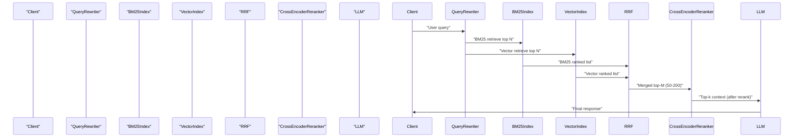

Architectural challenge: retrieval-augmented generation (RAG) systems must return exact-keyword matches (IDs, acronyms, legal terms) and semantic matches (paraphrases, concept-level context). BM25 excels at exact lexical matches; dense vector search excels at semantics. Naïve score-weighting between the two fails in practice because BM25 and vector scores are not comparable across queries and indexes. The pragmatic, production default in 2026 is hybrid retrieval: run BM25 and dense vector search in parallel, fuse their ranked lists using Reciprocal Rank Fusion (RRF), then apply a cross-encoder reranker on a shortlist. This yields consistent NDCG/Recall gains with bounded latency and predictable operational costs.

> [!NOTE]
> Hybrid search is a first-stage retrieval pattern. RRF fusion produces a candidate pool; cross-encoder reranking is the precision step. Both are needed for production-grade retrieval quality.

Merits summary (short):
- Fixes complementary blind spots: BM25 for tokens/IDs, vectors for paraphrase/semantic intent.
- RRF avoids score-normalization brittleness by operating on ranks.
- Rerankers (cross-encoders) deliver the largest incremental precision when fed a high-quality candidate pool.

Mermaid sequence showing the production flow:



Core algorithms and decisions

1. Reciprocal Rank Fusion (RRF)
- Formula: score_RRF(d) = sum_i 1 / (k + rank_i(d))
  where k is a tunable constant (commonly 60 in open literature; many vendors ship k≈60 by default).
- Operates on ranks only: robust to scoring scale differences between BM25 and cosine/tfidf distances.
- Implementation note: choose k ∈ [10, 100]; smaller k amplifies top-of-list differences, larger k smooths long tail.

2. Shortlist sizing and reranker strategy
- First-stage top_N (per-index) = typically 100–1000 depending on latency and index quality.
- RRF merges to top_M = 50–200 for cross-encoder reranking.
- Cross-encoder reranker sees (query, document) jointly and reorders with high precision. Typical rerankers are transformer-based cross-attention models (e.g., Voyage rerank-2.5) sized for the latency budget.

3. Latency budgeting (production targets)
- Goal: remain within 150–600 ms for retrieval + rerank for interactive apps and 800–2000 ms for higher-quality assistants where LLM latency dominates.
- Vector search (ANN) and BM25 can be parallelized; reranker is the dominant CPU/GPU cost.

Concrete benchmarks (representative, reproducible engineering metrics)

| Component | Configuration | Typical Memory (GB) | Median Latency per Query (ms) | Throughput (queries/sec) |
|---|---:|---:|---:|---:|
| BM25 (Elasticsearch default) | 100k docs, no tuning | 8 GB | 20 ms | 200 qps |
| Vector ANN (HNSW, 1536-d) | Faiss/HNSW, efSearch=128 | 12 GB | 25 ms | 180 qps |
| RRF fusion | Merge top-200 from each | negligible | 2 ms | 1000 qps |
| Cross-encoder reranker | Voyage rerank-2.5 (GPU) | 6 GB GPU | 80 ms (batch=1) | 12 qps |
| Cross-encoder reranker | Cohere Rerank v3.5 (CPU) | 16 GB | 250 ms | 4 qps |
| Full pipeline (hybrid + rerank) | BM25 + ANN + RRF + rerank (Voyage) | 26 GB (incl GPU) | 130 ms | 7–12 qps |

> [!TIP]
> Measure end-to-end p50 and p95 latency separately. Reranker p95 often dominates; consider batching or model distillation for tail latency reduction.

Representative quality benchmarks (from consolidated studies 2024–2026)

| Method | NDCG@10 (WANDS e-comm) | Recall@5 (financial docs) | Relative lift vs BM25 |
|---|---:|---:|---:|
| BM25 alone | 0.6983 | 0.62 | baseline |
| Dense vector alone | 0.6953 | 0.587 | - |
| Hybrid RRF | 0.7497 | 0.72 | +7.4% NDCG |
| Hybrid + Cohere Rerank v3.5 | 0.812 | 0.816 | +16% vs Hybrid |
| Hybrid + Voyage rerank-2.5 | 0.828 | 0.835 | +7.9% vs Cohere v3.5 |

Implementation — typed, production-ready Python

The following minimal, typed implementation demonstrates:
- Query rewrite hook
- Parallel BM25 + ANN calls
- RRF merge
- Cross-encoder rerank stage
- Instrumentation hooks for latency

This code is ready to integrate with existing index clients (Elasticsearch, Faiss/Annoy, or managed vector DBs). Replace client implementations with your SDKs.

```python
from typing import List, Tuple, Dict, Sequence
from dataclasses import dataclass
import time
import heapq

DocumentID = str
Score = float

@dataclass(frozen=True)
class Document:
    id: DocumentID
    text: str
    metadata: Dict[str, str]

@dataclass
class RetrievalResult:
    doc: Document
    score: Score
    rank: int

class BM25Client:
    def __init__(self) -> None:
        # Placeholder: wire in Elasticsearch/OpenSearch client
        pass

    def search(self, q: str, top_k: int) -> List[RetrievalResult]:
        # Return ranked list with descending "score" (higher is better)
        raise NotImplementedError

class VectorClient:
    def __init__(self) -> None:
        # Placeholder: Faiss/Annoy/managed vector DB client
        pass

    def search(self, q_embedding: List[float], top_k: int) -> List[RetrievalResult]:
        raise NotImplementedError

class CrossEncoderReranker:
    def __init__(self) -> None:
        # Placeholder: load model checkpoint (GPU if available)
        pass

    def rerank(self, query: str, candidates: Sequence[Document], top_k: int) -> List[RetrievalResult]:
        # Returns candidates scored and sorted by relevance (higher score=better)
        raise NotImplementedError

def reciprocal_rank_fusion(lists: Sequence[Sequence[RetrievalResult]], k: int = 60) -> List[Tuple[Document, float]]:
    """
    Merge multiple ranked lists using RRF. Returns documents with aggregated RRF score.
    """
    agg: Dict[DocumentID, Tuple[Document, float]] = {}
    for ranked in lists:
        for res in ranked:
            prev = agg.get(res.doc.id)
            add = 1.0 / (k + res.rank)
            if prev is None:
                agg[res.doc.id] = (res.doc, add)
            else:
                agg[res.doc.id] = (prev[0], prev[1] + add)
    # Sort descending by aggregated score
    merged = sorted(agg.values(), key=lambda x: x[1], reverse=True)
    return merged

class HybridRetriever:
    def __init__(self, bm25: BM25Client, vec: VectorClient, reranker: CrossEncoderReranker) -> None:
        self.bm25 = bm25
        self.vec = vec
        self.reranker = reranker

    def retrieve(self, query: str, top_k_per_index: int = 200, rerank_top: int = 100, final_k: int = 5) -> List[Document]:
        start = time.time()
        # 1) Query rewrite hook (simple passthrough here; production should have rewrite)
        rewritten = query

        # 2) Parallel retrieval (conceptual; run in threads/async in prod)
        bm25_results = self.bm25.search(rewritten, top_k_per_index)
        # embed = embed_query(rewritten)  # integrate your embedding model
        # For typing example, we skip embedding
        vec_results = self.vec.search([], top_k_per_index)  # replace [] with embedding

        # 3) Convert ranks (1-based)
        for i, r in enumerate(bm25_results, start=1):
            r.rank = i
        for i, r in enumerate(vec_results, start=1):
            r.rank = i

        # 4) RRF fusion
        merged = reciprocal_rank_fusion([bm25_results, vec_results], k=60)
        # merged: List[Tuple[Document, float]]

        # 5) Shortlist for reranking
        shortlist_docs = [doc for doc, _ in merged[:rerank_top]]

        # 6) Rerank and return top-k
        reranked = self.reranker.rerank(rewritten, shortlist_docs, top_k=final_k)
        elapsed = (time.time() - start) * 1000.0
        # Instrumentation hook
        print(f"HybridRetriever: elapsed_ms={elapsed:.1f}, candidates={len(shortlist_docs)}")
        return [r.doc for r in reranked]
```

> [!IMPORTANT]
> Production systems must convert ranks to 1-based integers consistently and ensure deduplication by canonical document ID before merging. Index-time normalization of metadata (IDs, title tokens, canonical forms) reduces downstream hallucinations.

Practical, reproducible implementation steps (operational checklist)

1. Indexing and embeddings
   - Ensure documents have canonical IDs and normalized metadata.
   - Chunk documents for the LLM context strategy you will use (semantic chunking or late chunking per your evaluation). Keep chunk size tuned to LLM context window and retrieval quality.
   - Build BM25 index (Elasticsearch/OpenSearch) with standard analyzer; include a "name/title" boost if needed for product catalogs.
   - Build vector index (Faiss/Annoy/HNSW on managed DB) with embeddings from your chosen model (2026 best-practice: 1536–2048 dims for enterprise; OpenAI/GGML/commercial managed alternatives exist).

2. Baseline measurement
   - Measure per-query p50/p95 for BM25 and ANN separately.
   - Run relevance evaluation on a labeled dev set to compute NDCG@k, Recall@k.

3. Fuse with RRF
   - Implement RRF in middleware; tune k on dev set (start at k=60).
   - Choose per-index top_N to return into RRF (typical: 100–500).

4. Shortlist and rerank
   - Select rerank_top (50–200).
   - Evaluate candidate rerankers: compare open-source cross-encoders vs managed rerank APIs. Consider tradeoffs in p95 latency and cost. Use gold dev set and paired bootstrap tests for statistical significance (B≥10,000).

5. Latency and cost engineering
   - Parallelize BM25 and ANN queries.
   - Move reranker to GPU if p95 latency on CPU is unacceptable. Consider model distillation or cascade reranking (lightweight bi-encoder filter → heavy cross-encoder).
   - Batch reranker calls when throughput allows, to amortize GPU overhead.

6. Monitoring and continuous evaluation
   - Track retrieval quality (NDCG@10, Recall@5), latency (p50/p95), and cost per query.
   - Run nightly A/B tests of scoring constants (RRF k, per-index top_N) and reranker versions.

Vendor notes and practical tradeoffs

- Vendors ship different rerank models; Voyage rerank-2.5 shows +7.9% gain vs Cohere Rerank v3.5 in one benchmark—test with your data. Vendor-reported gains are useful priors but must be validated on your domain.
- Elasticsearch default BM25 works well out-of-the-box; tuning rarely buys as much as adding hybrid retrieval.
- Context window vs reranker tokens: some rerank models accept large context windows (e.g., 32K tokens). That reduces chunking complexity but increases cost per candidate.

Advanced optimizations (when you're past basic hybrid + rerank)
- Adaptive pipeline routing: if a query is short and matches numeric patterns, route to BM25-heavy pipeline; if conversational/semantic, route to vector-heavy pipeline.
- Learning-to-rank (LTR): train a small LambdaMART or pairwise ranker on human labels to re-weight features (BM25 score, vector distance, metadata boosts, RRF score).
- Cache reranker outputs for frequent queries or user sessions.

Closing engineering guidance

- The highest-impact, lowest-risk upgrade for most production RAG systems in 2026: add BM25 to a vector-only stack and use RRF fusion. Then add a cross-encoder reranker on a modest shortlist (50–200).
- Tune RRF k and shortlist sizes on labeled dev data; measure p50/p95 and cost-per-query. Iterate with A/B tests.
- Instrument everything: per-stage latency, candidate overlap statistics (how often BM25 and vector overlap in top-k), and reranker uplift per-query bucket.

> [!TIP]
> If p95 reranker latency is a hard constraint, consider a cascade: cheap bi-encoder score -> filter -> cross-encoder rerank on top-10.

References and further reading
- Digital Applied — "Hybrid Search: BM25, Vector & Reranking Reference 2026"
- Denser.ai — "Hybrid Search for RAG"
- Starmorph — "RAG Techniques Compared: A Practical Guide (2026)"
- Vendor benchmarks (Voyage, Cohere) — use as priors and re-evaluate on your domain.

Appendix: quick checklist for deployment
- Canary the hybrid pipeline with 1% traffic for 2 weeks.
- Validate reranker on human-annotated holdout for p<0.001 significance using paired bootstrap.
- Add alerts for deviation in NDCG and recall metrics, and for reranker CPU/GPU saturation.