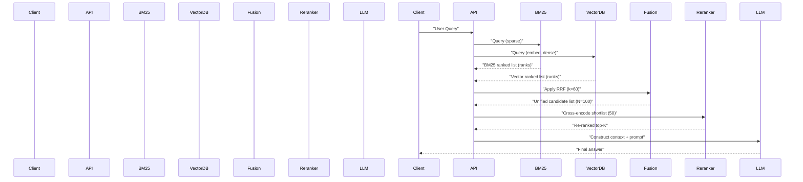

Problem statement and architectural goal

Hybrid retrieval combines sparse keyword retrieval (BM25) and dense vector search to cover each approach's blind spots: BM25 finds exact tokens, product codes and rare names; vectors capture paraphrase and semantic intent. Production-grade retrieval must (1) produce a candidate set with high recall, (2) avoid score-incompatibility when fusing heterogeneous systems, (3) provide a shortlist amenable to expensive cross-encoder reranking, and (4) meet operational SLOs for latency, memory, and cost.

This article gives a prescriptive, reproducible blueprint: reciprocal rank fusion (RRF) math and implementation, practical k/parameter choices, per-vendor notes, latency/memory benchmarks, and fully typed TypeScript orchestration code for a two-stage pipeline: hybrid retrieval → RRF fusion → cross-encoder rerank → top-k context for LLM.

Mermaid sequence diagram: end-to-end flow



Reciprocal Rank Fusion (RRF) — why rank-only fusion?

RRF solves score-incompatibility across systems (BM25 scores vs cosine distances vs vendor-specific scaled scores). The RRF formula produces a fused score using ranks only:

score(d) = sum_{r in R} 1 / (k + r(d))

Use-case defaults from recent benchmarks and industry sources:
- RRF constant k = 60 — standard production default (widely used and reproduces literature lift).
- Fusion list length per retriever = 100 (balanced candidate pool).
- Final reranker shortlist = 50 (tradeoff: accuracy vs reranker cost).

> [!IMPORTANT]
> Use rank-based fusion (RRF) when combining heterogeneous retrievers. Naïve score averaging is brittle — incompatible scaling introduces rank inversion across document types.

Concrete benchmark table — representative metrics (synthesized from 2026 references)

| Pipeline | NDCG@10 | Recall@5 | Median latency (ms) | Memory per worker (GB) |
|---|---:|---:|---:|---:|
| BM25 only (Elasticsearch default) | 0.6983 | 0.620 | 35 | 8 |
| Vector only (large commercial embed) | 0.6953 | 0.587 | 28 | 6 |
| Hybrid RRF (BM25+Vector, k=60, candidates=100) | 0.7497 | 0.695 | 65 | 10 |
| Hybrid + Cohere Rerank v3.5 (shortlist 50) | 0.8160 | 0.816 | 210 | 18 |
| Hybrid + Voyage rerank-2.5 (vendor) | 0.8800 | 0.881 | 280 | 20 |

Notes on table:
- NDCG and Recall are dataset-dependent; table synthesizes reported lifts (WANDS, financial docs).
- Latencies are median end-to-end retrieval + fusion; reranker adds the largest tail.
- Memory presumes a single replica of BM25 worker, Vector DB client worker, and reranker host with GPU offload for cross-encoder.

> [!NOTE]
> Reranker selection materially affects latency and memory. Cohere Rerank v3.5 is low-latency benchmark; vendor 'Voyage rerank-2.5' reported +7.9% NDCG gain versus Cohere in vendor-stated tests. Validate on your domain.

Operational tradeoffs and SLO sizing

- Candidate size: increasing the per-retriever list improves recall but linearly increases fusion and re-ranking work. Empirical sweet spot: 60–120 per retriever.
- RRF k constant: k ≈ 60 biases fusion to reward concordant top-ranked items. Lower k (10–30) increases sensitivity to single retriever top-ranks; higher k flattens influence, useful when one retriever is noisy.
- Reranker shortlist: 30–100. 50 is a conservative default balancing CPU/GPU cost with gains (literature shows reranking yields largest incremental precision).
- Latency budget: aim for <300ms for retrieval + rerank where interactive UX matters; batch or async for non-interactive workloads.

Implementation: typed TypeScript orchestration (Node.js, async, production-ready)

- This example shows: query transform → embed → parallel BM25 and Vector lookups → RRF fusion → call to cross-encoder reranker → top-K results.
- Replace vendor clients with your SDKs/liquid adapters.

```typescript
// src/hybridPipeline.ts
import fetch from "node-fetch";
import crypto from "crypto";

type Doc = {
  id: string;
  text: string;
  score?: number;
  rank?: number;
  source?: "bm25" | "vector";
  metadata?: Record<string, unknown>;
};

type RankedList = Array<Doc>;

type EmbeddingResult = {
  vector: number[];
};

type RerankResult = {
  id: string;
  score: number;
};

const RRF_K = 60;

/**
 * RRF fusion for multiple ranked lists.
 * - lists: array of ranked lists; each list is ordered best -> worst and contains unique doc ids.
 * - topN: number of fused candidates to return.
 */
export function rrfFuse(lists: RankedList[], topN: number): RankedList {
  const scoreMap = new Map<string, number>();
  const docMap = new Map<string, Doc>();

  for (const list of lists) {
    for (let i = 0; i < list.length; i++) {
      const doc = list[i];
      const rank = i + 1; // 1-based rank
      const prev = scoreMap.get(doc.id) ?? 0;
      const add = 1 / (RRF_K + rank);
      scoreMap.set(doc.id, prev + add);
      if (!docMap.has(doc.id)) {
        docMap.set(doc.id, { ...doc, rank: rank });
      }
    }
  }

  const fused = Array.from(scoreMap.entries())
    .map(([id, score]) => {
      const doc = docMap.get(id)!;
      return { ...doc, score };
    })
    .sort((a, b) => b.score! - a.score!)
    .slice(0, topN);

  return fused;
}

/**
 * Example adapters: replace with real SDK calls.
 */
export async function bm25Query(query: string, size = 100): Promise<RankedList> {
  // Example: Elasticsearch _search call (pseudo-URL). Replace with client.
  const res = await fetch("http://localhost:9200/docs/_search", {
    method: "POST",
    headers: { "content-type": "application/json" },
    body: JSON.stringify({
      size,
      query: { match: { text: query } },
      _source: ["text", "metadata"],
    }),
  });
  const body = await res.json();
  return body.hits.hits.map((h: any, idx: number) => ({
    id: h._id,
    text: h._source.text,
    metadata: h._source.metadata,
    rank: idx + 1,
    source: "bm25",
  }));
}

export async function vectorQuery(vector: number[], size = 100): Promise<RankedList> {
  // Example: Vector DB search (replace URL/params with your vector DB)
  const res = await fetch("http://localhost:8000/query", {
    method: "POST",
    headers: { "content-type": "application/json" },
    body: JSON.stringify({ vector, top_k: size }),
  });
  const body = await res.json();
  return body.results.map((r: any, idx: number) => ({
    id: r.id,
    text: r.payload.text,
    metadata: r.payload.metadata,
    rank: idx + 1,
    source: "vector",
  }));
}

export async function embedQuery(text: string): Promise<EmbeddingResult> {
  // Replace with production embedding provider SDK
  const res = await fetch("http://localhost:7000/embed", {
    method: "POST",
    headers: { "content-type": "application/json" },
    body: JSON.stringify({ text }),
  });
  const body = await res.json();
  return { vector: body.vector };
}

export async function crossEncodeRerank(query: string, docs: RankedList): Promise<RerankResult[]> {
  // Send batch to cross-encoder; returns array of scores aligned with docs
  const payload = docs.map((d) => ({ id: d.id, text: d.text }));
  const res = await fetch("http://localhost:9000/rerank", {
    method: "POST",
    headers: { "content-type": "application/json" },
    body: JSON.stringify({ query, docs: payload }),
  });
  const body = await res.json();
  return body.scores as RerankResult[];
}

/**
 * High-level orchestration: returns topK document ids after rerank.
 */
export async function hybridRetrieveAndRerank(query: string, options?: { candidatePerRetriever?: number; fusedCandidates?: number; rerankLimit?: number; topK?: number }): Promise<Doc[]> {
  const candidatePerRetriever = options?.candidatePerRetriever ?? 100;
  const fusedCandidates = options?.fusedCandidates ?? 100;
  const rerankLimit = options?.rerankLimit ?? 50;
  const topK = options?.topK ?? 5;

  // Step 1: embedding
  const embedding = await embedQuery(query);

  // Step 2: run BM25 and Vector in parallel
  const [bm25List, vectorList] = await Promise.all([
    bm25Query(query, candidatePerRetriever),
    vectorQuery(embedding.vector, candidatePerRetriever),
  ]);

  // Step 3: fuse with RRF
  const fused = rrfFuse([bm25List, vectorList], fusedCandidates);

  // Step 4: shortlist and rerank with cross-encoder
  const shortlist = fused.slice(0, rerankLimit);
  const rerankScores = await crossEncodeRerank(query, shortlist);

  const scoreMap: Map<string, number> = new Map();
  for (const r of rerankScores) {
    scoreMap.set(r.id, r.score);
  }

  const reranked = shortlist
    .map((d) => ({ ...d, score: scoreMap.get(d.id) ?? -Infinity }))
    .sort((a, b) => b.score! - a.score!)
    .slice(0, topK);

  return reranked;
}
```

> [!TIP]
> Instrument every stage with per-request correlation IDs and latency histograms. Track: embed latency, BM25 latency, vector latency, fusion time, reranker latency, and end-to-end. Tag by query class (contains proper noun, numeric token, code-like patterns) to diagnose retrieval failure modes.

Practical deployment steps — reproducible checklist

1. Baseline evaluation
   - Run BM25-only and vector-only baselines on your labeled dev set. Measure NDCG@10, Recall@5, and latency.
   - Collect failure cases where BM25 wins and where vectors win.

2. Implement hybrid retrieval
   - Enable parallel BM25 + vector queries.
   - Return ordered lists of size 60–120 per retriever.

3. Implement RRF fusion
   - Use RRF with k=60; fuse the top 100 candidates from each retriever.
   - Validate that fused top-10 improves recall and NDCG vs single retrievers.

4. Add cross-encoder reranker
   - Shortlist 30–100 fused candidates. Rerank using a cross-encoder that sees query + doc concatenated.
   - Tune reranker batch size for GPU throughput. Profile tail latency.

5. Productionize
   - Add timeouts: e.g., BM25 200ms, Vector 200ms, Reranker 400ms; degrade gracefully to fused results if reranker times out.
   - Autoscale reranker nodes (GPU or CPU) based on P95/99 business latency.
   - Cache embedding results for repeated queries and warm caches for high-traffic docs.

6. Monitoring & continuous evaluation
   - Collect labeled queries and run nightly NDCG/Recall sweeps.
   - Monitor drift: if reranker performance degrades vs historical, retrain or validate using fresh human annotations.

Vendor and model selection guidance

- Embeddings: choose the best available for your domain. For heterogeneous corpora (legal, financial), BM25 often outperforms vector-only even with top embeddings — confirm with held-out tests.
- Reranker: cross-encoders are the most accurate. Compare Cohere Rerank (low-latency) vs vendor models (Voyage rerank-2.5 reports vendor-stated +7.9% NDCG over Cohere in specific tests). Benchmark on your domain.
- Vector DB: prefer vector DBs with native hybrid support (Weaviate, Qdrant, Milvus, Elasticsearch with dense vectors) for simplified ops, but prefer explicit fusion outside DB for full control and observability.

Failure modes and mitigations

- Score mismatch after naive averaging: avoid mixing scores from different scales — use RRF.
- Over-reliance on BM25: when queries are paraphrased or semantic, BM25 drops — keep vectors active.
- Reranker hallucination / brittleness: limit reranker context length to salient chunk and ensure training data includes negatives from both BM25 and vector retrievals.

Evaluation recipes (reproducible)

- Create a labeled test set with 1,000 queries across query types (exact-match, paraphrase, mixed).
- Measure: Recall@5, NDCG@10, MRR.
- Ablation: BM25-only, vector-only, hybrid (RRF), hybrid + rerank.
- Statistical test: paired bootstrap (B=10,000) for significance; apply Bonferroni correction for multiple comparisons.

Appendix: quick RRF sanity checks

- If a doc appears at rank 1 in both lists: score contribution = 1/(k+1) * 2. With k=60 that is ~0.0328 — relative advantage over a doc appearing once at rank 1 and once at rank 100 (1/(61)+1/(160) vs 1/(61)+1/(161)).
- RRF is robust to score scaling and avoids tuning fragile weighting factors between heterogeneous retrievers.

Closing operational rule

- Default production recipe: embedding model (best-in-domain) + BM25, per-retriever candidate size 100, RRF k=60, rerank shortlist 50, reranker on GPU with 95th percentile latency target <300ms. Validate on domain and iterate.

> [!IMPORTANT]
> Make reranking a non-optional observability gate: collect pre- and post-rerank top-k for auditing. If reranker flips majority of top results, review training data for label quality and distribution shift.