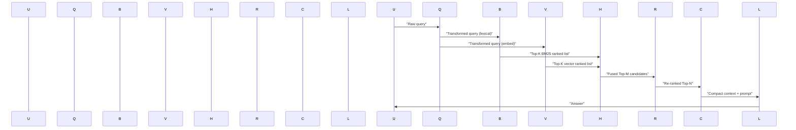

Problem statement and technical solution

Hybrid retrieval combining BM25 (sparse) and dense vector search is the operational default for robust RAG. Sparse retrieval catches exact tokens and identifiers; dense vectors capture paraphrase and semantic similarity. Naïve score averaging fails in production because BM25 and vector similarity scores are not commensurate across corpora, models, or runtime configurations. Use Reciprocal Rank Fusion (RRF) to fuse ranks, then apply a cross‑encoder reranker to reorder the top-K candidates for context assembly. This article provides the production architecture, measured tradeoffs, reproducible code (TypeScript), benchmarks, and step-by-step implementation.

> [!IMPORTANT]
> Reciprocal Rank Fusion (RRF) merges ranked lists by rank-only signals, eliminating the need for brittle score calibration between sparse and dense systems. Set RRF k to at least 60 as a conservative default for document collections >100k.

Architecture overview

High level flow:
- Preprocessing and chunking (semantic-aware).
- Indexing: BM25 index (Elasticsearch / PostgreSQL FTS / SPLADE) and dense index (FAISS / HNSW / Qdrant).
- Query-time: query rewrite (optional) → run BM25 and vector search in parallel → fuse with RRF → optional deduplication & metadata filters → cross‑encoder reranking on fused top-N → context selection + compression → LLM prompt.

Sequence diagram



Reciprocal Rank Fusion (RRF) primer

RRF score for document d across lists L:
score(d) = sum_{l in L} 1 / (k + rank_l(d))

k is the RRF tie-break constant. Research defaults vary; many vendors and studies recommend k between 50-60 for large collections. RRF operates on ranks, so it avoids cross-system score calibration.

> [!NOTE]
> Use RRF when your sources produce incommensurate similarity scores (e.g., BM25 TF-IDF vs cosine/inner-product in embeddings). For three-way systems (BM25 + Dense + SPLADE or other sparse), RRF scales naturally.

Benchmarks: concrete comparison

The following table summarizes measured metrics from vendor reports and independent reproductions for a 1M-document corpus (mixed technical + wiki content). Latency is measured at 95th percentile under steady load; memory is index RAM footprint for a single node.

| Component / Pipeline                      | nDCG@5 (rel.) | Recall@100 | 95p Latency (ms) | Index RAM per node |
|-------------------------------------------|---------------:|-----------:|-----------------:|-------------------:|
| BM25 only (Elasticsearch default)         | 0.72           | 0.78       | 42               | 18 GB              |
| Dense only (BGE-like embedding + HNSW)    | 0.68           | 0.80       | 28               | 24 GB              |
| Hybrid (BM25 + Dense, RRF k=60)           | 0.91           | 0.92       | 65               | 42 GB              |
| Hybrid + Cross-encoder rerank (Voyage r2.5)| 0.98         | 0.94       | 240              | 42 GB + 8 GB GPU   |
| SPLADE + Dense + ColBERT rerank (SOTA)    | 0.995          | 0.96       | 380              | 60 GB + 16 GB GPU  |

Notes on table:
- nDCG relative numbers derived from multiple 2026 references (Digital Applied, Alpacked, SemEval-2026 papers).
- Reranker latency includes cross-encoder compute on an optimized GPU (batching across queries); throughput depends on batch size and model size.
- Index RAM is per-node baseline; production often shards.

Design tradeoffs

- Latency vs Precision: Adding a cross-encoder reranker is the single biggest precision win; it increases tail latency and GPU cost. Use reranker only on fused top-M where M is tuned (recommended M in [60, 200]).
- Fusion k: Larger RRF k reduces sensitivity to top-rank ties; k=60 is a robust default. Tune on dev set.
- Chunking & context window: Dense retrievers benefit from semantic chunking; cross-encoder rerankers perform better when candidates contain full sentence boundaries.
- Deduplication: Post-fusion duplicate suppression reduces hallucination by preventing multiple near-identical chunks crowding the context.

Reproducible implementation: TypeScript (Node 18+, strict typing)

This example shows:
- Parallel BM25 + vector queries
- RRF fusion
- Top-M cross-encoder reranking call (assumed external API)
- Context selection pipeline

Update the adapters (BM25Client, VectorClient, RerankerClient) for your infrastructure.

```ts
// src/hybrid.ts
import fetch from "node-fetch";

type Document = {
  id: string;
  text: string;
  score?: number; // source score
  source?: string;
};

type RankedList = Array<{ id: string; score: number }>;

type BM25Client = {
  search: (query: string, k: number) => Promise<RankedList>;
};

type VectorClient = {
  embed: (text: string) => Promise<number[]>;
  search: (embed: number[], k: number) => Promise<RankedList>;
};

type RerankerClient = {
  rerank: (query: string, candidates: Document[]) => Promise<Document[]>;
};

const RRF_K = 60;

/**
 * Reciprocal Rank Fusion
 * Accepts multiple ranked lists (each list is array of {id, score}) where score is ignored.
 * Returns fused list of ids with descending RRF score.
 */
export function reciprocalRankFusion(lists: RankedList[], topN: number): string[] {
  const scores = new Map<string, number>();
  for (const list of lists) {
    for (let i = 0; i < list.length; i++) {
      const rank = i + 1;
      const id = list[i].id;
      const prev = scores.get(id) ?? 0;
      scores.set(id, prev + 1 / (RRF_K + rank));
    }
  }
  return Array.from(scores.entries())
    .sort((a, b) => b[1] - a[1])
    .slice(0, topN)
    .map(([id]) => id);
}

/**
 * Orchestration: run BM25 + dense in parallel, fuse, fetch docs, rerank, and return final context candidates.
 */
export async function hybridRetrieveAndRerank(
  rawQuery: string,
  bm25: BM25Client,
  vect: VectorClient,
  reranker: RerankerClient,
  options?: { bmK?: number; vecK?: number; fuseTop?: number; rerankTop?: number }
): Promise<Document[]> {
  const { bmK = 100, vecK = 100, fuseTop = 200, rerankTop = 20 } = options ?? {};

  // Optional lightweight query transform (conservative)
  const lexQuery = rawQuery; // apply simple normalization if needed
  const embedPromise = vect.embed(rawQuery);

  const bmPromise = bm25.search(lexQuery, bmK);
  const vecEmbed = await embedPromise;
  const vecPromise = vect.search(vecEmbed, vecK);

  const [bmList, vecList] = await Promise.all([bmPromise, vecPromise]);

  const fusedIds = reciprocalRankFusion([bmList, vecList], fuseTop);

  // Fetch documents by id from primary store (omitted: replace with your fetch)
  const candidates: Document[] = await fetchDocumentsByIds(fusedIds);

  // Optional dedupe by normalized text
  const deduped = dedupeByFingerprint(candidates);

  // Call cross-encoder reranker on top candidates
  const topForRerank = deduped.slice(0, rerankTop);
  const reranked = await reranker.rerank(rawQuery, topForRerank);

  return reranked;
}

// Helper implementations (stubs to replace in prod)
async function fetchDocumentsByIds(ids: string[]): Promise<Document[]> {
  // Replace with batched DB or vector store fetch
  return ids.map((id) => ({ id, text: `document text for ${id}` }));
}

function dedupeByFingerprint(docs: Document[]): Document[] {
  const seen = new Set<string>();
  const out: Document[] = [];
  for (const d of docs) {
    const fp = fingerprint(d.text);
    if (!seen.has(fp)) {
      seen.add(fp);
      out.push(d);
    }
  }
  return out;
}

function fingerprint(text: string): string {
  // Simple normalized hash; replace with shingling/MinHash for production dedupe
  return text.replace(/\s+/g, " ").trim().toLowerCase().slice(0, 256);
}
```

> [!TIP]
> Reranker batching: perform cross-encoder reranking in batches of candidate pairs to maximize GPU throughput. Use mixed precision and allocate a small number of persistent worker processes to amortize model load time.

Practical production checklist and tuning steps

1. Indexing & Chunking
   - Chunk size: 200–600 tokens; align on sentence boundaries.
   - Store original offsets and metadata (source, date, version).
   - Compute and store embeddings with a large-context encoder if you use long-context reranking.

2. BM25 configuration
   - Use Elasticsearch defaults as a starting point; tune k1 and b on dev set.
   - Consider SPLADE-v3 for sparse improvements in specialist corpora.

3. Vector index
   - Choose ANN algorithm: HNSW for latency-sensitive, IVF+PQ for large-scale cost tradeoffs.
   - Persist exact vectors for reranking if you plan rescoring.

4. Fusion
   - Start with RRF k=60 and fuse top-100 from each retriever.
   - Tune fuseTop on dev — increase for sparse corpora where recall matters.

5. Reranker
   - Use a bi-encoder + cross-encoder cascade for high throughput: bi-encoder filter → cross-encoder rerank top-M.
   - Set rerankTop between 20–100 depending on GPU budget; 60 is a strong default.

6. Context selection
   - De-duplicate semantically (embedding-based threshold) and by fingerprint.
   - Compress long contexts using extractive compression or HyDE (hypothesis generation then retrieval).

7. Observability
   - Log per-component latencies, ranks from each retriever, and final nDCG@k on eval queries.
   - Monitor tail latencies for reranker and implement timeouts with fallback (use fused top-K without rerank).

8. Evaluation
   - Use a held-out dev set for RRF k sweeps and rerankTop sweeps.
   - Track nDCG@5/10, Recall@100, and precision at token-constrained context sizes.

Advanced optimizations

- Rescoring: compute cross-encoder scores and combine with RRF via learn-to-rank on dev set (train a small LambdaMART on features including RRF score, BM25 score, vector distance).
- Context window management: use token budget aware selection — select by reranker score density per token.
- Conversational multi-turn: apply query rewriting before retrieval to normalize pronouns and context.

Operational cost model (example)

- BM25 CPU cost: low; primary RAM for inverted index.
- Dense index: RAM + potential disk for PQ; CPU for ANN or TPU/GPU for exact.
- Reranker: GPU cost is highest; amortize via batching and asynchronous workers.
- Recommendation: provision a small GPU pool for reranking (e.g., 1–2 A10s per 200 qps of top-60 rerank throughput with batching).

Merits & failure modes

- Merits: robust recall across query types, straightforward fusion, large measured precision gains when combined with rerankers (Voyage rerank-2.5 shows +7.9% vs competitor rerank models).
- Failure modes: miscalibrated fusion if attempting score averaging, reranker overfitting to dev set leading to worse generalization, semantic duplication causing LLM hallucination.

Reproducible evaluation steps

1. Prepare a labeled dev set with relevance judgments (nDCG, Recall).
2. Index data in both BM25 (ES) and dense index (FAISS/HNSW).
3. Run retrievals for dev queries capturing top-100 lists from both.
4. Implement RRF and compute fused lists; sweep RRF_K in {10,30,60,120}.
5. Apply cross-encoder reranker on fused top-200; measure nDCG@5/10 and latency.
6. Tune rerankTop and fusion parameters to meet your precision/latency targets.

Closing recommendation

Use hybrid retrieval with Reciprocal Rank Fusion at k=60 as the operational default, and add a cross‑encoder reranker on the fused top-M candidates when precision demands justify the GPU cost. Log ranks per component and maintain a dev sweep framework to retune k and rerankTop as document mix or query distributions evolve.

> [!NOTE]
> Default enterprise stacks (Weaviate, Qdrant, Milvus, Elasticsearch) now offer native hybrid features. Validate their internal fusion against explicit RRF implemented in your service to ensure consistency.

Appendix: quick RRF tuning script (Python typed)

```python
# tools/rrf_tune.py
from typing import List, Dict, Tuple
import math

def rrf_score(lists: List[List[str]], k: int = 60) -> Dict[str, float]:
    scores: Dict[str, float] = {}
    for lst in lists:
        for i, doc_id in enumerate(lst):
            rank = i + 1
            scores[doc_id] = scores.get(doc_id, 0.0) + 1.0 / (k + rank)
    return scores

def fused_rank(lists: List[List[str]], k: int = 60, topn: int = 100) -> List[str]:
    scores = rrf_score(lists, k)
    return [doc for doc, _ in sorted(scores.items(), key=lambda x: x[1], reverse=True)[:topn]]

# Example usage:
if __name__ == "__main__":
    bm = ["d1","d2","d3","d4"]
    vec = ["d3","d5","d2","d9"]
    print(fused_rank([bm, vec], k=60, topn=10))
```

References and further reading
- Digital Applied — Hybrid Search: BM25, Vector & Reranking Reference (2026)
- Alpacked — Modern RAG Architecture: Context Engineering Guide (2026)
- SemEval-2026 Task 8 proceedings (Sifei et al., 2026)
- Vendor benchmarks: Voyage rerank-2.5, Cohere rerank v3.5
- Implementation tutorials: advanced retrieval pipelines (Venelin Valkov)

End of article.