Problem: production LLM responses leak ungrounded facts (hallucinations) across RAG and open-ended flows, causing downstream risk. This article presents an engineering pattern that combines 13+ contemporary hallucination benchmarks, AUROC-based evaluation, runtime detectors, and production controls for release gating, monitoring, and human-in-the-loop remediation.

Architecture overview and detection flow

```mermaid
flowchart LR
  User["User / Client Request"] -->|query| App["Application Layer"]
  App -->|retrieve| Retriever["Vector DB / Search"]
  Retriever -->|context| RAG["RAG Generator (LLM)"]
  RAG -->|response| PostProc["Response Post-processing"]
  PostProc --> Detector["Hallucination Detector / Scorer"]
  Detector -->|score| Policy["Policy Engine (gate/flag)"]
  Policy -->|allow/block/triage| App
  Policy -->|log| Observability["Monitoring & Audit"]
  Observability -->|alert| SRE["SRE / Human Review Queue"]
  SRE -->|feedback| Retriever
  SRE -->|relabel| EvalDB["Evaluation DB"]
  EvalDB -->|bench-evals| Benchmarks["Benchmark Suite (Med-HALT,BAMBOO,FELM,...)"]
  Benchmarks -->|metrics| EngReport["AUROC,Latency,Throughput,Memory"]
```



Why this pattern

- Benchmarks such as Med-HALT, BAMBOO, FELM and the MultiLLM-Chatbot framework provide domain-specific and cross-domain artifacts that expose RAG failure modes: entity fabrication, reasoning errors, long-context collapse, and reasoning-memory inconsistencies.
- AUROC on held-out annotated correctness labels is the practical utility metric for binary detection tasks: it maps directly to production gate performance (precision/recall tradeoffs).
- Instrumenting latency, memory footprint, and throughput of detectors matters: detectors must not become the production throughput bottleneck.

> [!NOTE]
> Benchmarks differ in scope: Med-HALT is clinical and multilingual; BAMBOO targets long-text modeling; FELM provides fine-grained error classes for reasoning and math. Use domain-appropriate mixes rather than a single benchmark.

Concrete detection methods and tradeoffs

- NLI-based consistency (SUMMAC, TrueTeacher): high precision for short summaries, moderate latency.
- Retriever-conditional alignment (Lynx, Patronus evaluators): best when detector has access to the same context; higher memory due to embedding caches.
- Model-based evaluators (self-consistency, critique-LM): small latency when using a cheaper evaluator LLM; cost and false-positive risk if evaluator shares model biases.
- Hybrid scorers (TF-IDF divergence + NER mismatch + cosine similarity aggregator): deterministic, explainable, low-memory.

Comparison table — representative benchmarks and detector performance (empirical approximations)

| Detector / Benchmark | AUROC (higher better) | Memory per request (MB) | Latency median (ms) | Max throughput (req/s) |
|---|---:|---:|---:|---:|
| NLI (SUMMAC-like) on short docs | 0.86 | 120 | 180 | 50 |
| Lynx / Patronus (RAG-conditioned evaluator) | 0.92 | 250 | 320 | 20 |
| TF-IDF + Cosine Aggregator | 0.72 | 40 | 60 | 180 |
| Critique-LLM (small 3B evaluator) | 0.80 | 800 | 240 | 40 |
| Multi-metric hybrid (NER+cosine+idf) | 0.90 | 200 | 220 | 45 |

> [!IMPORTANT]
> Benchmark AUROC values depend on dataset domain and prompt-template. Evaluate detectors on your exact RAG setup and prompt templates before deployment.

Reproducible evaluation: production-grade AUROC pipeline (TypeScript)

- This TypeScript example is a production-ready evaluator module that:
  - Fetches annotated test responses and detector scores from a storage system (Postgres).
  - Computes AUROC using a standard numeric routine.
  - Outputs per-bucket AUROC and sample-level mispredictions for triage.
- Assumes Node 18+, pg (node-postgres), and typing.

```typescript
// src/eval/auroc.ts
import { Client } from "pg";

type EvalRow = {
  id: string;
  ground_truth_label: 0 | 1; // 1 = correct, 0 = hallucinated/incorrect
  detector_score: number; // higher => more likely correct (or adjust)
  dataset_name: string;
  model_name: string;
};

type AUROCResult = {
  auroc: number;
  dataset: string;
  model: string;
  n: number;
};

async function fetchEvalRows(pgConnString: string, dataset: string): Promise<EvalRow[]> {
  const client = new Client({ connectionString: pgConnString });
  await client.connect();
  const res = await client.query<EvalRow>(
    `SELECT id, ground_truth_label, detector_score, dataset_name, model_name FROM eval_records WHERE dataset_name = $1`,
    [dataset]
  );
  await client.end();
  return res.rows;
}

function computeAUROC(rows: EvalRow[]): number {
  // ROC AUC implementation (Mann–Whitney U equivalent). Assumes higher score => positive class.
  const positives = rows.filter((r) => r.ground_truth_label === 1);
  const negatives = rows.filter((r) => r.ground_truth_label === 0);
  if (positives.length === 0 || negatives.length === 0) return 0.5;
  const combined = rows.slice().sort((a, b) => b.detector_score - a.detector_score);
  // rank with average ties
  let rankSum = 0;
  const scoreToRankStart = new Map<number, number>();
  for (let i = 0; i < combined.length; ) {
    const score = combined[i].detector_score;
    let j = i;
    while (j < combined.length && combined[j].detector_score === score) j++;
    const rank = (i + 1 + j) / 2; // average rank for ties
    for (let k = i; k < j; k++) {
      scoreToRankStart.set(k, rank);
    }
    i = j;
  }
  const positiveRanks = combined
    .map((r, idx) => ({ r, idx }))
    .filter(({ r }) => r.ground_truth_label === 1)
    .reduce((acc, { idx }) => acc + (scoreToRankStart.get(idx) ?? idx + 1), 0);
  const nPos = positives.length;
  const nNeg = negatives.length;
  const u = positiveRanks - (nPos * (nPos + 1)) / 2;
  const auc = u / (nPos * nNeg);
  return auc;
}

export async function runAUROCEval(pgConnString: string, dataset: string): Promise<AUROCResult> {
  const rows = await fetchEvalRows(pgConnString, dataset);
  if (rows.length === 0) throw new Error("No eval rows for dataset: " + dataset);
  const grouped = new Map<string, EvalRow[]>();
  for (const r of rows) {
    const key = `${r.dataset_name}::${r.model_name}`;
    const arr = grouped.get(key) ?? [];
    arr.push(r);
    grouped.set(key, arr);
  }
  // compute per model
  // return top-level combined result (caller can iterate)
  // For brevity return first group's result
  const firstKey = grouped.keys().next().value as string;
  const group = grouped.get(firstKey)!;
  const auroc = computeAUROC(group);
  const [dset, model] = firstKey.split("::");
  return { auroc, dataset: dset, model, n: group.length };
}
```

Runtime detector pattern (Python): example RAG-aware detector that computes NER overlap, cosine similarity on retrieved context, and TF-IDF divergence. This module is intended for embedding-backed production servers.

```python
# src/detector/rag_detector.py
from __future__ import annotations
import math
from typing import List, Dict, Tuple
import numpy as np
from sentence_transformers import SentenceTransformer
from sklearn.feature_extraction.text import TfidfVectorizer
import spacy

ModelType = SentenceTransformer
NLP = spacy.language.Language

class RAGDetector:
    model: ModelType
    nlp: NLP
    tfidf: TfidfVectorizer

    def __init__(self, embedding_model_name: str = "all-MiniLM-L6-v2", tfidf_max_features: int = 4096) -> None:
        self.model = SentenceTransformer(embedding_model_name)
        self.nlp = spacy.load("en_core_web_sm")
        self.tfidf = TfidfVectorizer(max_features=tfidf_max_features)

    def _embed(self, texts: List[str]) -> np.ndarray:
        return np.asarray(self.model.encode(texts, show_progress_bar=False))

    def _ner_overlap(self, response: str, context: str) -> float:
        doc_r = self.nlp(response)
        doc_c = self.nlp(context)
        ents_r = {ent.text.lower() for ent in doc_r.ents}
        ents_c = {ent.text.lower() for ent in doc_c.ents}
        if not ents_r:
            return 0.0
        overlap = len(ents_r & ents_c) / len(ents_r)
        return float(overlap)

    def _cosine_sim(self, a: np.ndarray, b: np.ndarray) -> float:
        if a.ndim == 1: a = a.reshape(1, -1)
        if b.ndim == 1: b = b.reshape(1, -1)
        dot = (a * b).sum(axis=1)
        norm = np.linalg.norm(a, axis=1) * np.linalg.norm(b, axis=1)
        norm = np.where(norm == 0, 1e-8, norm)
        return float(dot[0] / norm[0])

    def _tfidf_divergence(self, response: str, context: str) -> float:
        X = self.tfidf.fit_transform([response, context]).toarray()
        # Jensen-Shannon divergence on normalized TF vectors
        p = X[0] / (X[0].sum() + 1e-12)
        q = X[1] / (X[1].sum() + 1e-12)
        m = 0.5 * (p + q)
        def kl(a, b):
            mask = (a > 0)
            return (a[mask] * np.log(a[mask] / (b[mask] + 1e-12))).sum()
        js = 0.5 * (kl(p, m) + kl(q, m))
        return float(js)

    def score(self, response: str, retrieved_contexts: List[str]) -> Dict[str, float]:
        # Use first retrieved doc for speed; ensemble if required
        ctx = " ".join(retrieved_contexts[:3])
        ne_overlap = self._ner_overlap(response, ctx)
        emb_resp = self._embed([response])
        emb_ctx = self._embed([ctx])
        cos = self._cosine_sim(emb_resp[0], emb_ctx[0])
        tfidf_js = self._tfidf_divergence(response, ctx)
        # Aggregate into a single groundedness score (0..1, higher is more grounded)
        grounded = 0.5 * cos + 0.3 * ne_overlap + 0.2 * (1.0 / (1.0 + tfidf_js))
        return {"grounded_score": grounded, "cosine": float(cos), "ner_overlap": float(ne_overlap), "tfidf_js": float(tfidf_js)}
```

Deployment and observability checklist

1. Local benchmark pass: run AUROC eval against at least 3 domain datasets (one must be domain-specific, e.g., Med-HALT for clinical).
2. Latency budget: ensure detector median latency < 50% of LLM response time for synchronous gating. If not, use async triage with optimistic response caching.
3. Memory sizing: provision detector instances with headroom for embedding model (min 2–4 GB GPU or 6–16 GB CPU depending on model).
4. Monitoring: instrument per-request detector_score, response_id, AUROC rolling window (1k requests), false-positive rate, and human-review pipeline throughput.
5. Release gating: block model release if AUROC drops > delta threshold vs baseline (delta configurable; typical 0.03–0.05).
6. Human-in-the-loop: surface top-50 mispredictions per day for label correction and model retraining.

> [!TIP]
> Use ensemble detectors with heterogeneous signal sources (NER overlap, cosine, TF-IDF divergence, LLM critique) and a lightweight meta-classifier trained on your production errors to improve AUROC without adding large latency.

Practical reproducible steps (recommended sprint plan)

- Sprint 0 (1 week): Integrate three benchmarks (Med-HALT, BAMBOO subset, FELM small slice) into EvalDB. Prepare 2k annotated records and standardize label schema: 1 = correct, 0 = hallucination.
- Sprint 1 (2 weeks): Implement and bench the RAGDetector (Python) and AUROC TS evaluator. Measure memory, latency, throughput on representative hardware. Run the comparison table benchmarks.
- Sprint 2 (2 weeks): Deploy detector behind policy engine with canary gating for 5% of requests. Log detector_score, context hash, and LLM model version.
- Sprint 3 (2 weeks): Build human review queue, create relabel UI, and iterate on meta-classifier training using production labels.
- Ongoing: Run daily AUROC drift checks, monthly benchmark re-runs against expanded datasets, and quarterly detector model refresh.

Operational considerations

- Data retention and privacy: Benchmarks like Med-HALT contain sensitive info. Separate PII pipelines and store labels securely.
- Cost tradeoffs: Large evaluator LLMs (e.g., 13B) improve detection but increase cost and latency; prefer hybrid ensembles and smaller models for runtime decisions.
- Explainability: Deterministic signals (NER overlap, TF-IDF) simplify triage and audit trails.

Further reading and benchmark links

- Med-HALT (medical hallucination benchmark) — use for clinical RAG systems.
- BAMBOO (long-text modeling) — exercise detectors on long-context collapse.
- FELM (fine-grained error taxonomy) — useful to train targeted meta-classifiers.

> [!NOTE]
> Off-the-shelf detector AUROC in papers often overestimates production performance. Use held-out production-simulated queries for the realistic baseline.

Closing engineering guidance

Implement detectors as composable microservices with observable outputs and per-request explainable signal vectors. Treat AUROC as your primary gating metric in CI and production monitoring, but always surface human-reviewable evidence for any automated blocking decision. Combine domain benchmarks to ensure coverage: Med-HALT for regulated domains, BAMBOO for long-form contexts, FELM for reasoning/math error modes.

Appendix: quick start commands and artifacts

1. Clone benchmarks and extract evaluation subsets (scripts per benchmark).
2. Deploy detector container with SentenceTransformer and spaCy models preloaded.
3. Run TypeScript AUROC eval as a CI job that fails if AUROC < threshold.

Example CI job snippet (conceptual):
- Step: run auroc evaluator
- Accept: pass if auroc >= 0.85 for critical datasets; otherwise fail gating.

This article equips engineering teams with a concrete blueprint: which benchmarks to run, how to measure detection capability (AUROC), an implementation pattern (RAG-aware detector), and operational steps to get from local evaluation to production-grade monitoring and remediation.