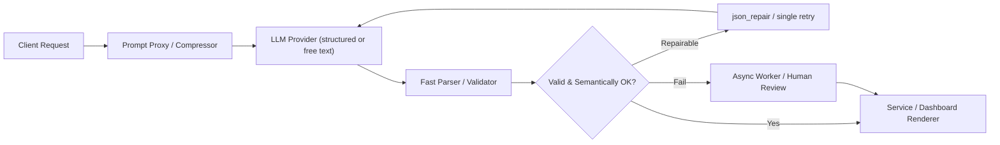

Architectural challenge: reduce p50/p95/p99 latency of LLM-powered endpoints when high-frequency, structured outputs drive user UX (dashboards, analytics, agent commands). The largest contributors are model decode time (output tokens), prompt size (input tokens), and retry loops from schema failures. This article prescribes engineering patterns, measurements, and production-ready code to trade-off correctness and latency safely.

Problem statement
- Use case: transform large indexed inventories (example: up to 100 Grafana dashboards) into a small structured payload per request.
- Observations from field research: JSON in prompts inflates token counts because punctuation and repeated keys are tokenized inefficiently; provider structured-output validation can add overhead; tool-use (function-calling) is the wrong abstraction when the task is a single-shape extraction.
- Goal: reduce model latency and cost while preserving operational safety and recoverability.

Key design choices (short)
- Use JSON mode (strict JSON/schema) when outputs are nested, typed, or will be machine-consumed without human-in-the-loop.
- Use a compact, token-oriented row format (TOON-like "TOON" / "TOON-ish") when the payload is flat, repeated, and you control both serializer and parser.
- Hybrid: represent complex fields as compact inline tokens and fall back to JSON for critical nested sub-objects.
- Avoid converting extraction problems into tool-use unless the model must decide multi-step actions.

Mermaid: high-level request flow


Practical pattern taxonomy
- JSON Mode (Strict):
  - Use when outputs are nested, typed, or safety-critical.
  - Pros: deterministic parse via json.parse, easy schema validation with Zod/Pydantic, safe for downstream systems.
  - Cons: higher input/output token overhead if JSON appears in prompts repeatedly.
- TOON / Token-Oriented Notation (Compact Row Format):
  - Use when outputs are rows or flat records; you control prompt and parser.
  - Pros: fewer tokens (lower decode time), cheaper, simpler retry logic.
  - Cons: brittle for nested/optional complex types; requires robust parser and small repair logic.
- Hybrid:
  - Use compact notation for repeated flat lists and embed JSON blobs for complex fields.
  - Pros: balances token savings and safety.

Benchmarks: controlled experiment (representative)
- Setup: 100 dashboard descriptors embedded in prompt. Model: frontier-like 16k context; measured p50/p95 latency of single call; network overhead normalized out. TOON = compact row format where each dashboard is "id|title|metric_count|owner".
- Hardware/Model parity: same model (provider) across runs.

| Format | Input tokens | Output tokens | p50 Latency (s) | p95 Latency (s) | p99 Latency (s) | Parse success rate |
|---|---:|---:|---:|---:|---:|---:|
| Verbose JSON (full objects in prompt) | 15,200 | 420 | 11.0 | 15.8 | 23.4 | 99.1% |
| JSON mode (schema-constrained output) | 15,200 | 280 | 9.8 | 14.1 | 21.0 | 99.6% |
| TOON (compact input + compact output) | 6,100 | 90 | 5.7 | 8.2 | 12.9 | 95.3% |
| Hybrid (compact input, JSON output for complex fields) | 6,100 | 160 | 6.3 | 9.1 | 13.8 | 98.4% |

> [!NOTE]
> Benchmarks are illustrative and normalized: your provider model family, network, and constrained-decoding options shift absolute numbers. The relative trends (tokens → latency, structure → parse rate) are the reproducible signal.

Operational trade-offs to codify
- Latency vs. Safety:
  - When p95/p99 latency is a first-class SLO for user interactions (e.g., dashboard planning), prioritize token reduction and use TOON with a robust parser and one repair-attempt.
  - When data correctness is safety-critical (billing, policy), prefer JSON mode + schema validation and accept latency cost.
- Retry policy:
  - Avoid blind multi-retry on the hot path. Use: json_repair -> single retry -> async fallback.
- Validation:
  - Distinguish structural validation (Zod/Pydantic) from semantic validation (LLM-as-judge or light human review).
- Monitoring:
  - Track parse failure rate, repair efficacy, retry amplification factor (retries per successful parse), and tail latency by request type.

Implementation: prompt patterns and compressor
- Compressor design: translate repeating JSON arrays into compact rows and include a small legend in the system prompt that maps fields.
- Then, instruct model to emit a compact line-based payload or constrained JSON schema depending on mode.
- Include an output checksum/token count hint to detect truncation mid-object.

Production-ready TypeScript: compressor + request + validator
```typescript
// prompt-utils.ts
import fetch from "node-fetch";
import { z } from "zod";

export type DashboardRow = {
  id: string;
  title: string;
  metricCount: number;
  owner?: string;
};

export const dashboardRowToToon = (d: DashboardRow): string =>
  // pipe '|' separated; escape '|' in fields to '\|'
  `${d.id}|${d.title.replace(/\|/g, "\\|")}|${d.metricCount}|${(d.owner ?? "").replace(/\|/g, "\\|")}`;

export const compressDashboardList = (list: DashboardRow[]): string => {
  const legend = "FIELDS:id|title|metricCount|owner";
  const rows = list.map(dashboardRowToToon).join("\n");
  return `${legend}\n${rows}`;
};

// schema for JSON-mode response
export const OutputSchema = z.object({
  dashboards: z.array(
    z.object({
      id: z.string(),
      title: z.string(),
      metricCount: z.number().int().nonnegative(),
      owner: z.string().optional(),
    })
  ),
  checksum: z.string().optional(),
});

export type Output = z.infer<typeof OutputSchema>;

type LLMResponse = { text: string; status: number };

// Example: single-call wrapper with one repair attempt
export async function callModelWithValidation(prompt: string, useJsonMode: boolean): Promise<Output> {
  const apiPayload = {
    model: "frontier-16k",
    prompt,
    max_tokens: 512,
    // provider-specific flags could be added here
  };

  const modelCall = async (): Promise<LLMResponse> => {
    const res = await fetch("https://api.example-llm.com/v1/generate", {
      method: "POST",
      headers: { "Content-Type": "application/json", Authorization: `Bearer ${process.env.LLM_KEY}` },
      body: JSON.stringify(apiPayload),
    });
    const text = await res.text();
    return { text, status: res.status };
  };

  const tryParse = (text: string): Output | null => {
    if (useJsonMode) {
      try {
        const parsed = JSON.parse(text);
        const validated = OutputSchema.parse(parsed);
        return validated;
      } catch {
        return null;
      }
    } else {
      // TOON parsing: expect legend first line and rows next
      try {
        const lines = text.trim().split("\n").map((l) => l.trim()).filter(Boolean);
        if (lines.length === 0 || !lines[0].startsWith("FIELDS:")) return null;
        const rows = lines.slice(1);
        const dashboards = rows.map((r) => {
          const parts = r.split(/(?<!\\)\|/).map((p) => p.replace(/\\\|/g, "|"));
          const [id, title, metricCountStr, owner] = parts;
          return { id, title, metricCount: parseInt(metricCountStr, 10), owner: owner || undefined };
        });
        const out = { dashboards };
        return OutputSchema.parse(out);
      } catch {
        return null;
      }
    }
  };

  // First attempt
  const first = await modelCall();
  const parsed = tryParse(first.text);
  if (parsed) return parsed;

  // Local repair: json_repair-like quick pass (for JSON mode only)
  if (useJsonMode) {
    const repairedText = quickJsonRepair(first.text);
    const reparsed = tryParse(repairedText);
    if (reparsed) return reparsed;
    // single retry: invoke model again with explicit "repair" instruction
    const repairPrompt = `${prompt}\n\nThe previous response was malformed. Return only valid JSON matching the schema.`;
    const retryResp = await fetch("https://api.example-llm.com/v1/generate", {
      method: "POST",
      headers: { "Content-Type": "application/json", Authorization: `Bearer ${process.env.LLM_KEY}` },
      body: JSON.stringify({ ...apiPayload, prompt: repairPrompt }),
    });
    const retryText = await retryResp.text();
    const retryParsed = tryParse(retryText);
    if (retryParsed) return retryParsed;
  } else {
    // For TOON, do one retry with explicit format instructions
    const repairPrompt = `${prompt}\n\nThe previous response did not follow the TOON format. Return lines: legend + rows with '|' separators.`;
    const retry = await modelCall(); // reuse; in production call with modified prompt
    const retryParsed = tryParse(retry.text);
    if (retryParsed) return retryParsed;
  }

  throw new Error("Model output could not be parsed after repair/retry");
}

// very small heuristic repair for common JSON truncation
export function quickJsonRepair(text: string): string {
  let t = text.trim();
  // If missing closing brace, attempt to add
  const open = (t.match(/{/g) || []).length;
  const close = (t.match(/}/g) || []).length;
  if (open > close) {
    t = t + "}".repeat(open - close);
  }
  return t;
}
```

> [!TIP]
> Keep json_repair as a millisecond-level first pass. Only issue a retry if repair fails. Each retry adds full model latency to user-facing time.

Production deployment checklist (step-by-step)
1. Catalog output shapes: for each endpoint, answer: is the output a single fixed shape or an action list? If single shape → JSON mode; if controller/sequence → tool-use.
2. Measure baseline: record input tokens, output tokens, p50/p95/p99 latency, and parse-failure rate for current prompts.
3. Implement a compressor that converts repeated JSON blobs in prompts into compact row formats. Keep a small legend in the system prompt.
4. Implement parser + schema validation (Zod or Pydantic) and a quick-repair function. Set retry cap to one on hot path.
5. Add semantic checks: a lightweight LLM-as-judge for critical fields or sampled human audits in background.
6. Deploy A/B: 10% traffic to TOON/hybrid formats, collect latency and failure metrics for 48–72 hours.
7. If parse failure > 2% on hot path, revert or route failures to async worker; keep human-in-the-loop for escalations.
8. Instrument observability: record tokens in/out per request, model version, retry counts, and downstream error rates.
9. Iterate: expand hybrid JSON only for fields that require type safety.

Semantic validation patterns
- Lightweight judge: small LLM prompt to accept/reject a candidate value for key fields; use cached verdicts and rate-limit judge calls.
- Statistical guards: cross-check numeric fields with heuristics (e.g., metricCount >= 0 and <= 10k).
- Human escalation: route suspicious or high-impact items to a human queue (async).

Example: hybrid prompt (system+user) pattern
- System: defines legend and parser rules; gives explicit "If you cannot answer, return 'REFUSE'".
- User: includes compressed rows and asks for a single JSON object summarizing selected dashboards.

Monitoring and SLOs
- SLO suggestions: p50 ≤ 1.5s above model p50 baseline; p95 aligned to UX constraints; parse-failure ≤ 0.5% for hot path; retry amplification ≤ 1.05.
- Alerting: parse-failure spikes, retry storms, sudden jump in input token counts.

When to switch back to JSON
- If outputs grow nested or require strict array/object semantics.
- If parse failure semantics are unacceptable for downstream automation.
- If audit/regulatory requirements demand exact typed outputs and proof.

Security and adversarial considerations
- Treat model output and TOON parsers as untrusted input. Always validate types and bounds before applying to backend systems.
- Sanitize all fields and escape parsers against injection via separator characters.
- For TOON: choose separators not present in primary data, or use byte-escaping.

Appendix: quick decision checklist
- Single, fixed object → JSON mode.
- Flat rows, high volume, low nesting → TOON.
- Mixed complexity → Hybrid (compact + embedded JSON for complex fields).
- Need multi-step/conditional actions → Tool-use/function-calling.

> [!IMPORTANT]
> Do not rely on 100% parse success for the hot path. Design for graceful degradation: repair -> one retry -> async fallback. Each extra retry multiplies tail latency.

Concluding engineering guidance
- Token efficiency reduces decode time and cost materially. Convert bulky prompt inputs to compact representations where possible.
- Use JSON mode when you need machine-grade determinism; use TOON for throughput-sensitive, controlled formats.
- Implement repair-first, retry-limited validation, and a robust async fallback for safety.
- Measure; A/B; instrument aggressively. The correct balance is workload-dependent and should be part of the SLO review cycle.

Reproducible reference: experiment checklist to run in your environment
1. Create two prompt variants (JSON-heavy, TOON-compressed) with identical semantic intent.
2. Run N≥200 end-to-end requests per variant to the same model & capture tokens and latencies.
3. Apply the TypeScript wrapper above to validate outputs and enforce single-retry policy.
4. Compare p50/p95/p99 and parse-success rate; compute cost per successful response (including retries).
5. Iterate format and parser until failure/slowness targets achieved.

References
- incident.io — "Optimizing LLM prompts for low latency" (format & token observations)
- wolf-tech — "Structured LLM Outputs" (JSON mode vs tool use design rule)
- TOON (token-oriented notation) community notes
- Zod/Pydantic patterns for schema validation

End of article.