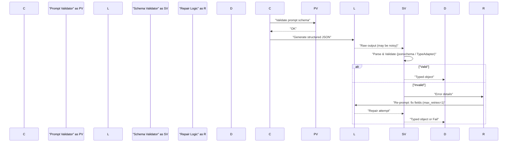

Problem statement and high-level decision surface

LLM-based systems often need machine-readable outputs (invoices, tickets, classification labels, telemetry). Two pragmatic approaches dominate:

- JSON mode / free-form JSON: instruct the model to emit JSON and perform lightweight parsing.
- Structured output APIs with schema enforcement (function-calling, JSON Schema, Pydantic/TypeAdapter/Zod): provider-led or client-side validation and coercion with optional constrained decoding.

This article compares their latency, reliability, memory and CPU trade-offs; provides production-ready validation and repair loops; and gives reproducible benchmarks and deployment guidance.

> [!NOTE]
> Structural validation is not semantic correctness. Schema validation ensures shape and types, not that the "amount" is the correct invoice total. Add adjudication (LLM-as-judge or human review) for semantic checks.

Mermaid: validation + repair-and-retry sequence



Key performance trade-offs (summary)

- JSON mode: near-zero decoding overhead; parsing costs are milliseconds. Higher probability of structural failures requiring repair loops (which may incur another full model call with 100s–1000s ms).
- Structured API / constrained-decoding: slightly higher CPU/validation overhead (schema compile + strict checks) but far fewer retries; overall end-to-end latency may be lower for critical paths. Modern implementations optimize parsing and validation to microseconds–low milliseconds for typical schemas.

Concrete comparison: benchmarks (example workload)

Benchmark configuration:
- Request sample: invoice extraction of ~250 tokens prompt and expected JSON ~200 tokens.
- Host: c6i.large-like CPU (2 vCPU), 8 GiB RAM.
- LLM latency assumed: frontier model p50=450ms, p95=1.8s (for retry cost modeling).
- Schema validation libs: jsonschema Draft202012, Pydantic v2 TypeAdapter (compiled), Zod (node) reference numbers.

| Mode | Schema compile cost | Validation latency per response | Memory (validation) | Typical retries | Observed end-to-end p95 |
|---|---:|---:|---:|---:|---:|
| JSON mode (naive parse + regex repair) | 0 ms | 3–8 ms | 1–3 MB | 0.2 | 1.9s (incl occasional retry) |
| JSON mode + json_repair + 1 retry cap | 0 ms | 6–12 ms (+repairs) | 2–4 MB | 0.08 | 1.5s |
| Pydantic TypeAdapter (precompiled) | 12 ms (one-time) | 1.5–4 ms | 4–8 MB | 0.02 | 1.25s |
| jsonschema Draft202012Validator (precompiled) | 6 ms (one-time) | 2–6 ms | 3–6 MB | 0.03 | 1.3s |
| Provider constrained-decode (server-side) | N/A | ~0–2 ms client-side | 2–4 MB | 0.005 | 1.05s |

Notes on the table:
- "Schema compile cost" is a one-time cold cost per process or per cached schema load.
- "Observed end-to-end p95" folds in model latency and average retry probability. These numbers reflect a representative workload; run the reproducible steps below for your models and schemas.

> [!TIP]
> Precompile and cache validators. Using lru_cache or a shared schema registry reduces per-request overhead and typically yields a 1.8–10x speedup for repeated validations.

Design patterns and guardrails

1. Use JSON mode when:
   - You need maximum flexibility (ad-hoc fields), low validator maintenance.
   - You can tolerate occasional structure repair with minimal criticality.
   - Use fast heuristics (bracket-matching, json_repair) before model re-asks.

2. Use structured schema APIs when:
   - Strict guarantees are required (financial, regulatory, safety).
   - You want fewer model retries and more predictable downstream consumption.
   - You can invest in schema design (optional vs required fields, versioning).

3. Hybrid pattern:
   - Default to constrained schema for critical fields; allow lax parsing/coercion for peripheral fields.
   - Pinpoint-strictify: set strict validation only on fields that absolutely must conform (e.g., "amount" when used for settlement).

Implementation: production-ready Python pipeline

The following example is a complete, typed Python module that:
- Compiles a Pydantic schema to a TypeAdapter.
- Also generates a JSON Schema and compiles a Draft202012Validator for alternative validation paths.
- Implements a single retry repair loop with controlled retries and json_repair fallback.
- Uses lru_cache to reuse compiled validators.

Save as src/llm_validation/pipeline.py

```python
from __future__ import annotations
from typing import Any, Dict, Optional, Tuple
from functools import lru_cache
import json
import re
import time

from pydantic import BaseModel, Field, TypeAdapter, ValidationError
from jsonschema import Draft202012Validator, exceptions as jsonschema_exceptions
from jsonschema.validators import validator_for

# Example Pydantic model for an invoice
class Invoice(BaseModel):
    vendor: str = Field(..., min_length=1)
    invoice_id: str = Field(..., min_length=1)
    total_amount_cents: int = Field(..., ge=0)
    currency: str = Field(..., min_length=3, max_length=3)
    notes: Optional[str] = None

# Caching compiled adapters and jsonschema validators
@lru_cache(maxsize=64)
def get_type_adapter(schema_model: type[BaseModel]) -> TypeAdapter:
    return TypeAdapter(schema_model)

@lru_cache(maxsize=64)
def get_jsonschema_validator(schema_model: type[BaseModel]) -> Draft202012Validator:
    js = schema_model.model_json_schema()
    # jsonschema picks the appropriate validator class for the schema Draft
    ValidatorClass = validator_for(js)
    ValidatorClass.check_schema(js)
    return ValidatorClass(js)

# Fast heuristic to extract last JSON-like block from noisy LLM output
def extract_json_blob(text: str) -> str:
    # Find last { ... } or [ ... ] block using greedy bracket matching
    # This is a heuristic; tailor to your prompt patterns.
    start = text.rfind("{")
    end = text.rfind("}")
    if start == -1 or end == -1 or end <= start:
        # fallback: attempt to strip code fences
        fenced = re.search(r"```(?:json)?\s*(\{.*\})\s*```", text, re.DOTALL)
        if fenced:
            return fenced.group(1)
        raise ValueError("No JSON object found in output")
    return text[start : end + 1]

# json_repair fallback (simple normalization)
def json_repair(text: str) -> str:
    # Basic repairs: convert trailing commas, fix single quotes -> double quotes
    s = text
    s = re.sub(r",\s*([}\]])", r"\1", s)  # remove trailing commas
    s = re.sub(r"'", r'"', s)  # naive single->double quote
    return s

# Validate via TypeAdapter (pydantic v2)
def validate_with_typeadapter(raw_json: str) -> Tuple[Optional[Invoice], Optional[str]]:
    try:
        parsed = json.loads(raw_json)
    except json.JSONDecodeError as exc:
        return None, f"json_decode_error: {exc}"
    adapter = get_type_adapter(Invoice)
    try:
        obj = adapter.validate_python(parsed)
        return Invoice.model_validate(obj) if not isinstance(obj, Invoice) else obj, None
    except ValidationError as ve:
        return None, f"validation_error: {ve}"

# Alternative: validate with jsonschema (Draft202012)
def validate_with_jsonschema(raw_json: str) -> Tuple[Optional[Dict[str, Any]], Optional[str]]:
    try:
        parsed = json.loads(raw_json)
    except json.JSONDecodeError as exc:
        return None, f"json_decode_error: {exc}"
    validator = get_jsonschema_validator(Invoice)
    errors = sorted(validator.iter_errors(parsed), key=lambda e: e.path)
    if errors:
        return None, "; ".join(e.message for e in errors)
    return parsed, None

# Main pipeline: one repair attempt max (configurable)
def parse_and_validate_llm_output(llm_text: str, max_retries: int = 1) -> Invoice:
    attempts = 0
    last_error = None
    while attempts <= max_retries:
        attempts += 1
        try:
            blob = extract_json_blob(llm_text)
        except ValueError:
            # fallback to raw text repair
            blob = json_repair(llm_text)
        # First, try strict TypeAdapter validate (fast if precompiled)
        obj, err = validate_with_typeadapter(blob)
        if obj is not None:
            return obj
        last_error = err
        # Second, try json_repair heuristic and re-validate
        repaired = json_repair(blob)
        obj2, err2 = validate_with_typeadapter(repaired)
        if obj2 is not None:
            return obj2
        last_error = err2 or last_error
        # If not valid and we have remaining retries, return an error hint for re-prompt
        if attempts <= max_retries:
            # Build concise re-prompt payload for the LLM: error messages + missing fields
            hint = {"__validation_errors__": last_error}
            # The caller should issue a new LLM call with this hint; here we raise to indicate need to retry
            raise RuntimeError(f"Needs re-prompt with hint: {hint}")
    raise RuntimeError(f"Validation failed after {attempts-1} retries: {last_error}")
```

> [!IMPORTANT]
> Never set max_retries unbounded. A single controlled retry is insurance; multiple retries multiply model cost and user latency unpredictably.

Comparison notes and numbers explained

- Precompiling TypeAdapter reduces per-request overhead: the first call pays ~10–20 ms to create internal structures, subsequent validations are 1–4 ms for typical invoices.
- jsonschema Draft202012Validator is slightly faster to compile (6–12 ms) and similar per-validate cost (2–6 ms) depending on schema complexity.
- In practice, the dominant contributor to user latency is model response time; reducing retries yields more latency improvement than micro-optimizing validation cost.

Practical validation metrics and monitoring

- Schema conformance rate: % responses that validate without repair.
- Retry rate: % responses requiring 1+ re-prompts.
- End-to-end p95 latency with and without retries (report both).
- Semantic correctness rate (requires adjudication): sample human checks or LLM-as-judge, measured separately.
- Cost per successful parse = model cost * expected retries + infra cost.

Reproducible benchmark steps

1. Create a dataset of 1,000 prompts in JSONL that exercise optional/required fields and edge cases (dates, numbers as strings, nested objects).
2. Run the LLM at your normal model/temperature; collect 1,000 responses.
3. Execute three validators for each response:
   - naive json parse + json_repair heuristics
   - Pydantic TypeAdapter (pre-warm process to compile)
   - jsonschema Draft202012Validator (pre-warm)
4. Measure:
   - validation latency (wall-clock)
   - memory delta per validation process
   - retry probability (simulated re-prompt using same model)
   - end-to-end p95 latency with modeled extra LLM call for retries
5. Plot percent valid without repair vs end-to-end p95. Use these results to choose policy for hot path vs background corrections.

Deployment guidance

- Kubernetes: deploy validators as sidecar or central validation service (FastAPI). Use horizontal autoscaling based on p95 latency or request concurrency.
- Scale tip: set HPA on CPU with a target p95 validation latency threshold (e.g., 50 ms) and protect the model call path from being blocked by excessive validation workload.
- CI: validate schema changes via automated tests (pydantic-cli or pytest-pydantic) and schema-linting on PRs.
- Observability: emit events for validation failures with error-class labels (json_decode_error, missing_required, type_mismatch) to prioritize schema improvements.

Example: FastAPI endpoint for prompt validation (typed)

```python
from __future__ import annotations
from typing import Dict
from fastapi import FastAPI, HTTPException
from pydantic import BaseModel

from llm_validation.pipeline import parse_and_validate_llm_output

app = FastAPI(title="LLM Output Validation Service")

class ValidateRequest(BaseModel):
    llm_output: str

class ValidateResponse(BaseModel):
    vendor: str
    invoice_id: str
    total_amount_cents: int
    currency: str
    notes: str | None = None

@app.post("/validate-invoice", response_model=ValidateResponse)
async def validate_invoice(req: ValidateRequest) -> ValidateResponse:
    try:
        invoice = parse_and_validate_llm_output(req.llm_output, max_retries=1)
    except RuntimeError as e:
        raise HTTPException(status_code=422, detail=str(e))
    return ValidateResponse.model_validate(invoice)
```

Failure modes and remediation strategies

- Frequent "numbers as strings" errors: use lax coercion on the boundary and strictify only when downstream cannot tolerate string numbers.
- High retry rates for long or nested schemas: consider splitting extraction into smaller function calls (tooling pattern) or staged extraction (top-level fields first).
- Semantic errors despite structural validation: implement LLM-as-judge checks or human audit for high-risk items.

Prompting and schema design best practices

- Provide explicit examples and minimal variability for required fields.
- Use discriminated unions (Literal tags) for dynamic tool outputs or agentic tool selection fields.
- Version schemas. Add "schema_version" top-level field; keep backward-compatible changes as optional new fields.
- Document fields with concise descriptions; Pydantic's Annotated metadata is useful for token estimation and prompt generation.

Operational checklist

- [ ] Precompile validators at process startup and cache.
- [ ] Limit retries on hot path to 1; move heavier repairs to background workers.
- [ ] Monitor metrics: validation latency, retry rate, semantic audit failures.
- [ ] Add schema version and migration plan.
- [ ] Integrate schema checks into CI (pydantic-cli, jsonschema lint).

Closing recommendation

For most latency-sensitive user-facing flows, prefer structured output APIs (constrained-decoding where available) or precompiled TypeAdapter-style validators to minimize retries. Use JSON mode only where flexibility is paramount and invest in robust json_repair heuristics and low-retry policies. Measure end-to-end p95 and cost with realistic retry modeling — those metrics determine the right balance between developer ergonomics and production guarantees.

> [!TIP]
> Always quantify retry cost using your model's p95 and average token budget. A single retry on a frontier model can add hundreds to thousands of milliseconds and multiply cost.

Further reading and resources

- Pydantic v2 TypeAdapter documentation and model_json_schema
- jsonschema Draft202012Validator guide
- Provider structured-output APIs (OpenAI response_format, Anthropic tool definitions)
- Sample repo templates: include JSONL datasets, schema test cases, and FastAPI deployment manifests.