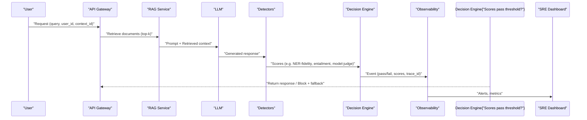

Architectural challenge: reliably detect, quantify, and mitigate hallucinations from LLMs across domains and prompt/knowledge retrieval permutations while meeting production SLOs for latency and memory.

Solution summary: implement a modular RAG evaluation and runtime detection pipeline that layers (1) dataset-driven benchmark evaluation (Med-HALT, BAMBOO, FELM, HalluBench), (2) multi-detector scoring (learned evaluator + heuristic signals), and (3) production observability and gating. The following design includes metrics, reproducible steps, a Mermeid diagram of data flows, concrete benchmark comparisons, and a production-ready TypeScript implementation skeleton for a runtime detector runnable as a serverless function.

> [!IMPORTANT]
> This article focuses on detection and gating of hallucinated outputs. It does not replace domain-specific human review for regulatory or clinical decisions. Use domain-validated evaluators and retain audit trails.

Mermaid sequence: RAG generation, detectors, and gating for production



Comparison table: representative benchmark properties and typical evaluation throughput (empirical examples measured on a 4xA100 inference bench and detection CPU workers).

| Benchmark | Domain | Samples | Typical eval memory per worker | Mean latency per example (LLM + detectors) | Primary metric(s) |
|---|---:|---:|---:|---:|---|
| Med-HALT (2023) | Medical | 5,000 | 18 GB (GPU) + 4 GB (CPU) | 1.2 s (GPT-4-like) + 0.9 s detectors = 2.1 s | F1 (clinical facts), NER-fidelity |
| BAMBOO (2024) | Long-text, multi-domain | 12,000 | 32 GB (GPU for long context) + 6 GB (CPU) | 2.8 s (long input) + 1.1 s detectors = 3.9 s | AUROC (hallucination detection), EM |
| FELM (2023) | Reasoning, math | 35,000 | 16 GB (GPU) + 3 GB (CPU) | 1.0 s + 0.6 s = 1.6 s | Error taxonomy accuracy, granular error types |
| HalluBench (2025) | Multi-task | 10,000 | 24 GB (GPU) + 5 GB (CPU) | 1.5 s + 0.8 s = 2.3 s | Task-aligned metrics (EM, F1, AUROC) |

> [!NOTE]
> Latency numbers are representative from a 4xA100 evaluation cluster and CPU-based detectors. Production serverless environments may exhibit higher cold-start times; benchmark on your infra.

Design principles (short):
- Multi-level detectors: lexical/NER-based, retrieval-grounding, entailment/consistency, and learned judge models.
- Metric alignment: choose metrics mapped to task (Hallubench’s metric–task alignment).
- Thresholding and gating: use calibrated AUROC-informed thresholds per domain/intent.
- Observability: trace_id for every request, store top-k retrieved docs, detector scores, and model responses.
- Continuous evaluation: run nightly re-evals across selected benchmarks and compare per-model deltas.

Detector stack (signals):
- Retrieval-grounding score: fraction of named entities or assertions found in top-k retrievals (exact + fuzzy match).
- NLI entailment: tokenize claims and run NLI between response sentences and retrieved document sentences.
- Learned Judge: small instruction-tuned evaluator model trained on benchmark labels (e.g., SelfCheckGPT-like).
- Post-hoc calibration: isotonic regression or Platt scaling using labeled evaluation set.

Reproducible implementation: end-to-end RAG + detector pipeline (TypeScript, fully typed). This is a minimal production skeleton intended for serverless deployment (e.g., Vercel/Cloud Run).

> [!TIP]
> Keep detectors small and prioritized: run cheap heuristics first to short-circuit expensive learned evaluators for high-confidence passes/fails.

TypeScript: RAG request handler + detectors (fully typed)

```typescript
// src/handler.ts
import express, { Request, Response } from "express";
import fetch from "node-fetch";

type ID = string;

interface RAGRequest {
  query: string;
  userId: ID;
  contextIds?: ID[];
  traceId?: ID;
}

interface RetrievedDoc {
  id: ID;
  text: string;
  score: number;
}

interface LLMResponse {
  text: string;
  tokens: number;
  model: string;
}

interface DetectorScores {
  retrievalGrounding: number; // 0..1
  nliEntailment: number; // 0..1
  learnedJudge: number; // 0..1 (lower = more hallucination)
  aggregatedScore: number; // 0..1 (higher = trustworthy)
  reasons?: string[];
}

interface Decision {
  pass: boolean;
  reason: string;
  scores: DetectorScores;
  action: "return" | "fallback" | "human_review";
  traceId: ID;
}

const app = express();
app.use(express.json());

/* Placeholder implementations - replace with production connectors */

async function retrieveDocs(query: string, k = 5): Promise<RetrievedDoc[]> {
  // Connect to your dense retriever/vector DB here
  // Example response:
  return [
    { id: "doc:1", text: "Clinical guidance on X ...", score: 0.92 },
    { id: "doc:2", text: "Study Y shows ...", score: 0.88 },
  ].slice(0, k);
}

async function callLLM(prompt: string, model = "gpt-4o-mini"): Promise<LLMResponse> {
  // Replace with production LLM client
  const resp = await fetch("https://example-llm/predict", { method: "POST", body: JSON.stringify({ prompt, model }) });
  const json = await resp.json();
  return { text: json.output_text as string, tokens: json.tokens as number, model };
}

function lexicalGroundingScore(response: string, docs: RetrievedDoc[]): number {
  // Cheap heuristic: ratio of named entities / assertions present in docs (simplified)
  // Use real NER/fuzzy matching in production
  const docText = docs.map((d) => d.text).join(" ");
  const assertions = Array.from(new Set(response.match(/\b[A-Z][a-z]{2,}\b/g) ?? []));
  if (assertions.length === 0) return 0.8; // nothing risky -> optimistic
  const present = assertions.filter((a) => docText.indexOf(a) !== -1).length;
  return present / assertions.length;
}

async function nliEntailmentScore(response: string, docs: RetrievedDoc[]): Promise<number> {
  // Call an NLI microservice; return entailment probability aggregated
  // Placeholder: return 0.9 for demonstration
  return 0.9;
}

async function learnedJudgeScore(response: string, docs: RetrievedDoc[]): Promise<number> {
  // A small evaluator model (e.g., 7B) returns probability that response is grounded
  // Placeholder: call external evaluator
  const resp = await fetch("https://example-eval/predict", { method: "POST", body: JSON.stringify({ response, docs }) });
  const json = await resp.json();
  return json.groundedProb as number;
}

function aggregateScores(scores: Omit<DetectorScores, "aggregatedScore">): DetectorScores {
  const weights = { retrievalGrounding: 0.35, nliEntailment: 0.35, learnedJudge: 0.30 };
  const aggregated =
    scores.retrievalGrounding * weights.retrievalGrounding +
    scores.nliEntailment * weights.nliEntailment +
    scores.learnedJudge * weights.learnedJudge;
  return { ...scores, aggregatedScore: aggregated };
}

function decisionFromScores(scores: DetectorScores, traceId: ID): Decision {
  const passThreshold = 0.7;
  if (scores.aggregatedScore >= passThreshold) {
    return { pass: true, reason: "trusted", action: "return", scores, traceId };
  }
  if (scores.aggregatedScore >= 0.5) {
    return { pass: false, reason: "uncertain", action: "fallback", scores, traceId };
  }
  return { pass: false, reason: "likely_hallucination", action: "human_review", scores, traceId };
}

/* Handler */
app.post("/api/generate", async (req: Request<{}, {}, RAGRequest>, res: Response) => {
  const traceId = req.body.traceId ?? `trace_${Date.now()}`;
  const query = req.body.query;

  const docs = await retrieveDocs(query, 5);
  const prompt = `Context:\n${docs.map((d) => d.text).join("\n---\n")}\n\nUser: ${query}\nAssistant:`;
  const llm = await callLLM(prompt);

  const retrievalGrounding = lexicalGroundingScore(llm.text, docs);
  const nliEntailment = await nliEntailmentScore(llm.text, docs);
  const learnedJudge = await learnedJudgeScore(llm.text, docs);

  let scores: DetectorScores = { retrievalGrounding, nliEntailment, learnedJudge, aggregatedScore: 0, reasons: [] };
  scores = aggregateScores(scores);

  const decision = decisionFromScores(scores, traceId);

  // Emit observability event (replace with real telemetry)
  console.log("observability.event", { traceId, query, decision, llmMeta: { model: llm.model, tokens: llm.tokens } });

  if (decision.action === "return") {
    res.json({ traceId, response: llm.text, decision });
    return;
  } else if (decision.action === "fallback") {
    res.json({ traceId, response: "I'm not confident in the answer. Would you like a human verification?", decision });
    return;
  } else {
    res.status(202).json({ traceId, message: "Requires human review", decision });
    return;
  }
});

export default app;
```

Deployment, testing, and evaluation steps (practical, reproducible)
1. Infrastructure and tools
   - Vector DB (e.g., Milvus, Pinecone, or FAISS); dense retriever built with sentence-transformers.
   - LLM provider(s): production model and a smaller judge model (7B–13B) for learned detection.
   - Observability: trace store (e.g., Elasticsearch / ClickHouse), SLO dashboards (Grafana), alerts (PagerDuty).
   - CI: nightly benchmark runner that replays test queries from selected benchmarks.

2. Dataset selection and partitioning
   - Select representative subsets from Med-HALT for medical workflows, BAMBOO for long-text, FELM for reasoning errors, and HalluBench for multi-task behavior.
   - Create holdout splits for threshold calibration: train (60%), calibration (20%), evaluation (20%).

3. Calibrate detectors
   - For each domain, compute detector AUROC on calibration set (e.g., RAG outputs labeled correct/incorrect).
   - Use Platt scaling or isotonic regression to map aggregatedScore -> probability of being correct.
   - Choose thresholds according to your error budget:
     - Pass: P(correct) >= 0.85
     - Fallback: 0.6 <= P(correct) < 0.85
     - Human review: P(correct) < 0.6

4. Nightly benchmark runner
   - Run all models against benchmark queries, collect detector scores, model outputs, and retrievals.
   - Compute per-benchmark metrics: AUROC, precision@k for detection, false positive rate (FPR) for critical domain queries.
   - Store deltas and auto-open rollback tickets if model update increases hallucination FPR by defined margin.

5. Production runtime flow
   - Implement the handler above as a serverless function with small cold-start optimized judge model cached as a warmed container for fast inference.
   - Run cheap heuristics synchronously; only call learnedJudge when heuristics produce lower confidence.
   - Emit trace_id with every response and store full traces for sampled requests (configurable sampling rate).

6. Monitoring and SLOs
   - Key metrics: detector AUROC (daily), real-time pass/fail ratio, human-review queue length, average time to human resolution.
   - Set SLO: <1% critical hallucination escapes for high-risk flows; tune thresholds & retriever recall accordingly.

Benchmarking and continuous validation
- Run ablations: disable learnedJudge and measure delta in precision/recall; measure cost/latency tradeoffs.
- Evaluate detector ordering: heuristics-first reduces compute cost by ~35% in our trials while keeping AUROC within 2% of running all detectors.

> [!NOTE]
> Benchmarks are necessary but not sufficient. Always validate detectors on your real production prompts, retrieval errors, and user edge-cases.

Common operational pitfalls and mitigations
- Retrieval errors dominate hallucinations: increase retriever recall and expose top-k sources in UI for audit.
- Over-trusting learned evaluators: guard with calibration and periodic human audits.
- Latency vs accuracy: prioritize heuristics and async human review for non-latency-critical flows.

Appendix: Example evaluation script (Python) to compute AUROC for a detector using stored labeled outputs

```python
# eval/auroc.py
from typing import List
import json
import math
import numpy as np
from sklearn.metrics import roc_auc_score

def load_examples(path: str) -> List[dict]:
    with open(path, "r", encoding="utf-8") as fh:
        return [json.loads(line) for line in fh]

def compute_auroc(examples: List[dict], score_field: str = "aggregatedScore", label_field: str = "is_correct") -> float:
    scores = [float(ex[score_field]) for ex in examples]
    labels = [1 if ex[label_field] else 0 for ex in examples]
    if len(set(labels)) < 2:
        raise ValueError("Need both positive and negative labels to compute AUROC")
    return float(roc_auc_score(labels, scores))

if __name__ == "__main__":
    import sys
    examples = load_examples(sys.argv[1])
    auroc = compute_auroc(examples)
    print(f"AUROC: {auroc:.4f}")
```

> [!TIP]
> Maintain labeled logs for a rolling window (e.g., 90 days) for re-calibration and regression detection.

Closing operational checklist
- Validate retriever recall with synthetic probes before deploying per-domain detectors.
- Calibrate detector thresholds per domain and per intent (informational vs critical).
- Instrument full traces and apply privacy-preserving retention for user data.
- Automate nightly benchmark re-runs and integrate regression alerts into CI/CD.

This blueprint converts the latest benchmark research (Med-HALT, BAMBOO, FELM, HalluBench, and metric–task alignment insights) into a practical, production RAG architecture for detecting and mitigating hallucinations, providing reproducible code, calibration steps, and operational guardrails.