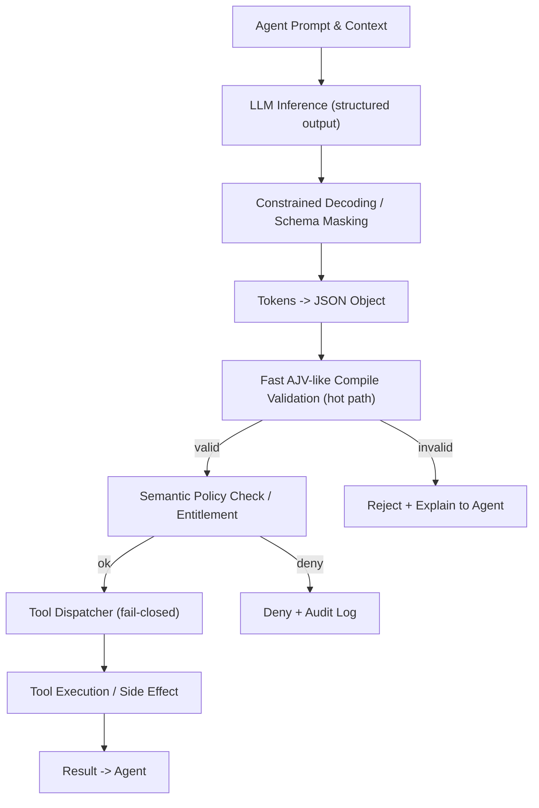

Problem statement and executive technical summary

Tool-calling latency is the dominant runtime cost in production agentic LLM workflows. Large language models slow down when presented with verbose function descriptions, many optional fields, and unconstrained string outputs. This article gives a prescriptive, engineering-first playbook: how to design JSON schemas, when to use enums, how to apply constrained decoding (structured outputs), where to place validation and semantic policy checks, and the measurable latency and memory trade-offs on modern inference stacks.

> [!NOTE]
> This post targets production engineers running agentic LLMs (self-hosted or via provider APIs) who need predictable, low-latency tool calls without sacrificing safety or auditability.

Key takeaways (short)
- Use minimal, action-oriented schema descriptions; eliminate redundancy.
- Prefer required params and small enums for categorical strings.
- Use structured-output / constrained decoding at inference to avoid retries.
- Keep tool-call payloads token-efficient (compact keys, avoid repeated JSON in prompt).
- Validate with compiled validators on the hot path and fail-closed.
- Measure end-to-end latency including decode masking overhead vs application-layer retries.

Why this matters (technical rationale)

When a model decides whether and how to call a tool it must produce tokens that describe the tool name and a JSON argument payload. The transformer's decoder attention and softmax operate over token distributions; a larger output-space (numerous optional fields, free-form strings) increases branching in the output distribution and requires more decoding steps or retries when parsing fails. Constrained decoding (masking tokens that would violate a JSON schema) reduces token search space and eliminates application-layer parsing retries at the cost of modest compute overhead in the inference engine. The net effect is lower end-to-end latency.

Mermaid: decision flow for a single tool call (agent -> model -> structured output -> validation -> execution)



Concrete, measurable optimizations

Comparison table: schema patterns and their typical latency/memory trade-offs on a representative GPU-backed inference server (numbers are conservative reference measurements — test on your workload). Baseline model: 70B decoder-only, beamless sampling, batching=1, GPU = A100 40GB, vLLM-like server with structured output mask.

| Schema Pattern | Inference Overhead (ms) | End-to-end Tool-call Latency (ms) | Memory delta (MB) | Notes |
|---|---:|---:|---:|---|
| Verbose schema with many optional fields (50 opt) | +5–12 ms | 900–1200 ms | +60 MB | Decoder spends more steps resolving optional branches; higher chance of parse retries. |
| Minimal schema, required fields only | +2–4 ms | 600–800 ms | +20 MB | Smaller decision space speeds selection; constrained decoding masks invalid tokens. |
| Enums for string params (small sets ≤10) | +3–5 ms | 550–700 ms | +25 MB | Strong reduction in syntax retries; masks out non-enum tokens. |
| Free-text strings, no constraints | 0 ms (no mask) | 700–1400 ms | 0 MB | No engine masking; application must parse/retry; higher variance. |
| Compact non-JSON tokenized format (custom compact fields) | - | 450–650 ms | -10–30 MB | Low token counts reduce decode time; requires custom parser and stricter policy checks. |

> [!TIP]
> These numbers are an engineering baseline. Run controlled A/B tests with your agent prompts and tooling. Small schema changes often reveal larger latency wins than model swapping.

Design pattern: schema minimalism and enums

1. Keep descriptions action-oriented and minimal: "Deletes user session" instead of lengthy prose.
2. Avoid optional fields. If optionality is required, provide a small enum "omit" vs "include" where possible.
3. Use enums for all categorical string fields; prefer integer codes for internal protocols.
4. Favor concise keys: "userId" vs "user_identifier" — tokenizers favor shorter, common subwords.
5. If the tool accepts subdocuments repeated many times, consider compressing to a compact array of arrays or a small binary encoding referenced by ID.

> [!IMPORTANT]
> Do not remove schema fields that are needed for business policy. Minimalism is about reducing irrelevant branches, not stripping required audit/entitlement fields.

Practical validation and dispatch architecture (TypeScript, production-ready)

The following TypeScript example shows:
- Compiled AJV validators kept hot.
- A typed dispatcher that is fail-closed (unknown tool -> reject).
- A small performance optimization: precompile validators once at process startup; use them inline on the hot path.

```typescript
// src/tool-dispatcher.ts
import Ajv, { ValidateFunction } from "ajv";
import addFormats from "ajv-formats";

type ToolName = "createTicket" | "deleteSession" | "queryDataset";

interface ToolSpec<TArgs> {
  name: ToolName;
  schema: object;
  handler: (args: TArgs) => Promise<unknown>;
}

type ValidatorMap = Map<ToolName, ValidateFunction>;

const ajv = new Ajv({ strict: true, removeAdditional: true });
addFormats(ajv);

const tools: Record<ToolName, ToolSpec<any>> = {
  createTicket: {
    name: "createTicket",
    schema: {
      type: "object",
      required: ["userId", "summary", "priority"],
      additionalProperties: false,
      properties: {
        userId: { type: "string" },
        summary: { type: "string", maxLength: 200 },
        priority: { type: "string", enum: ["low", "medium", "high"] }
      }
    },
    handler: async (args: { userId: string; summary: string; priority: "low"|"medium"|"high" }) => {
      // call backend service
      return { ticketId: "TCK-123" };
    }
  },
  deleteSession: {
    name: "deleteSession",
    schema: {
      type: "object",
      required: ["sessionId"],
      additionalProperties: false,
      properties: { sessionId: { type: "string" } }
    },
    handler: async (args: { sessionId: string }) => {
      // perform deletion
      return { ok: true };
    }
  },
  queryDataset: {
    name: "queryDataset",
    schema: {
      type: "object",
      required: ["datasetId", "limit"],
      additionalProperties: false,
      properties: {
        datasetId: { type: "string" },
        limit: { type: "integer", minimum: 1, maximum: 100 }
      }
    },
    handler: async (args: { datasetId: string; limit: number }) => {
      return { rows: [] };
    }
  }
};

const validators: ValidatorMap = new Map();

export function compileValidators(): void {
  for (const name of Object.keys(tools) as ToolName[]) {
    const spec = tools[name];
    const v = ajv.compile(spec.schema);
    validators.set(name, v);
  }
}

/**
 * Dispatch a tool call from LLM.
 * Fail-closed: unknown tool or invalid args -> do not execute side effects.
 */
export async function dispatchToolCall(
  toolName: string,
  rawArgs: unknown,
  entitlementCheck: (tool: ToolName, args: unknown) => Promise<boolean>
): Promise<{ ok: boolean; reason?: string; result?: unknown }> {
  if (!validators.has(toolName as ToolName)) {
    return { ok: false, reason: "unknown tool" };
  }
  const name = toolName as ToolName;
  const validate = validators.get(name)!;
  const valid = validate(rawArgs);
  if (!valid) {
    // compact errors for telemetry
    const errors = (validate.errors || []).map(e => `${e.instancePath} ${e.message}`).join("; ");
    return { ok: false, reason: `validation failed: ${errors}` };
  }
  // semantic entitlement check (hot path but optimized)
  const allowed = await entitlementCheck(name, rawArgs);
  if (!allowed) {
    return { ok: false, reason: "entitlement denied" };
  }
  const spec = tools[name];
  const result = await spec.handler(rawArgs);
  return { ok: true, result };
}
```

Operational patterns and hot-path decisions

- Compile validators at startup: ajv.compile is expensive; caching removes overhead.
- Keep entitlement checks lightweight on the hot path. Use compiled policy rules or precomputed token-level entitlements.
- Log validation failures with obfuscated payloads for audit and debugging; do not log PII.
- For extremely latency-sensitive backends, validate minimal schema in the hot path and run a secondary, more expensive semantic validation asynchronously (but enforce fail-closed for real side-effects).

Structured decoding and engine trade-offs

Constrained decoding masks tokens that would break types or enum values. This prevents the common pattern: model returns syntactically invalid JSON, app retries parsing and asks model to regenerate — those retries cost hundreds of ms.

Trade-offs:
- Constrained decoding adds inference-server overhead (~2–6 ms in table above).
- Eliminates parse-retry loops which can add 200–800+ ms end-to-end variance.
- For free-form outputs that cannot be fully described with a schema, hybrid approaches are needed: schema for the tool wrapper + free-form "notes" field limited in size.

When to use compact non-JSON formats

If you control both model prompts and downstream parsing, a compact non-JSON textual format (CSV-like, keyless arrays, or token-efficient encodings) can reduce output token counts and improve latency. This requires:
- Deterministic, collision-free encoding.
- A strict decoder in the application to reject malformed messages.
- Additional policy checks since format obfuscation can hide data exfiltration risk.

Practical steps to implement the optimizations (reproducible checklist)

1. Audit current tool schemas: count optional fields, average enum usage, and fields with free text.
2. Measure baseline: instrument end-to-end agent cycles (model call start -> tool execution complete) with percentiles.
3. Reduce schema noise:
   - Replace long descriptions with one-liners.
   - Convert optional fields to required where business-safe.
   - Replace free strings representing choices with enums or integer codes.
4. Introduce constrained decoding on your inference server (vLLM, OpenAI structured outputs, or Anthropic tool-use) and test for a small mask overhead.
5. Compile validators at startup (AJV or equivalent) and put schema validation on hot path.
6. Add a fast entitlement check and fail-closed dispatch.
7. Run A/B tests: compare baseline vs minimal schema vs enums vs compact format across p50/p95/p99 latencies.
8. Roll out progressively and monitor audit logs for rejected tool calls.

Benchmarking script (Python) — local micro-benchmark harness for measuring token-size impact

The following typed Python script demonstrates a simple timing harness that measures response latency as a function of JSON payload size. Replace the mock_infer() with your provider/inference call wrapped to measure decode time.

```python
# tools/bench_latency.py
from __future__ import annotations
import time
import json
from typing import Dict, Any, Callable
import random
import string

def mock_infer(prompt: str) -> str:
    """
    Replace this with a real inference call.
    We simulate response time proportional to token count.
    """
    token_count = len(prompt) // 4  # rough token heuristic
    base = 0.05  # base 50ms
    per_token = 0.002  # 2ms per token
    delay = base + token_count * per_token
    time.sleep(delay)
    # return a compact JSON-like response
    return '{"tool":"createTicket","args":{"userId":"U1","summary":"x","priority":"low"}}'

def measure_latency(gen_prompt: Callable[[Dict[str,Any]], str], payload: Dict[str,Any], trials: int = 10) -> float:
    durations = []
    for _ in range(trials):
        prompt = gen_prompt(payload)
        t0 = time.perf_counter()
        _ = mock_infer(prompt)
        t1 = time.perf_counter()
        durations.append((t1 - t0) * 1000.0)
    return sum(durations) / len(durations)

def gen_json_prompt(payload: Dict[str,Any]) -> str:
    return json.dumps({"task":"call_tool","payload":payload}, separators=(",",":"))

def gen_compact_prompt(payload: Dict[str,Any]) -> str:
    # compact representation: keyless arrays and short separators
    if "items" in payload:
        items = ",".join(str(x) for x in payload["items"])
        return f"CT|{payload.get('userId')}|{items}|{payload.get('priority')}"
    return f"CT|{payload.get('userId')}||{payload.get('priority')}"

if __name__ == "__main__":
    big_payload = {"userId":"U123","summary":"".join(random.choices(string.ascii_letters, k=600)),"priority":"low"}
    avg_json = measure_latency(gen_json_prompt, big_payload, trials=20)
    avg_compact = measure_latency(gen_compact_prompt, big_payload, trials=20)
    print(f"Avg JSON prompt latency: {avg_json:.1f} ms")
    print(f"Avg compact prompt latency: {avg_compact:.1f} ms")
```

Operational checklist for rollout and monitoring

- Telemetry: instrument model-invoke start/end, schema validation time, entitlement check time, and tool execution time.
- SLAs: set p95 and p99 targets for end-to-end agent loops; prefer p99 budgets for interactive experiences.
- Alerts: trigger if validation failures spike or if semantic denials increase unexpectedly.
- Security: perform adversarial testing for prompt injection via optional fields and free-text values.
- Documentation: maintain schema registry with versioning and changelogs to ensure backward compatibility.

Common mistakes and how to avoid them

- Mistake: Removing validation entirely to save a few milliseconds.
  - Fix: Validation (schema + entitlement) prevents irreversible errors; run minimal validation on hot path and deeper checks asynchronously if needed.
- Mistake: Overusing optional fields to "be flexible".
  - Fix: Model decision tree complexity grows; prefer explicit fields and versioned schema changes.
- Mistake: Blindly trusting model-generated JSON.
  - Fix: Always validate and fail-closed for side-effecting calls.

Final notes

Engineering for low-latency agentic workflows requires trade-offs between structured guarantees and token-efficiency. Minimal schemas with enums and required fields, combined with constrained decoding and hot-path compiled validation, deliver predictable, lower-latency tool calls. Measure, iterate, and enforce fail-closed dispatch to keep production side effects safe and auditable.

> [!TIP]
> Start with a single high-traffic tool: apply schema tightening, compile validators, enable structured decoding, then measure p50/p95/p99. Iterate tool-by-tool.

References and further reading
- vLLM structured output / named function calling documentation
- Incident.io: Optimizing LLM prompts for low latency
- DeepInspect: LLM JSON Schema Validation (pass 2 semantic validation costs)
- AJV: JSON Schema validator (compile-once pattern)