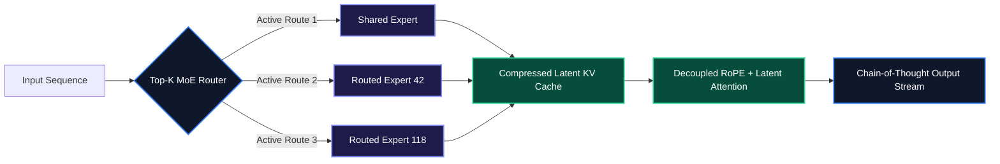

# DeepSeek-R1 & GRPO: The Open-Weights Reasoning Architecture

When scaling reasoning models, traditional Reinforcement Learning from Human Feedback (RLHF) hits a hard infrastructure ceiling: maintaining a separate critic (value) model doubles the GPU VRAM requirement throughout training. 

**DeepSeek-R1** solved this by combining **Multi-head Latent Attention (MLA)** with **Group Relative Policy Optimization (GRPO)**. By replacing absolute state-value estimation with intra-group reward normalization, GRPO eliminates the critic network entirely while training models to produce verifiable, step-by-step reasoning tokens before emitting final answers.

> [!NOTE]
> DeepSeek-R1 achieves parity with OpenAI o1 on competitive math (AIME 2024: 79.8% vs 79.2%) and coding benchmarks (Codeforces: 96.3 percentile) by applying large-scale reinforcement learning directly to cold-start base checkpoints.

---

## 1. Architectural Foundations: MLA and Sparsely Gated MoE

Traditional Multi-Head Attention (MHA) creates an acute memory bottleneck at long context lengths because the Key-Value (KV) cache scales linearly with sequence length $L$ and batch size $B$.

DeepSeek-V3/R1 addresses this with two core mechanisms:

1. **Multi-head Latent Attention (MLA)**: Projects keys and values into a low-rank compressed latent space ($\mathbf{c}_t^{KV}$) during inference. This compresses the active KV cache footprint by **up to 93%** compared to standard MHA.
2. **Fine-Grained MoE Routing**: Routes tokens dynamically across 256 routed experts (plus 1 shared expert), activating only 37B parameters per token out of 671B total weights.



---

## 2. Mathematical Mechanics of GRPO

Traditional PPO (Proximal Policy Optimization) evaluates the advantage $A_t$ of an action using a learned value network $V_\phi(s_t)$:

$$A_t = R_t - V_\phi(s_t)$$

**GRPO replaces the critic model with group statistics.** For each training prompt $q$, the policy $\pi_{\theta_{\text{old}}}$ samples a group of $G$ independent candidate outputs:

$$\mathcal{O} = \{o_1, o_2, \dots, o_G\}$$

Each output $o_i$ receives a scalar reward $r_i$ evaluated by deterministic rule-based verifiers (e.g., unit test pass rate, mathematical equality, format conformance). The normalized advantage $A_i$ is computed relative to the group:

$$A_i = \frac{r_i - \text{mean}(\{r_1, \dots, r_G\})}{\text{std}(\{r_1, \dots, r_G\}) + \epsilon}$$

The clipped GRPO objective function is formulated as:

$$\mathcal{J}_{\text{GRPO}}(\theta) = \mathbb{E}_{q \sim P(Q), \{o_i\}_{i=1}^G \sim \pi_{\theta_{\text{old}}}(O|q)} \left[ \frac{1}{G} \sum_{i=1}^{G} \left( \min\left( \frac{\pi_\theta(o_i|q)}{\pi_{\theta_{\text{old}}}(o_i|q)} A_i, \text{clip}\left(\frac{\pi_\theta(o_i|q)}{\pi_{\theta_{\text{old}}}(o_i|q)}, 1-\epsilon, 1+\epsilon\right) A_i \right) - \beta D_{\text{KL}}(\pi_\theta || \pi_{\text{ref}}) \right) \right]$$

> [!TIP]
> Group size $G$ is typically set between $8$ and $16$. Sampling multiple diverse trajectories per prompt forces the policy to explore alternate reasoning pathways without destabilizing gradient variance.

---

## 3. Implementing Rule-Based GRPO Verifiers in Python

Below is a complete, typed implementation of rule-based reward functions configured for Hugging Face `trl` (Transformer Reinforcement Learning):

```python
import re
from typing import Any
from pydantic import BaseModel, Field

class RewardAssessment(BaseModel):
    format_score: float = Field(default=0.0, ge=0.0, le=1.0)
    accuracy_score: float = Field(default=0.0, ge=-1.0, le=2.0)
    total_reward: float = Field(default=0.0)

def format_reward_func(completions: list[list[dict[str, str]]], **kwargs: Any) -> list[float]:
    """
    Enforces strict structural boundaries: reasoning must be isolated within <think>...</think>
    and final answers returned within <answer>...</answer>.
    """
    pattern = r"^<think>[\s\S]*?</think>\s*<answer>[\s\S]*?</answer>$"
    rewards = []
    
    for candidate in completions:
        content = candidate[0]["content"].strip()
        if re.match(pattern, content):
            rewards.append(1.0)
        else:
            rewards.append(0.0)
            
    return rewards

def math_accuracy_reward_func(
    completions: list[list[dict[str, str]]], 
    ground_truth: list[str], 
    **kwargs: Any
) -> list[float]:
    """
    Extracts the string contents of <answer>...</answer> and evaluates exact numerical parity.
    """
    rewards = []
    answer_regex = r"<answer>([\s\S]*?)</answer>"
    
    for candidate, target in zip(completions, ground_truth):
        content = candidate[0]["content"]
        match = re.search(answer_regex, content)
        
        if match:
            extracted_val = match.group(1).strip()
            if extracted_val == target.strip():
                rewards.append(2.0)  # Correct solution
            else:
                rewards.append(-0.5) # Format adhered, but incorrect answer
        else:
            rewards.append(-1.0)     # Malformed answer block
            
    return rewards

# Production TRL Integration Configuration
from trl import GRPOTrainer, GRPOConfig

def init_grpo_training_pipeline(model_id: str, train_dataset: Any) -> GRPOTrainer:
    training_args = GRPOConfig(
        output_dir="./deepseek-r1-grpo-checkpoints",
        learning_rate=2e-6,
        per_device_train_batch_size=2,
        gradient_accumulation_steps=8,
        num_generations=8,         # Group size G = 8
        max_prompt_length=512,
        max_completion_length=2048,
        beta=0.04,                 # KL penalty coefficient
        logging_steps=10,
    )
    
    return GRPOTrainer(
        model=model_id,
        reward_funcs=[format_reward_func, math_accuracy_reward_func],
        args=training_args,
        train_dataset=train_dataset,
    )
```

---

## 4. Deploying DeepSeek-R1 Distill Models with vLLM

For self-hosted production serving, distilled checkpoints (`DeepSeek-R1-Distill-Qwen-14B` and `32B`) retain full reasoning capabilities while running efficiently on single or dual NVIDIA A100/H100 nodes.

```python
from vllm import LLM, SamplingParams

# Initialize high-throughput tensor-parallel vLLM engine
engine = LLM(
    model="deepseek-ai/DeepSeek-R1-Distill-Qwen-14B",
    tensor_parallel_size=1,
    gpu_memory_utilization=0.92,
    max_model_len=16384,
    trust_remote_code=True,
    dtype="bfloat16",
)

# DeepSeek-R1 reasoning parameters
sampling_params = SamplingParams(
    temperature=0.6,      # Recommended temperature: 0.5 - 0.7
    top_p=0.95,
    max_tokens=4096,
    stop=["<|endoftext|>", "<|im_end|>"],
)

batch_prompts = [
    "<think>\nAnalyze time-complexity bottlenecks of concurrent lock-free skip lists in Rust.\n</think>\n",
    "<think>\nDerive the optimal chunk overlap percentage for dense vector retrieval across 100k RFC documents.\n</think>\n",
]

outputs = engine.generate(batch_prompts, sampling_params)

for output in outputs:
    print(f"\n--- Output ID: {output.request_id} ---")
    print(output.outputs[0].text)
```

---

## 5. Architectural Tradeoffs & Frontier Benchmark Comparison

| Metric / Capability | OpenAI o1 (Proprietary) | DeepSeek-R1 (Open-Weights) | DeepSeek-V3 (Base MoE) |
| :--- | :--- | :--- | :--- |
| **AIME 2024 (Math)** | 79.2% | **79.8%** | 39.2% |
| **MATH-500** | 96.4% | **97.3%** | 90.2% |
| **Codeforces Percentile** | **96.3** | **96.3** | 51.6% |
| **Training Budget** | Undisclosed ($100M+) | **~$6.0M** | ~$5.6M |
| **KV Cache Footprint** | Standard MHA ($O(L)$) | **Low (MLA Compression)** | **Low (MLA Compression)** |
| **Critic Model Overhead** | High (Separate Value Net) | **Zero (GRPO Group Stats)** | N/A (SFT + DPO) |

> [!IMPORTANT]
> When querying DeepSeek-R1 endpoints in production, do not inject system prompts that truncate reasoning loops (such as *"Be concise and return only the code"*). Doing so prevents the model from generating necessary self-correction tokens, drastically reducing task accuracy.

---

## Key Takeaways

- **Critic-Free Alignment**: GRPO eliminates auxiliary value networks by normalizing rewards over group trajectory batches ($G = 8 \dots 16$), drastically reducing GPU training memory.
- **Hardware-Aware KV Caching**: Multi-head Latent Attention compresses key-value vectors into low-rank representations, enabling long-context inference on constrained VRAM budgets.
- **Deterministic Verification**: Rule-based reward functions (format validation, AST parsing, exact math equality) provide high-signal gradients without human-annotated reward models.
