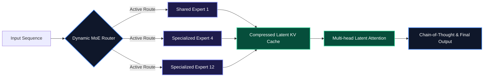

The release of **DeepSeek-R1** and **DeepSeek-V3** fundamentally reshaped the economics of artificial intelligence. By introducing breakthrough architectural innovations—specifically **Multi-head Latent Attention (MLA)** and **Group Relative Policy Optimization (GRPO)**—DeepSeek demonstrated that open-weights models can match or exceed proprietary frontier models while consuming a fraction of the training and inference compute budget.

In this deep dive, we explore how GRPO replaces expensive critic models in reinforcement learning, evaluate the underlying mathematical mechanics, and walk through deploying DeepSeek-R1 locally using **vLLM** and **Ollama**.

> [!NOTE]
> DeepSeek-R1 achieves competitive benchmarks with OpenAI o1 by applying pure reinforcement learning directly to base models, generating long "Chain-of-Thought" (CoT) reasoning tokens prior to final output emission.

---

## 1. Architectural Breakthroughs: MLA and MoE Scaling

Traditional Multi-Head Attention (MHA) creates massive memory bottlenecks during inference due to the Key-Value (KV) cache scaling linearly with sequence length. DeepSeek addresses this with two core innovations:

1. **Multi-head Latent Attention (MLA)**: Compresses the KV cache into a low-rank latent vector, reducing KV memory footprint by up to 93% without compromising context retrieval precision.
2. **DeepSeekMoE Architecture**: Uses fine-grained expert routing with high sparsity, activating only a small subset of parameters per token (e.g., 37B active parameters out of 671B total).



---

## 2. Understanding Group Relative Policy Optimization (GRPO)

Traditional Reinforcement Learning from Human Feedback (RLHF) relies on a **Critic Model** (value function network) that is equal in parameter size to the Policy Model (generator). This doubles the GPU memory required during RL training.

**GRPO eliminates the Critic Model entirely**. Instead of estimating absolute state values, GRPO samples a group of candidate outputs $\{o_1, o_2, \dots, o_G\}$ for each input prompt $q$, scores them using reward functions, and computes **relative advantages** across the sampled group.

### Mathematical Formulation
For a group of $G$ outputs with rewards $\{r_1, r_2, \dots, r_G\}$, the normalized advantage $A_i$ for output $o_i$ is computed as:

$$A_i = \frac{r_i - \text{mean}(\{r\}) Athletic}{\text{std}(\{r\}) + \epsilon}$$

The objective function maximizes:

$$\mathcal{J}_{\text{GRPO}}(\theta) = \mathbb{E} \left[ \frac{1}{G} \sum_{i=1}^{G} \min \left( \frac{\pi_\theta(o_i|q)}{\pi_{\theta_{\text{old}}}(o_i|q)} A_i, \text{clip}\left(\frac{\pi_\theta(o_i|q)}{\pi_{\theta_{\text{old}}}(o_i|q)}, 1-\epsilon, 1+\epsilon\right) A_i \right) - \beta D_{\text{KL}}(\pi_\theta || \pi_{\text{ref}}) \right]$$

> [!TIP]
> Because GRPO compares outputs within a generated group, it natively encourages exploration and self-correction without maintaining an auxiliary value network.

---

## 3. Implementing a Custom GRPO Reward Function in Python

Here is a production PyTorch snippet using `trl` and `transformers` showing how to define custom rule-based reward functions (e.g., verifying XML code format and math accuracy) for GRPO training:

```python
import re
from typing import List, Dict

def xml_format_reward_func(completions: List[List[Dict[str, str]]], **kwargs) -> List[float]:
    """
    Reward function enforcing that the model outputs thinking tokens wrapped in <think>...</think>
    and final solutions inside <answer>...</answer>.
    """
    rewards = []
    pattern = r"^<think>[\s\S]*?</think>\s*<answer>[\s\S]*?</answer>$"
    
    for completion in completions:
        content = completion[0]["content"]
        if re.match(pattern, content.strip()):
            rewards.append(1.0)
        else:
            rewards.append(0.0)
            
    return rewards

def math_accuracy_reward_func(completions: List[List[Dict[str, str]]], solution: List[str], **kwargs) -> List[float]:
    """
    Reward function checking exact numerical string match inside the answer tag.
    """
    rewards = []
    for completion, target in zip(completions, solution):
        content = completion[0]["content"]
        match = re.search(r"<answer>([\s\S]*?)</answer>", content)
        if match and match.group(1).strip() == target.strip():
            rewards.append(2.0)
        else:
            rewards.append(-0.5)
            
    return rewards

# Example Usage with TRL GRPOTrainer
# trainer = GRPOTrainer(
#     model=model,
#     reward_funcs=[xml_format_reward_func, math_accuracy_reward_func],
#     args=training_args,
#     train_dataset=dataset,
# )
```

---

## 4. Deploying DeepSeek-R1 Distill Models Locally with vLLM

You can host quantized or distilled versions of DeepSeek-R1 (e.g., `DeepSeek-R1-Distill-Qwen-14B` or `32B`) with continuous batching using **vLLM**.

```python
from vllm import LLM, SamplingParams

# Configure local inference engine with tensor parallelism
llm = LLM(
    model="deepseek-ai/DeepSeek-R1-Distill-Qwen-14B",
    tensor_parallel_size=1, # Number of GPUs
    gpu_memory_utilization=0.90,
    max_model_len=8192,
    trust_remote_code=True
)

sampling_params = SamplingParams(
    temperature=0.6, # Recommended temperature for DeepSeek reasoning models
    top_p=0.95,
    max_tokens=2048,
)

prompts = [
    "<think>\nWrite a Rust function for lock-free ring buffer.\n</think>\n"
]

outputs = llm.generate(prompts, sampling_params)

for output in outputs:
    prompt = output.prompt
    generated_text = output.outputs[0].text
    print(f"Generated CoT Output:\n{generated_text}")
```

---

## 5. Benchmark Comparison: Frontier vs Open-Weights

| Metric / Benchmark | OpenAI o1 (Proprietary) | DeepSeek-R1 (Open-Weights) | DeepSeek-V3 (Base MoE) |
| :--- | :--- | :--- | :--- |
| **AIME 2024 (Math)** | 79.2% | 79.8% | 39.2% |
| **MATH-500** | 96.4% | 97.3% | 90.2% |
| **Codeforces Percentile** | 96.3% | 96.3% | 51.6% |
| **Training Cost** | Undisclosed ($100M+) | ~$6.0M | ~$5.6M |
| **KV Cache Memory Overhead** | Standard (High) | Ultra-Low (MLA) | Ultra-Low (MLA) |

> [!IMPORTANT]
> When prompting DeepSeek-R1, do not pass system prompts that restrict reasoning length. Allow the model to generate uncensored `<think>` tokens for optimal problem-solving accuracy.

---

## Key Takeaways

- **GRPO Efficiency**: Removing the RL critic model drastically lowers GPU memory requirements during alignment fine-tuning.
- **MLA KV Compression**: Latent compression allows ultra-long context windows with minimal GPU VRAM consumption.
- **Distillation Power**: Smaller distilled variants (8B, 14B, 32B) retain a significant portion of full-scale R1 reasoning capabilities for local edge deployment.
- **Strict Format Enforcers**: Use structured rewards to ensure reasoning models output parseable `<think>` and `<answer>` blocks.
