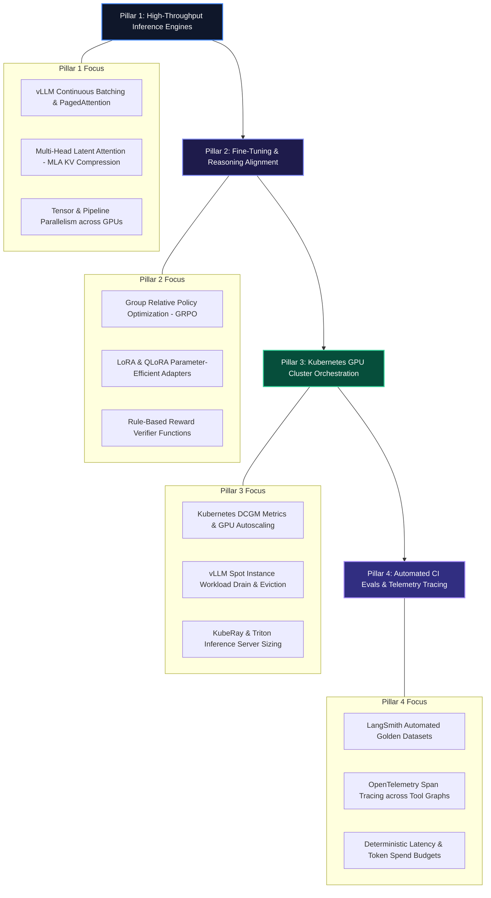

# The 2026 MLOps & Production LLM Infrastructure Roadmap

Operating AI systems in enterprise production requires transitioning from third-party API wrappers to self-hosted, scalable machine learning infrastructure. Platform engineers, SREs, and MLOps practitioners must manage **multi-node GPU clusters**, optimize Key-Value (KV) cache memory footprint, automate reinforcement learning alignment, and enforce continuous evaluation benchmarks.

This roadmap details the 4 core pillars required to build, orchestrate, and observe high-throughput, private LLM infrastructure.

> [!NOTE]
> Modern LLM infrastructure focuses heavily on inference efficiency: maximizing token generation throughput per dollar using tensor parallelism, PagedAttention, and low-rank KV cache compression (MLA).

---

## The 4 Pillars of Production LLM Infrastructure



---

## Pillar 1: High-Throughput Inference Serving Engines

Deploying open-weights reasoning models (such as `DeepSeek-R1-Distill-Qwen-14B` or `Llama-3.3-70B`) requires specialized inference engines with hardware-level optimizations:

### Core Milestones:
1. **PagedAttention & Continuous Batching**: Eliminating VRAM fragmentation by treating the KV cache like virtual memory pages.
2. **Multi-Head Latent Attention (MLA)**: Compressing key-value vectors into low-rank representations ($\mathbf{c}_t^{KV}$) to reduce inference memory consumption by up to 93%.
3. **Tensor Parallelism**: Splitting model matrix multiplications across multiple GPUs (e.g. 2x NVIDIA A100 SXM).

```python
from vllm import LLM, SamplingParams

# Milestone: High-Throughput Tensor-Parallel Serving
llm = LLM(
    model="deepseek-ai/DeepSeek-R1-Distill-Qwen-14B",
    tensor_parallel_size=2,
    gpu_memory_utilization=0.92,
    max_model_len=16384,
    dtype="bfloat16",
    trust_remote_code=True,
)

sampling_params = SamplingParams(
    temperature=0.6,
    top_p=0.95,
    max_tokens=4096,
)
```

📖 **Deep Dive Article**: [DeepSeek-R1 & GRPO: The Open-Weights Reasoning Architecture](/posts/deepseek-r1-grpo)

---

## Pillar 2: Parameter-Efficient Fine-Tuning & Reasoning Alignment

Aligning base models for domain-specific tasks without catastrophic forgetting:

### Core Milestones:
1. **Group Relative Policy Optimization (GRPO)**: Eliminating the critic model in RLHF to cut training VRAM consumption in half.
2. **Rule-Based Reward Verifiers**: Scoring completions automatically with exact format regex and unit test execution.
3. **LoRA & QLoRA Fine-Tuning**: Injecting low-rank adapter matrices into frozen transformer weights.

```python
from trl import GRPOTrainer, GRPOConfig

# Milestone: Critic-Free GRPO Alignment Configuration
training_args = GRPOConfig(
    output_dir="./r1-alignment-checkpoints",
    learning_rate=2e-6,
    per_device_train_batch_size=2,
    num_generations=8,     # Group size G = 8
    max_prompt_length=512,
    max_completion_length=2048,
    beta=0.04,
)
```

---

## Pillar 3: Kubernetes GPU Cluster Orchestration & FinOps

GPU infrastructure is expensive. Managing utilization, spot migrations, and container memory limits is vital for financial sustainability:

### Core Milestones:
1. **NVIDIA DCGM Telemetry**: Scraping `DCGM_FI_DEV_GPU_UTIL` and `DCGM_FI_DEV_FB_USED` metrics via Prometheus.
2. **Dynamic Workload Bin-Packing**: Consolidating under-utilized GPU nodes (<20% load) and auto-terminating idle instances.
3. **Spot Instance Orchestration**: Gracefully draining inference pods to reserved fallback clusters upon spot price surges.

```typescript
import { z } from "zod";

export const GPUNodeMetricsSchema = z.object({
  nodeId: z.string(),
  gpuModel: z.enum(["NVIDIA_H100", "NVIDIA_A100", "NVIDIA_L40S"]),
  utilizationPercent: z.number().min(0).max(100),
  vramOccupancyPercent: z.number().min(0).max(100),
  hourlyBurnUSD: z.number(),
});

export type GPUNodeMetrics = z.infer<typeof GPUNodeMetricsSchema>;
```

📖 **Deep Dive Articles**:
- [Autonomous AI DevOps Agents Part 6: FinOps Agents & Dynamic GPU Cost Optimization](/posts/ai-devops-agents-part-6-finops-gpu-cost-optimization)
- [Autonomous AI DevOps Agents Part 2: Kubernetes Self-Healing & Pod Crash Triage](/posts/ai-devops-agents-part-2-k8s-self-healing)

---

## Pillar 4: Automated CI/CD Evals & Distributed Observability

Maintaining output quality across model version updates and prompt modifications:

### Core Milestones:
1. **Automated LLM-as-a-Judge**: Running structured Pydantic evaluation rubrics in GitHub Actions CI gates.
2. **OpenTelemetry Span Tracing**: Measuring latency bottlenecks across multi-hop retrieval and tool calling steps.
3. **Golden Benchmark Versioning**: Maintaining curated test sets of domain edge cases.

```python
from pydantic import BaseModel, Field

# Milestone: Quantitative Evaluation Rubric
class EvaluationScorecard(BaseModel):
    factual_accuracy: float = Field(ge=0.0, le=1.0)
    latency_ms: float
    token_cost_usd: float
    reasoning: str
```

📖 **Deep Dive Articles**:
- [LLM Evals in Production: Automated Benchmarking with LangSmith](/posts/production-llm-evals)
- [Building a Multi-Agent AI Framework Part 5: Production Evals & Telemetry](/posts/multi-agent-framework-part-5-resilience-evals)

---

## Infrastructure Capability Matrix

| Pillar | Core Tooling | Primary Deliverable |
| :--- | :--- | :--- |
| **Pillar 1: Serving** | vLLM, Ollama, TensorRT-LLM | Low-Latency Streaming Inference Cluster |
| **Pillar 2: Alignment** | TRL, PyTorch, LoRA, GRPO | Domain-Tuned Reasoning Checkpoints |
| **Pillar 3: Orchestration** | Kubernetes, NVIDIA DCGM, Prometheus | Auto-Scaled & Spot-Optimized GPU Fleet |
| **Pillar 4: Observability** | LangSmith, OpenTelemetry, GitHub Actions | Continuous CI/CD Evaluation Gate |

---

## Recommended Learning Sequence

Follow our specialized series to build this infrastructure:

1. **[DeepSeek-R1 & GRPO Deep Dive](/posts/deepseek-r1-grpo)**: MLA memory compression and critic-free training.
2. **[Autonomous AI DevOps Agents Playlist](/playlists/autonomous-ai-devops-agents)**: Kubernetes self-healing, eBPF telemetry, and GPU FinOps.
3. **[Production LLM Evals Handbook](/posts/production-llm-evals)**: Automated CI/CD benchmarking with LangSmith.
