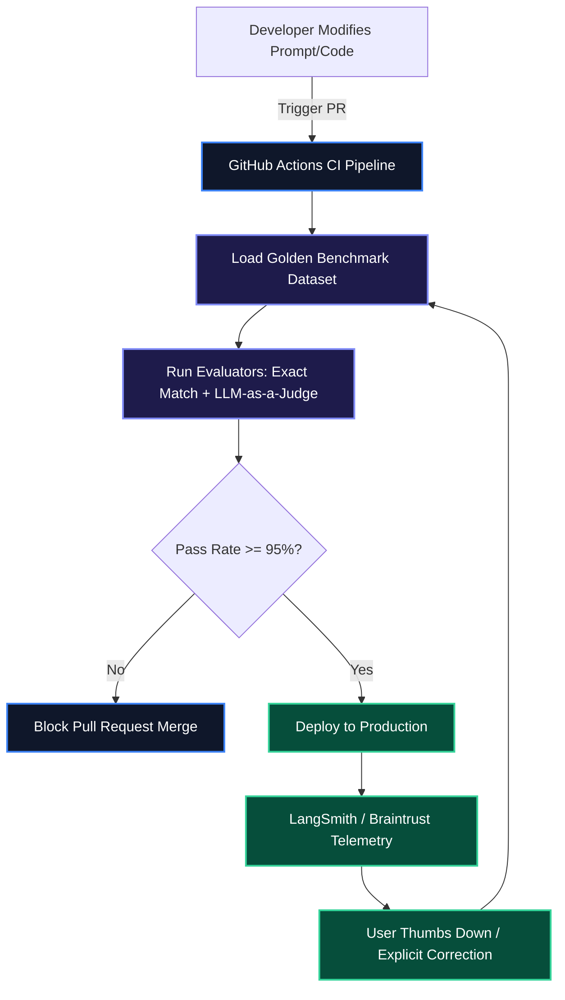

The single biggest blocker to shipping AI agents to enterprise production is **evaluation**. Without continuous, automated evaluation (Evals), prompt modifications, model updates, or retrieval adjustments introduce unseen regressions that damage output quality, increase latency, and inflate operational API costs.

In this handbook, we cover how to construct production-grade evaluation pipelines using **LangSmith** and **Braintrust**, implement deterministic scoring metrics, and integrate automated LLM-as-a-judge test suites into GitHub Actions CI/CD workflows.

> [!NOTE]
> Evals are to AI engineering what unit tests are to traditional software development. Never deploy a prompt change or model migration without running your evaluation suite against benchmark datasets.

---

## 1. The Continuous Evaluation Pipeline

A robust evaluation strategy tracks quality across three stages:
1. **Pre-commit / CI Evaluation**: Running synthetic regression datasets on prompt changes.
2. **Online Telemetry Tracing**: Capturing real user inputs, outputs, and latency traces in production.
3. **Feedback Feedback Loops**: Converting low-score user interactions into new golden test cases.



---

## 2. Defining Deterministic & Heuristic Evaluators

Before relying on expensive LLM-as-a-judge calls, always run fast, deterministic Python heuristics (e.g., regex matching, schema validation, latency budgets, and cost thresholds).

```python
import re
from typing import Dict, Any

def eval_json_schema_validity(run_output: str) -> float:
    """
    Evaluates whether the output string is valid JSON without markdown wrapping.
    Returns 1.0 for pass, 0.0 for fail.
    """
    import json
    try:
        json.loads(run_output)
        return 1.0
    except ValueError:
        return 0.0

def eval_latency_budget(latency_ms: float, max_budget_ms: float = 1500.0) -> float:
    """
    Evaluates runtime latency against SLA budget.
    """
    if latency_ms <= max_budget_ms:
        return 1.0
    return max(0.0, 1.0 - ((latency_ms - max_budget_ms) / max_budget_ms))

def eval_no_forbidden_phrases(run_output: str, forbidden: list[str]) -> float:
    """
    Ensures model avoids apologetic or generic fallback phrases.
    """
    lowered = run_output.lower()
    for phrase in forbidden:
        if phrase.lower() in lowered:
            return 0.0
    return 1.0
```

---

## 3. Implementing Automated LLM-as-a-Judge with LangSmith

For qualitative criteria—such as tone consistency, hallucination detection, or answer conciseness—we use strong referee models (e.g., GPT-4o or Claude 3.5 Sonnet) configured with structured scoring rubrics.

```python
from langsmith.evaluation import StringEvaluator, evaluate
from langsmith.schemas import Run, Example
from openai import OpenAI
from pydantic import BaseModel, Field

client = OpenAI()

class GradeResult(BaseModel):
    score: float = Field(description="Score between 0.0 (completely inaccurate) and 1.0 (perfect).")
    explanation: str = Field(description="Detailed justification for the assigned score.")

def llm_judge_correctness(run: Run, example: Example) -> Dict[str, Any]:
    """
    Custom LangSmith evaluator comparing model prediction against ground truth reference.
    """
    input_question = example.inputs.get("question", "")
    reference_answer = example.outputs.get("answer", "")
    predicted_answer = run.outputs.get("output", "")

    prompt = f"""
    You are an expert technical referee evaluating AI model outputs.
    
    Question: {input_question}
    Reference Ground Truth: {reference_answer}
    Model Predicted Answer: {predicted_answer}
    
    Grade the prediction for factual correctness, completeness, and lack of hallucination.
    """

    response = client.beta.chat.completions.parse(
        model="gpt-4o",
        messages=[{"role": "user", "content": prompt}],
        response_format=GradeResult,
        temperature=0.0
    )

    grade = response.choices[0].message.parsed
    return {
        "key": "factual_correctness",
        "score": grade.score,
        "comment": grade.explanation
    }

# Run automated evaluation suite over a target dataset
# results = evaluate(
#     my_target_chain,
#     data="SidhyaBlog-Golden-Benchmark",
#     evaluators=[llm_judge_correctness],
#     experiment_prefix="prompt-v2.1-test"
# )
```

---

## 4. GitHub Actions CI/CD Evaluation Workflow

Automating evaluation in your pull request workflow prevents regressions from reaching production main branches.

```yaml
# .github/workflows/evals.yml
name: AI Model Regression Evals

on:
  pull_request:
    branches: [ main ]

jobs:
  run-evals:
    runs-on: ubuntu-latest
    steps:
      - name: Checkout Codebase
        uses: actions/checkout@v4

      - name: Set up Python
        uses: actions/setup-python@v5
        with:
          python-version: "3.11"

      - name: Install Dependencies
        run: |
          pip install langsmith openai pydantic pytest

      - name: Execute LangSmith Evaluation Suite
        env:
          LANGCHAIN_API_KEY: ${{ secrets.LANGCHAIN_API_KEY }}
          OPENAI_API_KEY: ${{ secrets.OPENAI_API_KEY }}
          LANGCHAIN_TRACING_V2: "true"
          LANGCHAIN_PROJECT: "ci-pr-evals"
        run: |
          python -m pytest tests/evals/test_benchmarks.py --exitfirst
```

---

## 5. Evaluation Framework Matrix

| Metric / Feature | Human Annotations | Custom Python Heuristics | LangSmith / Braintrust Evals |
| :--- | :--- | :--- | :--- |
| **Feedback Speed** | Slow (Days/Weeks) | Instant (<10ms) | Fast (1-3s per sample) |
| **Cost Per Sample** | High ($1-$5) | Free ($0.00) | Low (~$0.005) |
| **CI/CD Automation** | Impossible | First-class | First-class |
| **Qualitative Nuance** | Excellent | Poor | High (with LLM Referee) |
| **Trace Visibility** | None | Limited Log Snippets | Full Call Tree Tracing & Token Costs |

> [!WARNING]
> Watch out for "LLM-as-a-judge bias"—models often favor responses generated by their own family (e.g., GPT-4o scoring GPT-4o higher than Claude 3.5). Use multi-model referee panels or standardized scoring criteria to mitigate bias!

---

## Key Takeaways

- **Golden Benchmark Datasets**: Maintain a curated, version-controlled dataset of edge-case user queries and expected outputs.
- **Layered Scoring Strategy**: Run cheap deterministic Python heuristics first before calling expensive LLM-as-a-judge routines.
- **Automated CI Gates**: Block pull requests automatically if evaluation scores regress below target thresholds (e.g., 95% pass rate).
- **Telemetry Tracing**: Capture real-world production traces in LangSmith or Braintrust to continuously expand test coverage.
