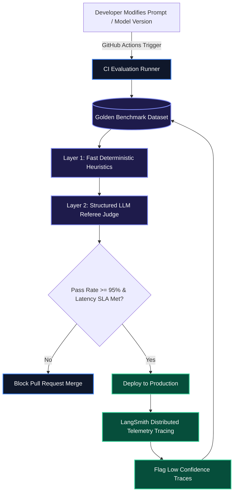

# LLM Evals in Production: Automated Benchmarking with LangSmith & Braintrust

When software teams ship LLM-powered features without automated evaluation suites, even minor prompt tweaks or model API version bumps cause silent production regressions: structured JSON schemas break, latency SLAs degrade, and domain hallucinations slip through undetected.

Evaluation pipelines (Evals) are to AI engineering what automated integration test suites are to distributed backend systems. This guide details how to construct an automated evaluation pipeline using **deterministic Python heuristics**, **structured LLM-as-a-judge scorers**, **LangSmith dataset benchmarking**, and **GitHub Actions CI gates**.

> [!NOTE]
> Treat prompts and model parameters like code. Every pull request modifying a system prompt or model configuration should trigger automated evaluation runs against a versioned golden benchmark dataset before merging.

---

## 1. The Continuous Evaluation Lifecycle

A robust evaluation harness operates across three testing horizons:
1. **Offline Regression Testing (CI/CD)**: Running deterministic heuristics and judge models on PR branches against versioned benchmark datasets.
2. **Online Telemetry & Tracing**: Capturing production input/output tokens, latency distributions, and runtime exceptions.
3. **Curated Feedback Loops**: Ingesting production edge cases (e.g. user thumbs-down or explicit corrections) into golden datasets.



---

## 2. Layer 1: Deterministic & Heuristic Evaluators

Before burning compute on LLM referee models, always execute deterministic Python assertions (JSON parsing, regex schema constraints, latency ceilings, and forbidden word filters).

```python
import json
import re
from typing import Callable

def eval_strict_json(output: str) -> float:
    """
    Asserts that the LLM output is valid JSON without markdown code fences.
    Returns 1.0 for valid parse, 0.0 for failure.
    """
    clean_text = output.strip()
    if clean_text.startswith("```"):
        return 0.0  # Rejected: Contained markdown fences when raw JSON was requested
    try:
        json.loads(clean_text)
        return 1.0
    except ValueError:
        return 0.0

def eval_latency_sla(duration_ms: float, max_allowed_ms: float = 1200.0) -> float:
    """
    Computes a linear decay score if latency exceeds the SLA budget.
    """
    if duration_ms <= max_allowed_ms:
        return 1.0
    overshoot = duration_ms - max_allowed_ms
    return max(0.0, 1.0 - (overshoot / max_allowed_ms))

def eval_forbidden_phrases(output: str, forbidden_phrases: list[str]) -> float:
    """
    Ensures the model avoids apologetic conversational fluff or sycophancy.
    """
    lowered = output.lower()
    for phrase in forbidden_phrases:
        if phrase.lower() in lowered:
            return 0.0
    return 1.0
```

---

## 3. Layer 2: Automated LLM-as-a-Judge with Structured Output

For evaluating semantic alignment, factual grounding, and tone adherence, configure a referee model (such as GPT-4o) with a strictly typed Pydantic scoring schema:

```python
from langsmith.evaluation import evaluate
from langsmith.schemas import Run, Example
from openai import OpenAI
from pydantic import BaseModel, Field

client = OpenAI()

class EvaluationRubric(BaseModel):
    factual_correctness: float = Field(
        ge=0.0, le=1.0, 
        description="1.0 if output factually answers question without hallucination, else 0.0-0.9."
    )
    conciseness_score: float = Field(
        ge=0.0, le=1.0, 
        description="1.0 if output avoids filler or unnecessary verbosity."
    )
    justification: str = Field(description="Detailed explanation justifying the rubric scores.")

def structured_llm_judge(run: Run, example: Example) -> dict:
    """
    LangSmith custom evaluator using OpenAI Structured Outputs.
    """
    question = example.inputs.get("question", "")
    ground_truth = example.outputs.get("reference_answer", "")
    model_output = run.outputs.get("output", "")

    prompt = f"""
    You are an expert technical evaluator. Grade the model prediction against the ground truth reference.

    User Question: {question}
    Reference Answer: {ground_truth}
    Candidate Prediction: {model_output}
    """

    response = client.beta.chat.completions.parse(
        model="gpt-4o",
        messages=[{"role": "user", "content": prompt}],
        response_format=EvaluationRubric,
        temperature=0.0,
    )

    rubric = response.choices[0].message.parsed
    return {
        "key": "correctness_score",
        "score": rubric.factual_correctness,
        "comment": rubric.justification,
    }

# Runnable LangSmith Evaluation Suite
def run_evaluation_suite(target_pipeline: Callable[[dict], dict], dataset_name: str):
    results = evaluate(
        target_pipeline,
        data=dataset_name,
        evaluators=[structured_llm_judge],
        experiment_prefix="prompt-v3-ci-benchmark",
        max_concurrency=4,
    )
    print(f"Evaluation Complete. Results recorded in LangSmith: {results}")
    return results
```

---

## 4. GitHub Actions CI/CD Regression Workflow

Automating evaluation in your pull request workflow prevents prompt regressions from breaking production:

```yaml
# .github/workflows/evals.yml
name: LLM Regression & Quality Evals

on:
  pull_request:
    paths:
      - 'prompts/**'
      - 'lib/ai/**'
      - 'models/**'

jobs:
  run-evals:
    runs-on: ubuntu-latest
    steps:
      - name: Checkout Codebase
        uses: actions/checkout@v4

      - name: Set up Python 3.11
        uses: actions/setup-python@v5
        with:
          python-version: "3.11"

      - name: Install Test Dependencies
        run: |
          pip install langsmith openai pydantic pytest

      - name: Execute Golden Benchmark Suite
        env:
          LANGCHAIN_API_KEY: ${{ secrets.LANGCHAIN_API_KEY }}
          OPENAI_API_KEY: ${{ secrets.OPENAI_API_KEY }}
          LANGCHAIN_TRACING_V2: "true"
          LANGCHAIN_PROJECT: "ci-regression-evals"
        run: |
          python -m pytest tests/evals/test_production_benchmarks.py --exitfirst
```

---

## 5. Evaluation Framework Comparison Matrix

| Evaluation Dimension | Manual Human Spot Checks | Python Deterministic Assertions | LLM-as-a-Judge (LangSmith) |
| :--- | :--- | :--- | :--- |
| **Execution Latency** | Days to Weeks | **Instant (< 5ms)** | 1–3 seconds |
| **Cost Per Run** | High ($5–$20/sample) | **Free ($0.00)** | ~$0.003 / sample |
| **CI Automation** | Impossible | **First-Class** | **First-Class** |
| **Nuance & Reasoning** | High | Low (Syntax/Regex only) | **High (Structured Rubric)** |
| **Drift Detection** | Slow & Subjective | Binary | **Continuous & Trackable** |

> [!WARNING]
> Beware of "LLM Self-Preference Bias"—evaluator models systematically score outputs from their own model family higher. Counter this by pairing multi-family referee panels (e.g. Claude 3.5 Sonnet judging GPT-4o outputs) or enforcing strictly defined scoring rubrics.

---

## Key Takeaways

- **Layered Verification**: Run cheap, fast deterministic assertions (JSON validity, regex patterns, forbidden tokens) first before triggering LLM referee calls.
- **Strict Pydantic Rubrics**: Avoid asking judge models for free-form scores. Use structured output schemas with bounded ranges (`ge=0.0, le=1.0`) and required justification fields.
- **Automated CI Merge Gates**: Integrate evaluation benchmarks into GitHub Actions pull requests to block prompt regressions before deployment.
- **Telemetry-Driven Datasets**: Route production edge cases directly into golden benchmark datasets to maintain high test coverage over time.
