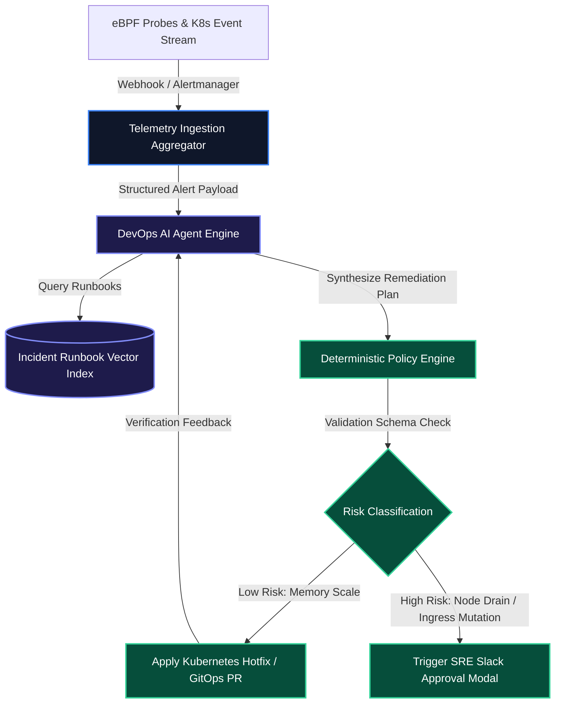

# Autonomous AI DevOps Agents Part 1: Control Plane Architecture & Event Loops

Traditional infrastructure monitoring suffers from an inherent signal-to-noise deficit: static Prometheus alert rules fire when arbitrary memory or latency thresholds are breached, but they cannot correlate cluster events with recent deployments, upstream network hiccups, or memory leaks.

Autonomous DevOps control loops bridge this gap by intercepting real-time telemetry, correlating stack traces against codebase diffs, and generating validated remediations.

> [!IMPORTANT]
> Non-deterministic language models must never possess direct root or cluster-admin privileges to Kubernetes clusters. All agentic tool executions must pass through a **deterministic policy validation proxy** with audit logging and human approval escalation gates.

---

## 1. System Architecture: The Agentic Control Loop

The control plane ingests telemetry from Prometheus and Kubernetes event streams, performs diagnostic reasoning, and routes planned patches through policy authorization gates:



---

## 2. Safe Execution Proxy & Policy Engine in TypeScript

Below is the production TypeScript policy proxy enforcing boundary constraints before any infrastructure mutation occurs:

```typescript
import { z } from "zod";

// Schema for pod remediation actions
export const RemediationActionSchema = z.object({
  clusterId: z.string(),
  namespace: z.string().min(1),
  targetResource: z.string(),
  actionType: z.enum([
    "RESTART_POD",
    "SCALE_DEPLOYMENT_REPLICAS",
    "PATCH_CONTAINER_MEMORY",
    "DRAIN_NODE",
  ]),
  parameters: z.record(z.unknown()),
  estimatedRisk: z.enum(["LOW", "MEDIUM", "HIGH", "CRITICAL"]),
});

export type RemediationAction = z.infer<typeof RemediationActionSchema>;

export interface ExecutionVerdict {
  isAllowed: boolean;
  requiresHumanApproval: boolean;
  reason: string;
}

export class DevOpsPolicyEngine {
  private allowedNamespaces = new Set(["staging", "production-workers"]);
  private maxMemoryScaleMB = 4096;

  public evaluateAction(action: RemediationAction): ExecutionVerdict {
    // Rule 1: Enforce namespace boundary
    if (!this.allowedNamespaces.has(action.namespace)) {
      return {
        isAllowed: false,
        requiresHumanApproval: false,
        reason: `Namespace '${action.namespace}' is outside autonomous agent execution boundary.`,
      };
    }

    // Rule 2: Escalation gate for node drainage or critical mutations
    if (action.actionType === "DRAIN_NODE" || action.estimatedRisk === "CRITICAL") {
      return {
        isAllowed: false,
        requiresHumanApproval: true,
        reason: `High-risk operation (${action.actionType}) requires explicit on-call SRE approval.`,
      };
    }

    // Rule 3: Resource ceiling validation
    if (action.actionType === "PATCH_CONTAINER_MEMORY") {
      const requestedMB = Number(action.parameters.memoryMB || 0);
      if (requestedMB > this.maxMemoryScaleMB) {
        return {
          isAllowed: false,
          requiresHumanApproval: true,
          reason: `Requested memory limit (${requestedMB}MB) exceeds safe ceiling of ${this.maxMemoryScaleMB}MB.`,
        };
      }
    }

    return {
      isAllowed: true,
      requiresHumanApproval: false,
      reason: "Action passed all deterministic policy criteria.",
    };
  }
}
```

---

## 3. Traditional Monitoring vs. Autonomous Agent Triage

| Capability | Traditional Prometheus / Alertmanager | Autonomous AI DevOps Agent |
| :--- | :--- | :--- |
| **Trigger Mechanism** | Static CPU/RAM percentage threshold | Contextual event streams & anomaly correlation |
| **Root Cause Triage** | Manual SRE inspection of logs & traces | Automated stack trace extraction & commit diffing |
| **Remediation Speed** | 15–45 min (PagerDuty on-call response) | **< 30 seconds (Automated bounded patch)** |
| **Safety Governance** | Runbook steps executed manually in terminal | **Deterministic Policy Proxy + GitOps Audit Trail** |

---

## Key Takeaways

- **Deterministic Execution Proxies**: Decoupling LLM diagnosis from API mutation prevents accidental outages caused by model hallucinations.
- **Strict Blast-Radius Controls**: Restrict autonomous agents to non-critical namespaces and capped resource ceilings.
- **GitOps Alignment**: High-risk remediations should be proposed as Git commits and Pull Requests rather than raw, un-tracked cluster mutations.

**[Continue to Part 2: Kubernetes Self-Healing & CrashLoopBackOff Triage →](/posts/ai-devops-agents-part-2-k8s-self-healing)**
