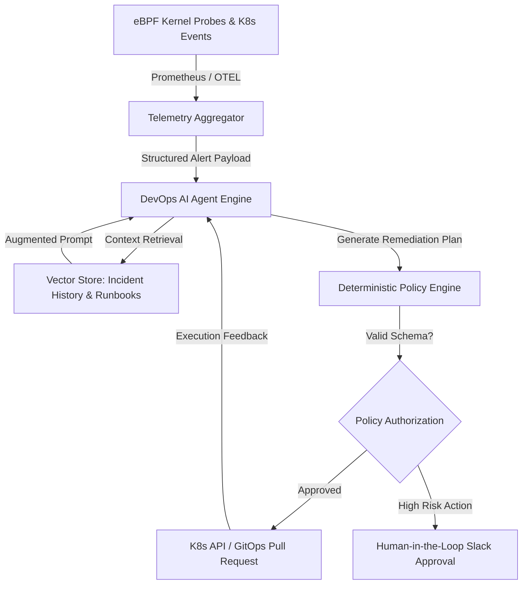

# Autonomous AI DevOps Agents Part 1: Control Plane Architecture & Event Loops

Modern cloud infrastructure management has evolved from reactive dashboard monitoring to **autonomous AI agentic control planes**. In distributed Kubernetes clusters, static alert thresholds fail because they produce excessive noise without context.

This 7-part engineering series explores how to build production-grade **DevOps AI Agents** capable of continuous monitoring, root-cause analysis, and self-healing infrastructure remediation.

> [!IMPORTANT]
> Non-deterministic LLMs should never have raw, un-sandboxed root permissions to production Kubernetes clusters. All agentic tool calls must pass through a **deterministic policy validation proxy** before execution.

---

## 1. System Architecture: The Agentic Control Loop

An autonomous DevOps agent operates as an event-driven loop. It ingests cluster telemetry from **eBPF probes** and **OpenTelemetry collectors**, synthesizes pod metrics with log tracebacks, plans a corrective action, and executes a validated patch.



---

## 2. Defining the Tool Schema in TypeScript

To ensure strict type safety when agents invoke infrastructure APIs, we use **Zod** to validate all tool parameters before calling `kubectl` or cloud SDKs.

```typescript
import { z } from "zod";

// Schema for pod restart remediation tool
export const PodRemediationSchema = z.object({
  namespace: z.string().min(1, "Namespace is required"),
  podName: z.string().min(1, "Pod name is required"),
  reason: z.enum(["OOMKilled", "CrashLoopBackOff", "DiskPressure", "Deadlock"]),
  recommendedAction: z.enum([
    "RESTART_POD",
    "SCALE_REPLICAS",
    "FLUSH_CACHE",
    "ISOLATE_NODE",
  ]),
  memoryPatchMB: z.number().optional(),
});

export type PodRemediationInput = z.infer<typeof PodRemediationSchema>;

// Safe execution wrapper with deterministic guardrails
export async function executePodRemediation(input: PodRemediationInput) {
  const validated = PodRemediationSchema.parse(input);

  if (validated.recommendedAction === "ISOLATE_NODE") {
    // High-risk actions require human authorization
    return {
      status: "PENDING_APPROVAL",
      message: `Node isolation for ${validated.podName} queued for SRE approval.`,
    };
  }

  console.log(`[Agent Exec] Remediation applied to ${validated.namespace}/${validated.podName}`);
  return { status: "SUCCESS", appliedAction: validated.recommendedAction };
}
```

---

## 3. Traditional Monitoring vs. Autonomous Agent Triage

| Capability | Traditional Prometheus/Alertmanager | Autonomous AI DevOps Agent |
| :--- | :--- | :--- |
| **Trigger Mechanism** | Static CPU/RAM thresholds | eBPF anomaly detection & contextual log correlation |
| **Root Cause Triage** | Manual SRE inspection | Automated trace analysis & git diff inspection |
| **Remediation Speed** | 15–45 minutes (On-call page) | < 30 seconds (Automated patch) |
| **Safety Mechanism** | Manual playbook execution | Policy proxy + Human-in-the-loop fallback |

---

## 4. Key Takeaways

1. **Event-Driven Runtime**: Autonomous DevOps agents leverage non-deterministic reasoning for triage while relying on deterministic state machines for execution.
2. **Strict Schema Validation**: Zod and Pydantic schemas enforce type safety across all cluster tool invocations.
3. **Policy Authorization**: High-risk actions (such as node drain or ingress mutation) must route through Human-in-the-Loop approvals.

👉 **[Continue to Part 2: Kubernetes Self-Healing Agents & CrashLoopBackOff Remediation →](/posts/ai-devops-agents-part-2-k8s-self-healing)**
