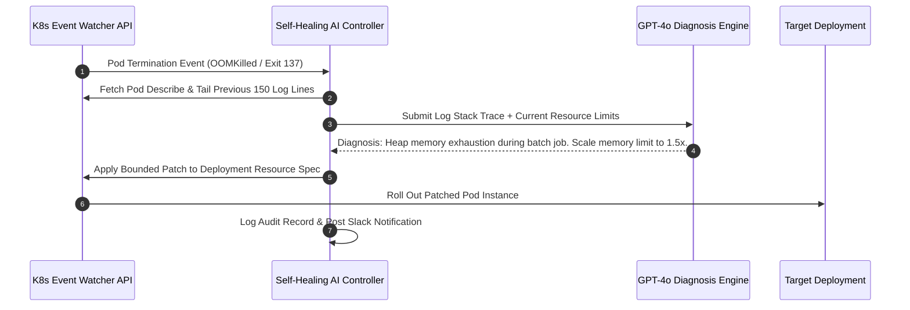

# Kubernetes Self-Healing & CrashLoopBackOff Triage

When a critical Kubernetes pod enters `CrashLoopBackOff` or is terminated by the Linux OOM killer (`ExitCode: 137`), engineering teams lose valuable MTTR (Mean Time To Recovery) waiting for on-call engineers to manually run `kubectl logs --previous` and inspect crash dumps.

In this guide, we implement an automated self-healing controller in Python using the official **Kubernetes API client** and **OpenAI Structured Outputs** to diagnose container failures and apply bounded resource patches.

---

## 1. Crash Triage & Remediation Workflow



---

## 2. Python Self-Healing Controller with Kubernetes Client

Below is the production Python implementation that monitors pod crash events and executes automated remediations:

```python
from kubernetes import client, config
from openai import OpenAI
from pydantic import BaseModel, Field

# Initialize Kubernetes In-Cluster or Local Kubeconfig
try:
    config.load_incluster_config()
except config.ConfigException:
    config.load_kube_config()

core_api = client.CoreV1Api()
apps_api = client.AppsV1Api()
openai_client = OpenAI()

class CrashDiagnosis(BaseModel):
    root_cause: str = Field(description="Summary of the failure mechanism identified from logs.")
    recommended_action: str = Field(description="SCALE_MEMORY, RESTART, or ESCALATE_SRE")
    suggested_memory_mb: int = Field(description="New memory limit in MB if scaling is required.")
    confidence: float = Field(ge=0.0, le=1.0)

def triage_crashing_pod(namespace: str, pod_name: str, deployment_name: str) -> dict:
    # 1. Fetch previous crash logs
    try:
        logs = core_api.read_namespaced_pod_log(
            name=pod_name,
            namespace=namespace,
            tail_lines=150,
            previous=True,
        )
    except Exception as e:
        logs = f"Failed to fetch previous logs: {str(e)}"

    # 2. Query LLM for structured triage
    prompt = f"""
Analyze the Kubernetes container failure logs below:
Namespace: {namespace}
Pod: {pod_name}

Logs:
{logs}
"""
    response = openai_client.beta.chat.completions.parse(
        model="gpt-4o-mini",
        messages=[
            {"role": "system", "content": "You are a Kubernetes SRE expert. Diagnose pod crashes and recommend bounded actions."},
            {"role": "user", "content": prompt}
        ],
        response_format=CrashDiagnosis,
        temperature=0.1,
    )

    diagnosis = response.choices[0].message.parsed

    # 3. Apply bounded deployment memory patch if recommended
    if diagnosis.recommended_action == "SCALE_MEMORY" and diagnosis.suggested_memory_mb <= 4096:
        patch_body = {
            "spec": {
                "template": {
                    "spec": {
                        "containers": [
                            {
                                "name": deployment_name,
                                "resources": {
                                    "limits": {"memory": f"{diagnosis.suggested_memory_mb}Mi"}
                                }
                            }
                        ]
                    }
                }
            }
        }
        apps_api.patch_namespaced_deployment(
            name=deployment_name,
            namespace=namespace,
            body=patch_body
        )
        return {"status": "PATCHED", "diagnosis": diagnosis}

    return {"status": "ESCALATED", "diagnosis": diagnosis}
```

---

## 3. Crash Taxonomy & Automated Action Matrix

| Exit Code / Reason | Primary Root Cause | Automated Agent Action | Safety Boundary |
| :--- | :--- | :--- | :--- |
| **OOMKilled (Exit 137)** | Container exceeded memory cgroup limit | Scale limit by 1.5x up to 4GiB ceiling | Auto-applied with audit log |
| **CrashLoopBackOff (Exit 1)** | Unhandled application runtime exception | Extract stack trace & create GitHub issue | Logged, non-destructive |
| **ImagePullBackOff** | Misconfigured image tag or expired registry token | Revert deployment commit via GitOps PR | SRE notification |
| **Node DiskPressure** | Un-rotated logs or temp file build-up | Evict ephemeral pods & trigger disk cleanup | Human approval gate |

---

## Key Takeaways

- **Sliding Window Log Extraction**: Tailing the previous 100–200 lines captures root cause stack traces without exceeding model token limits.
- **Strict Ceiling Caps**: Never allow autonomous remediation scripts to scale memory or CPU limits beyond predefined organization budgets.
- **Audit Logging**: Every automated deployment patch must record the diagnostic reasoning and trigger an SRE notification.

**[Continue to Part 3: Automated CI/CD Pipeline Triage & Flaky Test Quarantine →](/posts/ai-devops-agents-part-3-cicd-triage)**
