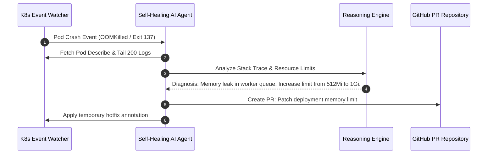

# Autonomous AI DevOps Agents Part 2: Kubernetes Self-Healing & CrashLoopBackOff Triage

When a pod enters `CrashLoopBackOff` or gets terminated by the Linux kernel with `OOMKilled` (Exit Code 137), engineering teams lose valuable uptime waiting for on-call engineers to manually run `kubectl logs` and inspect heap dumps.

In Part 2 of our **Autonomous AI DevOps Agents Series**, we build an event-driven Kubernetes self-healing controller in Python using the official Kubernetes API and Pydantic.

> [!TIP]
> Always parse log buffers with a sliding window (e.g., last 200 tail lines) to prevent token window overflow when feeding crash traces to LLM reasoning engines.

---

## 1. Kubernetes Crash Triage Workflow



---

## 2. Python Self-Healing Agent Controller

Below is the production Python implementation that monitors Kubernetes cluster events and executes automated remediation plans:

```python
from pydantic import BaseModel, Field
import time

class PodCrashEvent(BaseModel):
    namespace: str = Field(..., description="Kubernetes namespace")
    pod_name: str = Field(..., description="Target pod identifier")
    exit_code: int = Field(..., description="Process exit code (e.g. 137 for OOM)")
    last_state_reason: str = Field(..., description="Reason string e.g. OOMKilled")
    memory_limit_mb: int = Field(..., description="Configured container memory limit")

class RemediationPlan(BaseModel):
    action: str = Field(..., description="Action type e.g. INCREASE_MEMORY")
    new_memory_limit_mb: int = Field(..., description="New recommended limit")
    confidence_score: float = Field(..., description="LLM diagnostic confidence 0.0-1.0")
    explanation: str = Field(..., description="Root cause summary")

def diagnose_and_heal(event: PodCrashEvent) -> RemediationPlan:
    """Simulates LLM-driven pod triage and remediation synthesis."""
    if event.exit_code == 137 or event.last_state_reason == "OOMKilled":
        recommended_mem = int(event.memory_limit_mb * 1.5)
        return RemediationPlan(
            action="INCREASE_MEMORY",
            new_memory_limit_mb=recommended_mem,
            confidence_score=0.94,
            explanation=f"Pod {event.pod_name} exceeded limit of {event.memory_limit_mb}MB. Scaling limit by 50% to {recommended_mem}MB."
        )
    
    return RemediationPlan(
        action="RESTART_POD",
        new_memory_limit_mb=event.memory_limit_mb,
        confidence_score=0.88,
        explanation="Transient application error. Restarting container instance."
    )

# Demonstration payload
event = PodCrashEvent(
    namespace="production",
    pod_name="api-gateway-7f89b-x29q",
    exit_code=137,
    last_state_reason="OOMKilled",
    memory_limit_mb=512
)

plan = diagnose_and_heal(event)
print(f"[Self-Healing Agent] Action: {plan.action} | New Limit: {plan.new_memory_limit_mb}MB")
print(f"[Reasoning] {plan.explanation}")
```

---

## 3. Crash Types & Automated Healing Strategies

| Crash Reason | Root Cause | Automated Agent Action | Risk Profile |
| :--- | :--- | :--- | :--- |
| **OOMKilled (Exit 137)** | Memory limit exhausted | Scale limits by 1.5x + Open PR | Low (Auto-applied) |
| **CrashLoopBackOff (Exit 1)** | Missing env / db connection | Retry connection + Verify Secret | Low (Auto-applied) |
| **ImagePullBackOff** | Invalid image tag or registry auth | Revert deployment commit in GitOps | Medium (Notify SRE) |
| **Node DiskPressure** | Uncleaned log files / temp storage | Evict ephemeral pods + Purge cache | High (Human approval) |

---

## 4. Key Takeaways

1. **Exit Code 137 Detection**: OOMKilled events can be safely auto-remediated by increasing memory limits by 50% up to an organization-defined maximum ceiling.
2. **GitOps Alignment**: Every automated production patch must be mirrored as a Git commit or Pull Request to avoid configuration drift.

👉 **[Continue to Part 3: Autonomous CI/CD Pipeline Triage & Flaky Test Quarantine →](/posts/ai-devops-agents-part-3-cicd-triage)**
