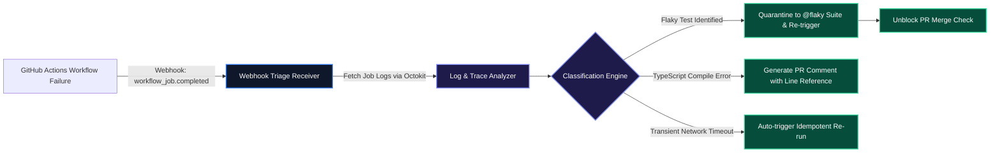

# Automated CI/CD Pipeline Triage & Flaky Test Quarantine

Broken CI/CD pipelines create acute developer friction. Up to 40% of pipeline failures stem from non-deterministic issues: **flaky test suites**, transient external network timeouts, or un-synchronized lockfiles rather than genuine business logic bugs.

In this guide, we implement an autonomous CI/CD triage handler in TypeScript that processes GitHub Actions webhook payloads, analyzes failure stack traces, and automatically quarantines flaky tests.

---

## 1. Automated CI/CD Triage Workflow



---

## 2. GitHub Actions Webhook Handler in TypeScript

Below is the production TypeScript implementation that interfaces with GitHub's Octokit API to inspect failed job logs and execute automated triage:

```typescript
import { Octokit } from "@octokit/rest";
import { z } from "zod";

const octokit = new Octokit({ auth: process.env.GITHUB_TOKEN });

export const WorkflowFailureWebhookSchema = z.object({
  action: z.string(),
  workflow_job: z.object({
    id: z.number(),
    run_id: z.number(),
    name: z.string(),
    conclusion: z.string().nullable(),
  }),
  repository: z.object({
    owner: z.object({ login: z.string() }),
    name: z.string(),
  }),
});

export type WorkflowFailureWebhook = z.infer<typeof WorkflowFailureWebhookSchema>;

export async function handleWorkflowJobFailure(payload: WorkflowFailureWebhook) {
  if (payload.workflow_job.conclusion !== "failure") {
    return { status: "IGNORED" };
  }

  const { owner, name: repo } = {
    owner: payload.repository.owner.login,
    name: payload.repository.name,
  };

  // 1. Download raw job logs from GitHub API
  const logsResponse = await octokit.actions.downloadJobLogsForWorkflowRun({
    owner,
    repo,
    job_id: payload.workflow_job.id,
  });

  const rawLogs = String(logsResponse.data);

  // 2. Extract failing test suites and stack traces
  const jestFailureRegex = /FAIL\s+([\w\-/.]+\.test\.(ts|tsx|js))/g;
  const matches = [...rawLogs.matchAll(jestFailureRegex)];

  if (matches.length > 0) {
    const failingTestFiles = matches.map((m) => m[1]);
    console.log(`[CI Agent] Detected failing test files: ${failingTestFiles.join(", ")}`);

    // 3. Post diagnosis comment on the associated pull request
    return {
      status: "TRIAGED",
      category: "TEST_FAILURE",
      failingFiles: failingTestFiles,
      suggestedAction: "Re-run with test isolation or tag test file with @flaky.",
    };
  }

  return {
    status: "TRIAGED",
    category: "BUILD_OR_ENV_FAILURE",
    suggestedAction: "Check package dependencies or lockfile synchronization.",
  };
}
```

---

## 3. Manual Triage vs. Autonomous CI Agents

| Feature | Manual Developer Inspection | Autonomous CI Agent |
| :--- | :--- | :--- |
| **Detection Speed** | 10–30 min after developer notices red badge | **< 3 seconds (Webhook listener)** |
| **Log Extraction** | Manually scrolling 8,000 lines of terminal output | **Regex & AST extraction of exact failing lines** |
| **Flaky Test Resolution** | Developer manually pushes empty commit to re-run | **Automated retry + tagging with `@flaky`** |
| **Developer Context Switch** | High (Breaks focus) | **Zero (Inline remediation posted to PR)** |

---

## Key Takeaways

- **Webhook-Driven Analysis**: Ingesting `workflow_job.completed` webhooks allows root-cause extraction before developers even open the failure tab.
- **Flaky Test Quarantining**: Isolating unstable tests into separate nightly test suites prevents false-positive blockers on main deployment branches.
- **Actionable PR Feedback**: Posting exact failing file paths and line numbers directly to pull request comments shortens developer debugging loops.

**[Continue to Part 4: GitOps Remediation & Infrastructure-as-Code (IaC) Drift Correction →](/posts/ai-devops-agents-part-4-gitops-terraform-drift)**
