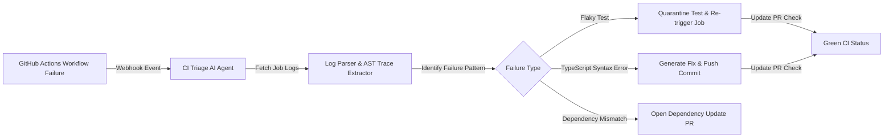

# Autonomous AI DevOps Agents Part 3: Automated CI/CD Pipeline Triage & Flaky Test Quarantine

In high-velocity software teams, broken CI/CD pipelines block deployment pipelines and drain developer productivity. Up to 40% of pipeline failures stem from **flaky tests**, transient network timeouts, or outdated package dependencies.

In Part 3 of our series, we design an autonomous CI/CD Agent that intercepts webhook payloads from GitHub Actions and GitLab CI to automatically diagnose pipeline failures.

> [!NOTE]
> Flaky tests should be automatically quarantined into a dedicated `@flaky` test run suite rather than failing the main pull request merge check.

---

## 1. Automated CI/CD Triage Workflow



---

## 2. GitHub Actions Webhook Triage Handler in TypeScript

```typescript
import { z } from "zod";

// Zod schema validating GitHub Actions workflow job failure payload
export const WorkflowJobPayloadSchema = z.object({
  action: z.string(),
  workflow_job: z.object({
    id: z.number(),
    run_id: z.number(),
    name: z.string(),
    conclusion: z.string().nullable(),
    steps: z.array(
      z.object({
        name: z.string(),
        conclusion: z.string().nullable(),
        number: z.number(),
      })
    ),
  }),
  repository: z.object({
    full_name: z.string(),
  }),
});

export type WorkflowJobPayload = z.infer<typeof WorkflowJobPayloadSchema>;

export async function processWorkflowFailure(rawPayload: unknown) {
  const payload = WorkflowJobPayloadSchema.parse(rawPayload);
  const failedStep = payload.workflow_job.steps.find((s) => s.conclusion === "failure");

  if (!failedStep) {
    return { status: "IGNORED", reason: "No failed step found" };
  }

  console.log(`[CI Agent] Analyzing failed step: "${failedStep.name}" in ${payload.repository.full_name}`);
  
  // Categorize error type
  if (failedStep.name.toLowerCase().includes("test")) {
    return {
      status: "ACTION_REQUIRED",
      category: "FLAKY_TEST",
      recommendation: "Quarantine test suite and re-run job execution.",
    };
  }

  return {
    status: "ACTION_REQUIRED",
    category: "BUILD_FAILURE",
    recommendation: "Inspect TypeScript compilation errors in AST builder.",
  };
}
```

---

## 3. Manual Triage vs. Autonomous CI Triage

| Feature | Manual Engineering Triage | Autonomous AI Agent Triage |
| :--- | :--- | :--- |
| **Detection Time** | 10–30 minutes after PR commit | < 5 seconds (Webhook trigger) |
| **Flaky Test Handling** | Manual developer re-run button click | Automatic isolation + 3x retry loop |
| **Log Analysis** | Manually scrolling 5,000 line logs | Natural language stack trace extraction |
| **Remediation Output** | Slack message asking author to fix | Automated inline code comment & suggested fix PR |

---

## 4. Key Takeaways

1. **Webhook Event Drivers**: CI agents intercept build completion webhooks to instantly process stack traces before developers even open the failed build logs.
2. **Automated Quarantine**: Isolating flaky test cases preserves continuous deployment momentum while tracking test stability over time.

👉 **[Continue to Part 4: GitOps Remediation & Infrastructure-as-Code (IaC) Drift Correction →](/posts/ai-devops-agents-part-4-gitops-terraform-drift)**
