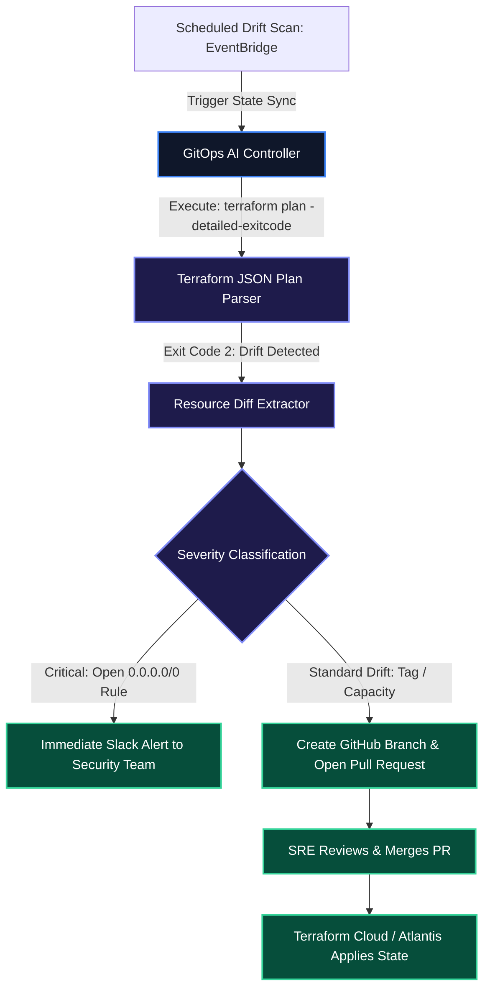

# GitOps Remediation & Terraform Drift Correction

In cloud environments managed via Infrastructure-as-Code (Terraform, OpenTofu, Pulumi), **configuration drift** occurs when cloud resources (AWS Security Groups, S3 bucket policies, IAM roles) are modified directly in the cloud console outside of version control.

Undetected drift introduces critical security vulnerabilities and breaks automated deployments. In this guide, we implement an autonomous GitOps drift controller in Python that inspects Terraform execution plans, classifies severity, and drafts corrective pull requests.

> [!WARNING]
> Never permit an autonomous AI agent to execute `terraform apply --auto-approve` directly against production state files. Drift remediations must be committed to Git branches and reviewed via Pull Requests to maintain immutable audit trails.

---

## 1. GitOps Drift Detection & Remediation Flow



---

## 2. Python Terraform JSON Plan Parser with Pydantic

Below is the production Python parser that processes `terraform show -json` output:

```python
import json
from typing import List, Optional
from pydantic import BaseModel, Field

class ResourceChange(BaseModel):
    address: str = Field(description="Terraform resource identifier e.g. aws_security_group.web_api")
    type: str = Field(description="Resource type e.g. aws_security_group")
    actions: List[str] = Field(description="List of planned actions e.g. ['update'], ['delete']")
    before_state: Optional[dict] = Field(default=None)
    after_state: Optional[dict] = Field(default=None)

class DriftSummary(BaseModel):
    has_drift: bool
    drifted_count: int
    critical_security_drift: bool
    resources: List[ResourceChange]

def parse_terraform_plan_json(raw_plan_json: str) -> DriftSummary:
    plan_data = json.loads(raw_plan_json)
    changes: List[ResourceChange] = []
    has_security_risk = False

    for rc in plan_data.get("resource_changes", []):
        actions = rc.get("change", {}).get("actions", [])
        if "no-op" not in actions and "read" not in actions:
            change_obj = ResourceChange(
                address=rc.get("address", ""),
                type=rc.get("type", ""),
                actions=actions,
                before_state=rc.get("change", {}).get("before"),
                after_state=rc.get("change", {}).get("after"),
            )
            changes.append(change_obj)

            # Security heuristic: Detect permissive ingress rules added out-of-band
            if rc.get("type") == "aws_security_group_rule":
                cidr_blocks = rc.get("change", {}).get("before", {}).get("cidr_blocks", [])
                if "0.0.0.0/0" in str(cidr_blocks):
                    has_security_risk = True

    return DriftSummary(
        has_drift=len(changes) > 0,
        drifted_count=len(changes),
        critical_security_drift=has_security_risk,
        resources=changes,
    )
```

---

## 3. Drift Resolution Taxonomy

| Drift Mechanism | Example Root Cause | Automated Agent Action | Review Gate |
| :--- | :--- | :--- | :--- |
| **Out-of-Band Security Rule** | Engineer opened port 22/3389 manually | Revert rule to HCL baseline via PR | **Immediate Security Escalation** |
| **IAM Policy Drift** | Permissive wildcard added in console | Re-align with least-privilege Terraform spec | SRE PR Review |
| **Instance Type Modification** | Node type changed during incident | Sync HCL instance type with live state | Auto-generated PR |

---

## Key Takeaways

- **Detailed Exit Codes**: Running `terraform plan -detailed-exitcode` returns exit code `2` specifically when state drift is detected, enabling clean programmatic gating.
- **JSON Plan Parsing**: Inspecting `resource_changes` via structured schemas isolates modified attributes before generating corrective HCL patches.
- **GitOps as Single Source of Truth**: Reconciling drift through Pull Requests maintains an immutable historical audit trail of all infrastructure changes.

**[Continue to Part 5: eBPF Kernel Observability & Real-Time Anomaly Triage →](/posts/ai-devops-agents-part-5-ebpf-kernel-observability)**
