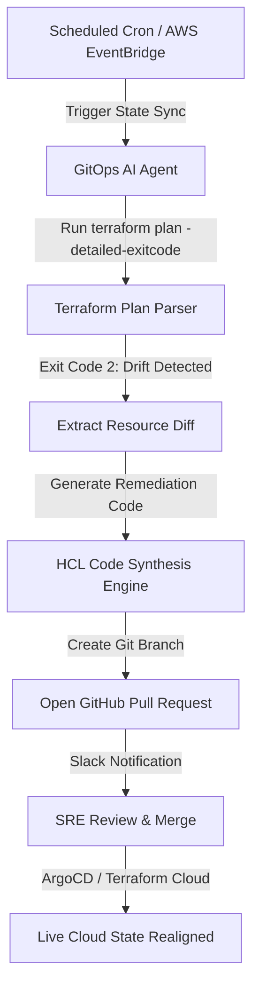

# Autonomous AI DevOps Agents Part 4: GitOps Remediation & Terraform Drift Correction

In cloud environments managed by Terraform, Pulumi, or ArgoCD, **configuration drift** occurs when live cloud resources (e.g. AWS Security Groups, S3 Bucket policies, Kubernetes ingress rules) are mutated outside of the version-controlled codebase.

In Part 4 of our series, we build an agentic GitOps drift remediation controller.

> [!WARNING]
> Never allow an AI agent to run `terraform apply --auto-approve` directly on production state files. Drift resolution must be submitted as a pull request to maintain immutable audit trails.

---

## 1. GitOps Drift Detection Architecture



---

## 2. Python Terraform Drift Parser with Pydantic

```python
from pydantic import BaseModel, Field
from typing import List

class ResourceDrift(BaseModel):
    resource_type: str = Field(..., description="e.g. aws_security_group_rule")
    resource_id: str = Field(..., description="Identifier e.g. sg-0a1b2c3d")
    attribute: str = Field(..., description="Drifted property e.g. ingress_cidr")
    expected_value: str = Field(..., description="HCL defined state")
    actual_value: str = Field(..., description="Live cloud state")

class DriftReport(BaseModel):
    has_drift: bool
    drifted_resources: List[ResourceDrift]
    severity: str = Field(..., description="LOW, MEDIUM, HIGH, CRITICAL")

def parse_terraform_plan(plan_output: str) -> DriftReport:
    """Parses terraform plan JSON output for resource drift."""
    # Simulated drift analysis
    drifted = [
        ResourceDrift(
            resource_type="aws_security_group_rule",
            resource_id="sg-production-api",
            attribute="cidr_blocks",
            expected_value='["10.0.0.0/16"]',
            actual_value='["0.0.0.0/0"]'
        )
    ]
    return DriftReport(
        has_drift=True,
        drifted_resources=drifted,
        severity="CRITICAL"
    )

report = parse_terraform_plan("sample_plan_json")
print(f"[GitOps Agent] Drift Severity: {report.severity}")
for d in report.drifted_resources:
    print(f" -> Resource {d.resource_id} ({d.attribute}): Live='{d.actual_value}' vs Expected='{d.expected_value}'")
```

---

## 3. Drift Resolution Strategies

| Scenario | Drift Cause | Agent Remediation Action | Governance Gate |
| :--- | :--- | :--- | :--- |
| **Manual AWS Console Edit** | Engineer opened port 22 manually | Revert rule via Pull Request | Automated PR + Slack Alert |
| **IAM Policy Mutation** | Overly permissive policy attached | Revert policy to least privilege | High Risk: Human Approval |
| **K8s Replica Mismatch** | Manual HPA scaling override | Sync HPA config in Helm chart | Auto-merged PR |

---

## 4. Key Takeaways

1. **Immutable Audit Trail**: All AI-generated infrastructure changes must pass through version-controlled Pull Requests.
2. **Drift Classification**: Categorizing drift severity ensures critical security group mutations get escalated instantly to security response teams.

👉 **[Continue to Part 5: eBPF Kernel Observability & Real-Time Anomaly Triage →](/posts/ai-devops-agents-part-5-ebpf-kernel-observability)**
