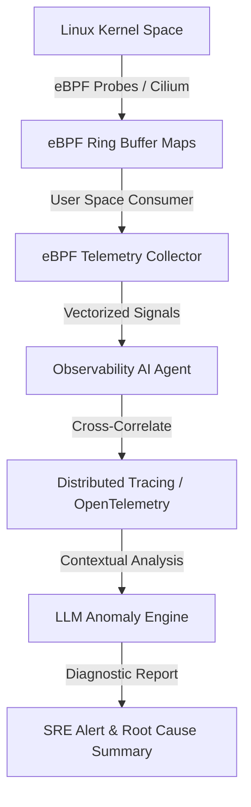

# Autonomous AI DevOps Agents Part 5: eBPF Kernel Observability & Real-Time Anomaly Triage

Traditional metrics-based monitoring relies on user-space HTTP instrumentation and log parsing. However, silent failure modes—such as **kernel socket queue drops**, TCP retransmissions, or CPU cgroup throttling—remain completely invisible to standard application monitors.

In Part 5 of our series, we combine **eBPF (Extended Berkeley Packet Filter)** kernel probes with LLM anomaly triage to achieve zero-overhead kernel observability.

> [!IMPORTANT]
> eBPF runs directly inside the Linux kernel at near-zero CPU overhead (~1%), allowing continuous tracking of every system call and network packet without modifying application code.

---

## 1. eBPF Kernel-to-Agent Architecture



---

## 2. Python eBPF Telemetry Processor with Pydantic

```python
from pydantic import BaseModel, Field

class EBPFKernelSignal(BaseModel):
    pid: int = Field(..., description="Process ID")
    comm: str = Field(..., description="Process name e.g. node, python, envoy")
    event_type: str = Field(..., description="e.g. TCP_RETRANSMIT, CGROUP_THROTTLED")
    latency_us: int = Field(..., description="Kernel delay in microseconds")
    socket_drop_count: int = Field(0, description="Dropped packet count")

class AnomalyDiagnostic(BaseModel):
    is_anomaly: bool
    root_cause: str
    confidence: float
    recommended_tuning: str

def analyze_kernel_signal(signal: EBPFKernelSignal) -> AnomalyDiagnostic:
    """Analyzes eBPF kernel event signals for non-obvious performance degradation."""
    if signal.event_type == "TCP_RETRANSMIT" and signal.latency_us > 50000:
        return AnomalyDiagnostic(
            is_anomaly=True,
            root_cause=f"High TCP retransmission latency ({signal.latency_us / 1000}ms) in process {signal.comm} (PID {signal.pid}).",
            confidence=0.96,
            recommended_tuning="Adjust net.ipv4.tcp_rmem buffer size and inspect upstream VPC router queues."
        )
    
    return AnomalyDiagnostic(
        is_anomaly=False,
        root_cause="Normal kernel operational telemetry.",
        confidence=0.99,
        recommended_tuning="No action required."
    )

signal = EBPFKernelSignal(
    pid=4082,
    comm="envoy",
    event_type="TCP_RETRANSMIT",
    latency_us=68000,
    socket_drop_count=14
)

diag = analyze_kernel_signal(signal)
print(f"[eBPF AI Agent] Anomaly Detected: {diag.is_anomaly}")
print(f" -> Root Cause: {diag.root_cause}")
print(f" -> Tuning Recommendation: {diag.recommended_tuning}")
```

---

## 3. Telemetry Method Comparison

| Metric Type | Log Scraper (Promtail) | User Space APM (Datadog) | eBPF Kernel Probes |
| :--- | :--- | :--- | :--- |
| **CPU Overhead** | High (5–15%) | Medium (3–8%) | **Near Zero (~1%)** |
| **Kernel Visibility** | None | Limited | **Full System Call & TCP Socket Layer** |
| **App Code Modifications** | Required (Logging) | Required (SDK tracing) | **Zero (No code changes needed)** |
| **Detection Speed** | Seconds to Minutes | 10–30 Seconds | **Real-Time (Microseconds)** |

---

## 4. Key Takeaways

1. **Kernel-Level Precision**: eBPF exposes low-level system call delays and network queue packet drops before they degrade user HTTP responses.
2. **Zero Code Overhead**: Instantly monitors legacy or third-party container images without modifying code base imports.

👉 **[Continue to Part 6: FinOps AI Agents & Dynamic GPU Cluster Cost Optimization →](/posts/ai-devops-agents-part-6-finops-gpu-cost-optimization)**
