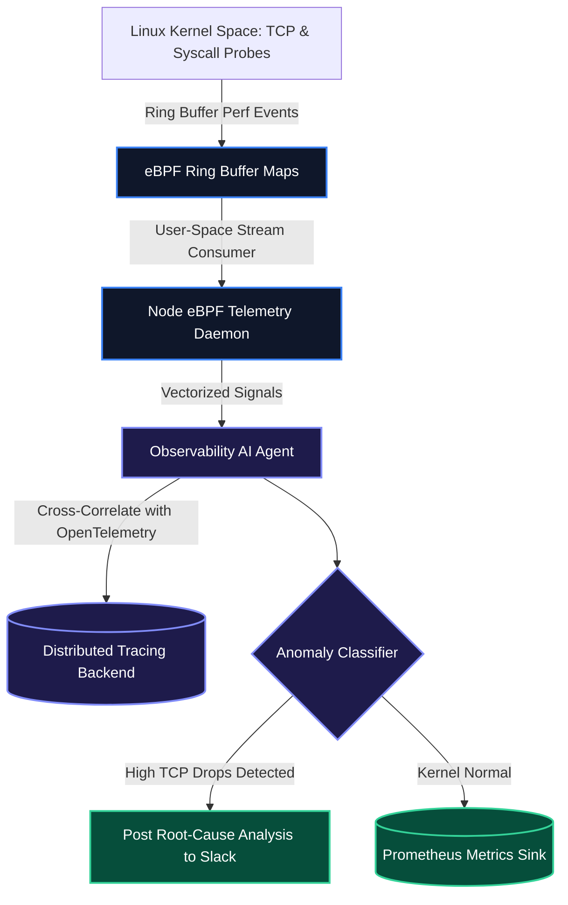

# eBPF Kernel Observability & Real-Time Anomaly Triage

User-space application metrics and HTTP access logs often miss the root causes of degraded distributed systems: **kernel socket buffer overflows**, TCP retransmissions, and silent CPU cgroup throttling happen beneath application runtimes.

By running **eBPF (Extended Berkeley Packet Filter)** probes directly in the Linux kernel, telemetry agents capture system call timings and network drops with sub-microsecond latency and negligible CPU overhead (~1%).

> [!IMPORTANT]
> eBPF instruments the kernel safely without modifying kernel source code or loading unstable external kernel modules. Probes are verified by the in-kernel eBPF verifier before execution.

---

## 1. eBPF Kernel Telemetry Architecture



---

## 2. Python eBPF Telemetry Event Processor with Pydantic

Below is the Python telemetry processor configured to ingest signals from eBPF TCP tracepoints (`tracepoint:tcp:tcp_retransmit_skb`):

```python
from pydantic import BaseModel, Field
from typing import Optional

class KernelNetworkSignal(BaseModel):
    pid: int = Field(description="Process identifier emitting system calls.")
    comm: str = Field(description="Command name e.g. envoy, node, python3")
    source_ip: str
    dest_ip: str
    dest_port: int
    retransmit_count: int = Field(ge=0)
    kernel_latency_us: int = Field(description="Socket queue latency in microseconds.")

class AnomalyVerdict(BaseModel):
    is_critical_anomaly: bool
    severity: str
    root_cause_summary: str
    recommended_kernel_tuning: Optional[str] = None

def evaluate_kernel_telemetry(signal: KernelNetworkSignal) -> AnomalyVerdict:
    """
    Evaluates kernel network signals to detect upstream VPC congestion or buffer exhaustion.
    """
    # Anomaly Rule: Repeated TCP retransmissions with high socket latency
    if signal.retransmit_count > 10 and signal.kernel_latency_us > 40000:
        return AnomalyVerdict(
            is_critical_anomaly=True,
            severity="CRITICAL",
            root_cause_summary=(
                f"Severe TCP retransmission spike ({signal.retransmit_count} drops) detected on "
                f"process '{signal.comm}' (PID {signal.pid}) routing to {signal.dest_ip}:{signal.dest_port}."
            ),
            recommended_kernel_tuning=(
                "Inspect upstream VPC routing tables, increase net.core.rmem_max, "
                "and verify downstream endpoint health."
            )
        )

    return AnomalyVerdict(
        is_critical_anomaly=False,
        severity="INFO",
        root_cause_summary="Kernel networking parameters operating within normal baseline."
    )
```

---

## 3. Telemetry Method Comparison

| Capability | Log Scraping (Promtail/Fluentd) | User-Space APM (Datadog/NewRelic) | eBPF Kernel Probes |
| :--- | :--- | :--- | :--- |
| **CPU Overhead** | High (5–15% CPU) | Medium (3–8% CPU) | **Near Zero (~1% CPU)** |
| **Visibility Scope** | Application logs only | Instrument-supported frameworks | **Full System Calls & Network Sockets** |
| **Code Modification** | Logging library imports | SDK wrapping required | **Zero application changes required** |
| **Detection Latency** | Seconds to Minutes | 10–30 Seconds | **Real-Time (Microseconds)** |

---

## Key Takeaways

- **Low-Overhead Introspection**: eBPF provides kernel-level visibility without application code modifications or performance penalties.
- **Deep Failure Detection**: Intercepting socket drops and cgroup throttle events catches silent performance degradation before user-facing latency spikes appear.
- **Contextual Correlation**: Pairing eBPF kernel events with OpenTelemetry traces pinpoints the exact microservice and PID causing cluster-wide network saturation.

**[Continue to Part 6: FinOps Agents & Dynamic GPU Cluster Cost Optimization →](/posts/ai-devops-agents-part-6-finops-gpu-cost-optimization)**
