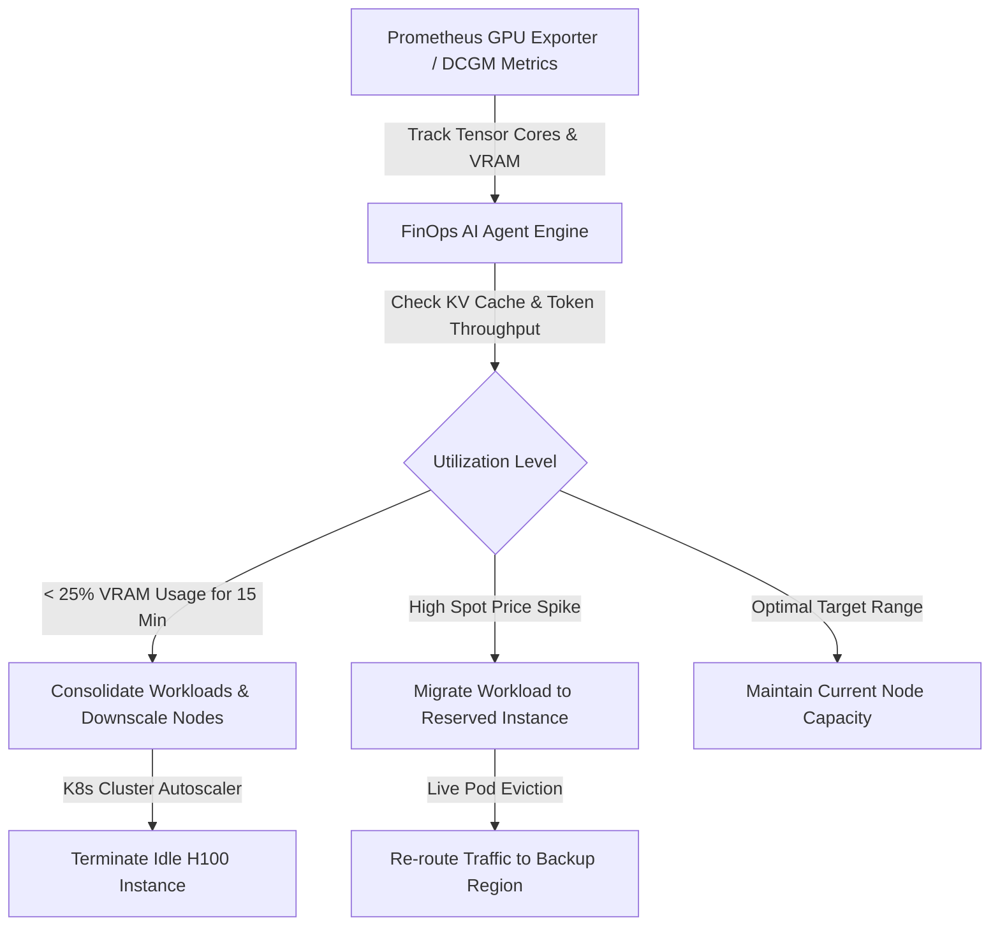

# Autonomous AI DevOps Agents Part 6: FinOps Agents & Dynamic GPU Cluster Cost Optimization

As software organizations scale AI/ML workloads, **NVIDIA H100 and A100 GPU compute costs** often represent up to 70% of total cloud infrastructure spending. Over-provisioned inference replicas and un-utilized GPU memory (KV cache waste) lead to thousands of dollars in monthly cloud inefficiency.

In Part 6 of our series, we design an **Autonomous FinOps AI Agent** that dynamically monitors GPU memory utilization, auto-scales vLLM inference instances, and orchestrates spot-instance fallback strategies.

> [!TIP]
> Use dynamic KV-cache monitoring in vLLM to scale GPU pods based on active token throughput rather than static CPU memory metrics.

---

## 1. FinOps GPU Optimization Flow



---

## 2. TypeScript FinOps Cost Evaluator with Zod

```typescript
import { z } from "zod";

export const GPUMetricSchema = z.object({
  nodeId: z.string(),
  gpuModel: z.enum(["NVIDIA_H100", "NVIDIA_A100", "NVIDIA_L40S", "NVIDIA_T4"]),
  utilizationPercentage: z.number().min(0).max(100),
  vramUsedGB: z.number(),
  vramTotalGB: z.number(),
  hourlyCostUSD: z.number(),
  isSpotInstance: z.boolean(),
});

export type GPUMetric = z.infer<typeof GPUMetricSchema>;

export function evaluateClusterEfficiency(metrics: GPUMetric[]) {
  let totalHourlySpend = 0;
  let wastedHourlySpend = 0;
  const recommendations: string[] = [];

  for (const m of metrics) {
    totalHourlySpend += m.hourlyCostUSD;

    if (m.utilizationPercentage < 20) {
      const wastedCost = m.hourlyCostUSD * (1 - m.utilizationPercentage / 100);
      wastedHourlySpend += wastedCost;
      recommendations.push(
        `Node ${m.nodeId} (${m.gpuModel}) is under-utilized (${m.utilizationPercentage}%). Consolidate pods and scale down.`
      );
    }
  }

  const monthlyWastedEst = wastedHourlySpend * 24 * 30;

  return {
    totalHourlySpendUSD: totalHourlySpend,
    wastedHourlySpendUSD: wastedHourlySpend,
    estimatedMonthlySavingsUSD: monthlyWastedEst,
    recommendations,
  };
}

// Test metrics payload
const sampleMetrics: GPUMetric[] = [
  {
    nodeId: "g4dn-worker-1a",
    gpuModel: "NVIDIA_A100",
    utilizationPercentage: 14,
    vramUsedGB: 11,
    vramTotalGB: 80,
    hourlyCostUSD: 4.10,
    isSpotInstance: false,
  },
];

const report = evaluateClusterEfficiency(sampleMetrics);
console.log(`[FinOps Agent] Monthly Savings Potential: $${report.estimatedMonthlySavingsUSD.toFixed(2)}`);
console.log(` -> Recommendation: ${report.recommendations[0]}`);
```

---

## 3. GPU Workload Optimization Matrix

| GPU Model | Hourly On-Demand | Hourly Spot Cost | Optimal Workload Type | Savings Potential |
| :--- | :--- | :--- | :--- | :--- |
| **NVIDIA H100 (80GB)** | $8.20 / hr | $2.45 / hr | Large Model Fine-Tuning & Batch Inference | **65–70% via Spot** |
| **NVIDIA A100 (80GB)** | $4.10 / hr | $1.25 / hr | Medium LLM Serving (vLLM / Ollama) | **60–68% via Spot** |
| **NVIDIA L40S (48GB)** | $2.10 / hr | $0.75 / hr | Real-Time RAG & Embeddings Generation | **55–65% via Auto-scale** |

---

## 4. Key Takeaways

1. **Active Token Scaling**: Metrics like token throughput and KV-cache occupancy provide far more accurate auto-scaling signals than raw CPU utilization.
2. **Automated Cost Control**: Continuous agent-driven workload consolidation prevents orphaned GPU instances from inflating monthly cloud bills.

👉 **[Continue to Part 7: Human-in-the-Loop Production Guardrails & Telemetry Evals →](/posts/ai-devops-agents-part-7-production-guardrails-evals)**
