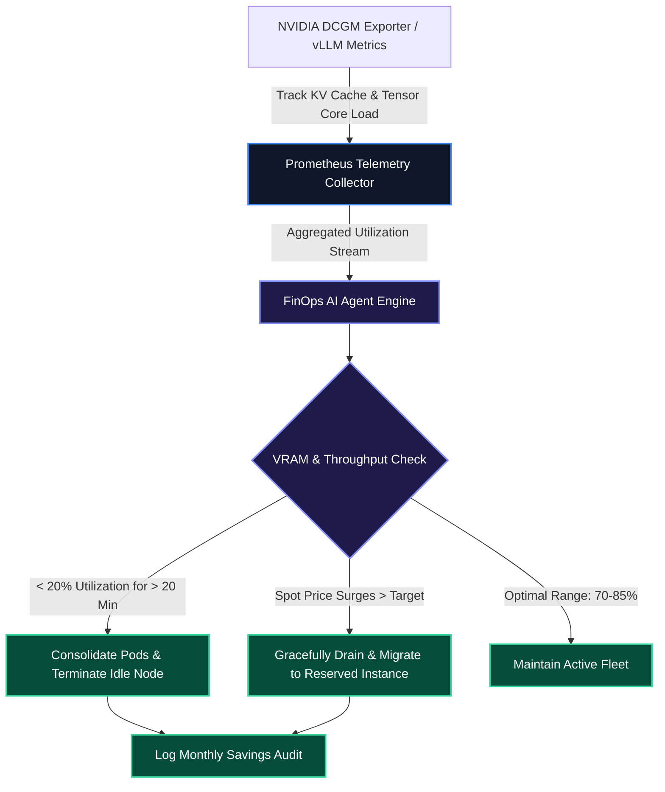

# FinOps Agents & Dynamic GPU Cluster Cost Optimization

In organizations running high-throughput LLM workloads, GPU compute (NVIDIA H100, A100, L40S) frequently accounts for over **65% of total cloud infrastructure spending**. Static replica provisioning leads to extreme capital waste: clusters sized for peak traffic sit under-utilized during off-peak hours, incurring thousands of dollars in idle VRAM costs.

In this guide, we implement an autonomous FinOps AI Agent in TypeScript that monitors NVIDIA DCGM GPU telemetry, auto-scales vLLM inference worker nodes, and orchestrates spot instance migrations.

> [!TIP]
> Use dynamic KV-cache occupancy and active token throughput metrics from vLLM rather than static container CPU/RAM utilization to drive GPU horizontal pod autoscaling.

---

## 1. FinOps GPU Optimization Lifecycle



---

## 2. TypeScript FinOps GPU Efficiency Evaluator with Zod

Below is the production TypeScript evaluator querying NVIDIA DCGM metrics:

```typescript
import { z } from "zod";

export const NodeTelemetrySchema = z.object({
  nodeId: z.string(),
  gpuModel: z.enum(["NVIDIA_H100", "NVIDIA_A100", "NVIDIA_L40S", "NVIDIA_T4"]),
  activeGpuUtilPercent: z.number().min(0).max(100),
  vramUsedGigabytes: z.number(),
  vramTotalGigabytes: z.number(),
  hourlyOnDemandRateUSD: z.number(),
  isSpot: z.boolean(),
});

export type NodeTelemetry = z.infer<typeof NodeTelemetrySchema>;

export interface OptimizationReport {
  totalHourlyBurnUSD: number;
  estimatedWastedHourlyUSD: number;
  monthlySavingsProjectedUSD: number;
  recommendations: Array<{ nodeId: string; action: string; justification: string }>;
}

export function evaluateClusterEfficiency(nodes: NodeTelemetry[]): OptimizationReport {
  let totalHourly = 0;
  let wastedHourly = 0;
  const recommendations: Array<{ nodeId: string; action: string; justification: string }> = [];

  for (const node of nodes) {
    totalHourly += node.hourlyOnDemandRateUSD;
    const vramOccupancy = (node.vramUsedGigabytes / node.vramTotalGigabytes) * 100;

    // Condition: Node is under-utilized across both compute and VRAM
    if (node.activeGpuUtilPercent < 20 && vramOccupancy < 30) {
      const wastedPortion = node.hourlyOnDemandRateUSD * (1 - node.activeGpuUtilPercent / 100);
      wastedHourly += wastedPortion;

      recommendations.push({
        nodeId: node.nodeId,
        action: "DRAIN_AND_CONSOLIDATE",
        justification: `GPU compute (${node.activeGpuUtilPercent}%) and VRAM (${vramOccupancy.toFixed(1)}%) are critically low. Evict pods to neighboring nodes.`,
      });
    }
  }

  return {
    totalHourlyBurnUSD: totalHourly,
    estimatedWastedHourlyUSD: wastedHourly,
    monthlySavingsProjectedUSD: wastedHourly * 24 * 30,
    recommendations,
  };
}
```

---

## 3. GPU Instance Optimization Matrix

| GPU Model | VRAM (GB) | On-Demand ($/hr) | Spot ($/hr) | Workload Fit | Spot Savings Potential |
| :--- | :--- | :--- | :--- | :--- | :--- |
| **NVIDIA H100 SXM** | 80 GB | $8.20 / hr | $2.45 / hr | Large-scale pre-training & 70B+ FP8 Serving | **~70% via Spot** |
| **NVIDIA A100 SXM** | 80 GB | $4.10 / hr | $1.25 / hr | Standard vLLM / Ollama 8B–32B Serving | **~69% via Spot** |
| **NVIDIA L40S** | 48 GB | $2.10 / hr | $0.75 / hr | RAG Embeddings & Small Distill Inference | **~64% via Auto-scale** |

---

## Key Takeaways

- **KV-Cache Driven Scaling**: Scaling LLM clusters on memory buffer occupancy rather than CPU utilization avoids false-positive autoscaling triggers.
- **Spot Workload Orchestration**: Running fault-tolerant batch inference pipelines on spot instances cuts GPU infrastructure bills by up to 70%.
- **Continuous Bin-Packing**: Automating workload consolidation ensures under-utilized GPU nodes are drained and decommissioned promptly.

**[Continue to Part 7: Production Guardrails & Telemetry Evals →](/posts/ai-devops-agents-part-7-production-guardrails-evals)**
