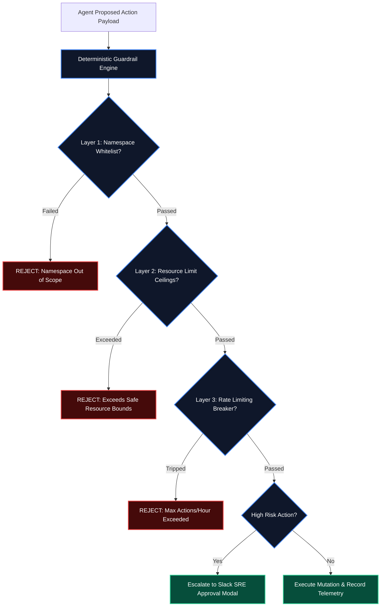

# Production Guardrails & Telemetry Evals for DevOps Agents

Deploying autonomous AI agents with access to cloud infrastructure without strict boundary controls introduces severe operational risks: an unexpected hallucination or prompt injection can trigger cluster-wide pod terminations, accidental firewall mutations, or cloud budget overruns.

In this concluding installment of the **Autonomous AI DevOps Agents Series**, we construct a **Production Guardrails Engine** in Python combining deterministic circuit breakers, RBAC boundaries, and automated evaluation metrics.

> [!CAUTION]
> Never grant an autonomous AI agent wildcard RBAC permissions (`*.*`). Always bind agent ServiceAccounts to specific namespaces with strict verbs (`get`, `list`, `patch`) and explicitly deny cluster-level mutating operations (`delete`, `drain`).

---

## 1. Multi-Layer Guardrail Architecture



---

## 2. Python Production Guardrail Engine with Pydantic

Below is the production Python implementation that enforces multi-layer safety invariants before any infrastructure mutation executes:

```python
import time
from typing import List, Optional
from pydantic import BaseModel, Field

class ProposedAction(BaseModel):
    action_id: str
    tool_name: str
    target_namespace: str
    requested_memory_mb: int = Field(default=0, ge=0)
    is_destructive: bool = Field(default=False)
    timestamp: float = Field(default_factory=time.time)

class GuardrailVerdict(BaseModel):
    is_allowed: bool
    requires_human_approval: bool
    rejection_reason: Optional[str] = None

class ProductionGuardrailEngine:
    def __init__(
        self,
        allowed_namespaces: List[str],
        max_memory_mb_ceiling: int = 4096,
        max_actions_per_hour: int = 6,
    ):
        self.allowed_namespaces = set(allowed_namespaces)
        self.max_memory_mb_ceiling = max_memory_mb_ceiling
        self.max_actions_per_hour = max_actions_per_hour
        self.action_history: List[float] = []

    def evaluate(self, action: ProposedAction) -> GuardrailVerdict:
        current_time = time.time()
        # Clean history older than 1 hour (3600 seconds)
        self.action_history = [t for t in self.action_history if current_time - t < 3600]

        # 1. Rate Limiting Check
        if len(self.action_history) >= self.max_actions_per_hour:
            return GuardrailVerdict(
                is_allowed=False,
                requires_human_approval=False,
                rejection_reason=f"Rate limit exceeded: Maximum {self.max_actions_per_hour} actions allowed per hour.",
            )

        # 2. Namespace Boundary Check
        if action.target_namespace not in self.allowed_namespaces:
            return GuardrailVerdict(
                is_allowed=False,
                requires_human_approval=False,
                rejection_reason=f"Target namespace '{action.target_namespace}' is outside allowed boundaries.",
            )

        # 3. Resource Bounds Ceiling Check
        if action.requested_memory_mb > self.max_memory_mb_ceiling:
            return GuardrailVerdict(
                is_allowed=False,
                requires_human_approval=False,
                rejection_reason=f"Requested memory ({action.requested_memory_mb}MB) exceeds organizational ceiling of {self.max_memory_mb_ceiling}MB.",
            )

        # 4. Human-In-The-Loop Escalation for Destructive Actions
        if action.is_destructive:
            return GuardrailVerdict(
                is_allowed=False,
                requires_human_approval=True,
                rejection_reason="Destructive operations require explicit SRE human authorization.",
            )

        # Action Approved: Record timestamp in rate limiter
        self.action_history.append(current_time)
        return GuardrailVerdict(is_allowed=True, requires_human_approval=False)
```

---

## 3. Production Safety Taxonomy Matrix

| Guardrail Layer | Safety Mechanism | Trigger Condition | Enforcement Action |
| :--- | :--- | :--- | :--- |
| **Namespace Boundary** | Exact Set Membership | Pod located in `kube-system` / `vault` | Instant Rejection |
| **Resource Ceiling** | Bounded Integer Check | Patch exceeds 4GiB RAM or 2 vCPUs | Block Patch & Alert SRE |
| **Rate Limit Breaker** | Sliding Window Counter | > 6 automated actions within 60 minutes | Trip Circuit Breaker |
| **Human Approval** | Slack Interactive Modal | Node drains, DNS / Ingress mutations | Hold in queue until approved |

---

## Masterclass Series Index

1. **[Part 1: Control Plane Architecture & Event Loops](/posts/ai-devops-agents-part-1-architecture)**
2. **[Part 2: Kubernetes Self-Healing & CrashLoopBackOff Triage](/posts/ai-devops-agents-part-2-k8s-self-healing)**
3. **[Part 3: Automated CI/CD Pipeline Triage & Flaky Test Quarantine](/posts/ai-devops-agents-part-3-cicd-triage)**
4. **[Part 4: GitOps Remediation & Terraform Drift Correction](/posts/ai-devops-agents-part-4-gitops-terraform-drift)**
5. **[Part 5: eBPF Kernel Observability & Real-Time Anomaly Triage](/posts/ai-devops-agents-part-5-ebpf-kernel-observability)**
6. **[Part 6: FinOps Agents & Dynamic GPU Cluster Cost Optimization](/posts/ai-devops-agents-part-6-finops-gpu-cost-optimization)**
7. **Part 7: Production Guardrails & Telemetry Evals** (Current Article)

Explore the complete series on the **[Autonomous AI DevOps Agents Playlist](/playlists/autonomous-ai-devops-agents)**!
