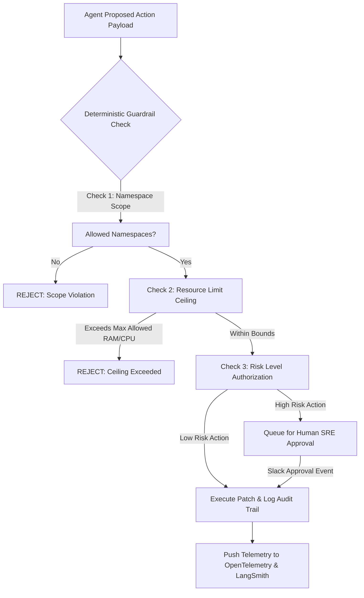

# Autonomous AI DevOps Agents Part 7: Production Guardrails & Telemetry Evals

Deploying autonomous AI agents into production cloud infrastructure introduces serious operational risks if agents act on hallucinations or attempt unsafe cluster operations.

In the final chapter of our **Autonomous AI DevOps Agents Series**, we implement a comprehensive **Production Guardrails Engine** using deterministic circuit breakers, RBAC authorization, and LLM-as-a-Judge telemetry evaluation suites.

> [!CAUTION]
> Never grant an AI agent wildcard permissions (`rbac: '*'`) on Kubernetes clusters. Always enforce strict Least Privilege Service Accounts (`serviceAccountName`) with write access restricted to specific namespaces.

---

## 1. Guardrail Architecture & Execution Pipeline



---

## 2. Python Production Guardrail Engine with Pydantic

```python
from pydantic import BaseModel, Field
from typing import List, Optional

class ProposedAction(BaseModel):
    action_id: str
    tool_name: str = Field(..., description="Target tool e.g. patch_k8s_deployment")
    target_namespace: str = Field(..., description="Target namespace")
    requested_memory_mb: int = Field(0, description="Requested memory modification")
    is_destructive: bool = Field(False, description="Whether operation deletes resources")

class GuardrailEvaluation(BaseModel):
    is_approved: bool
    requires_human_approval: bool
    rejection_reason: Optional[str] = None

class GuardrailEngine:
    def __init__(self, allowed_namespaces: List[str], max_memory_mb: int):
        self.allowed_namespaces = allowed_namespaces
        self.max_memory_mb = max_memory_mb

    def evaluate(self, action: ProposedAction) -> GuardrailEvaluation:
        # Rule 1: Namespace boundary check
        if action.target_namespace not in self.allowed_namespaces:
            return GuardrailEvaluation(
                is_approved=False,
                requires_human_approval=False,
                rejection_reason=f"Namespace '{action.target_namespace}' is outside agent operational boundary."
            )

        # Rule 2: Memory limit ceiling check
        if action.requested_memory_mb > self.max_memory_mb:
            return GuardrailEvaluation(
                is_approved=False,
                requires_human_approval=False,
                rejection_reason=f"Requested memory ({action.requested_memory_mb}MB) exceeds ceiling of {self.max_memory_mb}MB."
            )

        # Rule 3: Destructive actions require SRE human approval
        if action.is_destructive:
            return GuardrailEvaluation(
                is_approved=False,
                requires_human_approval=True,
                rejection_reason="Destructive operations require explicit SRE authorization."
            )

        return GuardrailEvaluation(is_approved=True, requires_human_approval=False)

# Guardrail engine initialization
engine = GuardrailEngine(allowed_namespaces=["staging", "production"], max_memory_mb=4096)

sample_action = ProposedAction(
    action_id="act-9012",
    tool_name="patch_k8s_deployment",
    target_namespace="production",
    requested_memory_mb=2048,
    is_destructive=False
)

eval_result = engine.evaluate(sample_action)
print(f"[Guardrail Engine] Approved: {eval_result.is_approved} | Requires Human: {eval_result.requires_human_approval}")
```

---

## 3. Production Safety Matrix

| Guardrail Type | Scope & Rule | Action on Violation | Risk Prevention |
| :--- | :--- | :--- | :--- |
| **Namespace Isolation** | Restrict agent to `apps` / `staging` | Instant API Rejection | Prevents cluster-wide outages |
| **Resource Ceilings** | Max RAM scale: 4GiB per pod | Block patch & Log alert | Prevents cloud budget exhaustion |
| **Rate Limit Breaker** | Max 5 automated patches per hour | Trip circuit breaker | Prevents infinite retry loops |
| **Human-in-the-Loop** | Mandate approval for node drains | Route to Slack `#sre-approvals` | Ensures human oversight for high-risk changes |

---

## 4. Masterclass Series Conclusion & Key Takeaways

Across this **7-Part Autonomous AI DevOps Agents Masterclass**, we have built a complete, production-ready agentic control plane:

1. **Part 1**: Structured the event-driven agent loop with Pydantic & LangGraph.
2. **Part 2**: Built real-time Kubernetes self-healing for `OOMKilled` and `CrashLoopBackOff`.
3. **Part 3**: Automated CI/CD pipeline triage and flaky test quarantine.
4. **Part 4**: Implemented GitOps state drift detection for Terraform and IaC.
5. **Part 5**: Integrated zero-overhead eBPF Linux kernel probes.
6. **Part 6**: Optimized GPU cluster costs and dynamic vLLM spot-instance scaling.
7. **Part 7**: Hardened the entire system with production guardrail engines and telemetry evals.

Congratulations on mastering autonomous DevOps engineering! You are now ready to deploy robust, self-healing AI infrastructure in production.
