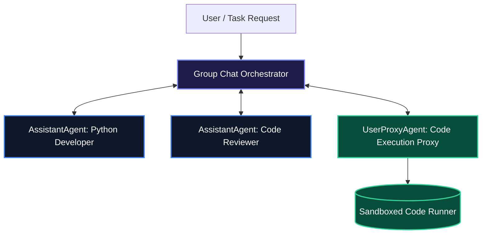

# Microsoft AutoGen 0.4+ Architecture Guide: Event-Driven Multi-Agent Systems

Microsoft's **AutoGen** was among the earliest frameworks to prove that conversational multi-agent dialogue could solve complex coding and reasoning challenges.

With **AutoGen 0.4+**, the framework underwent an architectural rewrite from legacy synchronous conversable chat loops to a **fully asynchronous, event-driven Actor Model**—enabling distributed agent messaging, strict message typing, and scalable group chats.

---

## 1. Core Architecture & Mental Model

AutoGen 0.4+ models agent systems using the **Actor Model**:
1. **Agents as Actors**: Each agent is an isolated entity with its own internal state that communicates purely via asynchronous message passing.
2. **`AssistantAgent`**: An autonomous reasoning agent backed by an LLM client.
3. **`UserProxyAgent`**: Acts as a proxy for human inputs or executes generated code in sandboxed Docker/local environments.
4. **Group Chat Orchestrators (`RoundRobinGroupChat`, `SelectorGroupChat`)**: Manages multi-agent speaking turns, consensus evaluation, and termination conditions.



---

## 2. Installation & Quick Setup

```bash
pip install autogen-agentchat autogen-ext[openai]
```

---

## 3. Recommended Production Folder Structure

```text
autogen_project/
├── agents/
│   ├── developer.py     # AssistantAgent for coding
│   └── reviewer.py      # AssistantAgent for QA
├── teams/
│   └── code_team.py     # GroupChat team assembly & termination
├── runtime/
│   └── execution.py     # Docker code execution context
└── main.py
```

---

## 4. Complete, Runnable Starter Project in Python

Below is an AutoGen 0.4+ implementation of a 2-agent collaborative team with automated termination conditions:

```python
import asyncio
from autogen_agentchat.agents import AssistantAgent, UserProxyAgent
from autogen_agentchat.teams import RoundRobinGroupChat
from autogen_agentchat.conditions import TextMentionTermination
from autogen_ext.models.openai import OpenAIChatCompletionClient

async def main():
    # 1. Initialize Model Client
    model_client = OpenAIChatCompletionClient(model="gpt-4o-mini")

    # 2. Define Specialist Agents
    coder = AssistantAgent(
        name="Developer",
        model_client=model_client,
        system_message="You are a senior Python developer. Write clean, typed Python code. When the solution is complete and verified, say 'TERMINATE'.",
    )

    reviewer = AssistantAgent(
        name="Reviewer",
        model_client=model_client,
        system_message="You are a code reviewer. Inspect the Developer's code for edge cases, performance, and type safety. Suggest fixes or confirm readiness.",
    )

    # 3. Define Termination Condition
    termination = TextMentionTermination("TERMINATE")

    # 4. Assemble Team in Round-Robin Dialogue
    team = RoundRobinGroupChat(
        participants=[coder, reviewer],
        termination_condition=termination,
        max_turns=6,
    )

    # 5. Run Team Stream
    task = "Write a Python function to compute the rolling average of a time-series stream with a window size of 5."
    print(f"Task: {task}\n---")

    async for message in team.run_stream(task=task):
        if hasattr(message, "content"):
            print(f"[{message.source}]:\n{message.content}\n")

if __name__ == "__main__":
    asyncio.run(main())
```

---

## 5. Architectural Tradeoffs Matrix

| Feature | AutoGen 0.2 (Legacy) | AutoGen 0.4+ (Modern) |
| :--- | :--- | :--- |
| **Execution Architecture** | Synchronous blocking loops | **Asynchronous Actor Model & Event Streams** |
| **Message Safety** | Unstructured dictionaries | **Strict Pydantic Message Schemas** |
| **Code Execution** | Local host execution by default | **Sandboxed Docker & Modal Environments** |
| **Distribution** | Single machine only | **Distributed Cross-Process & Network Actors** |

---

## 6. When to Use vs. When to Avoid

### Choose AutoGen When:
- You need dynamic, conversational group chats between multiple agents that negotiate, critique, and refine solutions collaboratively.
- You want native sandboxed code execution capabilities.

### Avoid AutoGen When:
- Your workflow requires strict, non-conversational DAG pipelines where agents execute rigid sequential tasks without chatting (use **LangGraph** or **CrewAI** instead).
