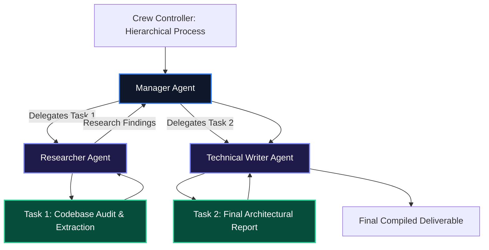

# CrewAI Framework Guide: Role-Playing Autonomous Multi-Agent Teams

While single-agent systems struggle when handling multi-faceted projects, dividing work across specialized, role-playing agents dramatically increases task completion rates.

**CrewAI** is a popular Python multi-agent orchestration framework that structures collaboration around **Agents** (with defined roles, goals, and backstories), **Tasks** (discrete deliverables), and **Crews** (governed by sequential or hierarchical execution processes).

---

## 1. Core Architecture & Mental Model

CrewAI structures multi-agent work around four core primitives:

1. **Agent**: Encapsulates a role, specific goal, backstory (which shapes prompting tone), memory, and authorized tools. Agents can autonomously delegate sub-tasks to peer agents.
2. **Task**: Defines an actionable goal, expected output structure, assigned agent, and dependencies.
3. **Crew**: The team container managing the execution environment.
4. **Process**: Determines orchestration strategy:
   - `Process.sequential`: Tasks execute in linear sequence, passing results downstream.
   - `Process.hierarchical`: A Manager Agent autonomously delegates tasks to specialists and validates results.



---

## 2. Installation & Quick Setup

```bash
pip install crewai crewai-tools
```

---

## 3. Recommended Production Folder Structure

```text
my_crew_project/
├── config/
│   ├── agents.yaml      # Declarative agent roles, goals, backstories
│   └── tasks.yaml       # Declarative task descriptions & expected outputs
├── tools/
│   └── custom_tools.py  # Custom Python tool definitions
├── crew.py              # Crew definition & process assembly
└── main.py              # Execution CLI entrypoint
```

---

## 4. Complete, Runnable Starter Project in Python

Below is a complete Python implementation demonstrating a 2-agent sequential crew conducting an automated infrastructure audit:

```python
from crewai import Agent, Task, Crew, Process
from crewai.tools import tool

# 1. Define Custom Type-Safe Tool
@tool("Query Cluster Metric")
def query_cluster_metric(metric_name: str) -> str:
    """Queries cluster monitoring metrics for CPU and Memory load."""
    return f"Metric '{metric_name}' current value: 84.2% (Warning threshold exceeded)."

# 2. Define Specialist Agents
sre_agent = Agent(
    role="Senior Site Reliability Engineer",
    goal="Diagnose performance bottlenecks and resource exhaustion across cluster nodes.",
    backstory="You are an expert SRE with 10 years of Kubernetes and Linux kernel experience. You provide concise, data-driven diagnoses.",
    tools=[query_cluster_metric],
    verbose=True,
    memory=True,
)

writer_agent = Agent(
    role="Technical Incident Communicator",
    goal="Draft clear, actionable incident response summaries for executive and engineering stakeholders.",
    backstory="You specialize in translating complex infrastructure failures into clear RCA (Root Cause Analysis) postmortems.",
    verbose=True,
)

# 3. Define Dependent Tasks
audit_task = Task(
    description="Query CPU load metrics and identify if nodes require immediate scaling or consolidation.",
    expected_output="A structured bullet-point diagnosis of current cluster resource constraints.",
    agent=sre_agent,
)

summary_task = Task(
    description="Using the SRE diagnosis, draft a formal Root Cause Analysis summary with recommended remediation steps.",
    expected_output="A complete Markdown RCA report with Executive Summary and Technical Action Items.",
    agent=writer_agent,
)

# 4. Assemble and Run the Crew
incident_crew = Crew(
    agents=[sre_agent, writer_agent],
    tasks=[audit_task, summary_task],
    process=Process.sequential,
    verbose=True,
)

if __name__ == "__main__":
    result = incident_crew.kickoff()
    print("\n\n### FINAL CREW DELIVERABLE ###\n")
    print(result)
```

---

## 5. Architectural Tradeoffs Matrix

| Feature | Custom LangGraph State Graph | CrewAI |
| :--- | :--- | :--- |
| **Setup Speed** | Moderate (Requires node/edge wiring) | **Extremely Fast (Role & Task based)** |
| **Role-Playing Prompting** | Manual prompt crafting | **First-Class (Role, Goal, Backstory)** |
| **Orchestration Control** | Granular conditional branching | **Pre-built Sequential & Hierarchical** |
| **Task Delegation** | Custom routing code | **Native Agent-to-Agent Delegation** |

---

## 6. When to Use vs. When to Avoid

### Choose CrewAI When:
- You are rapidly building collaborative, role-based multi-agent teams (e.g. Researcher + Writer + Reviewer).
- You want declarative YAML configuration for agent personas and task deliverables.

### Avoid CrewAI When:
- You need precise, micro-level control over state transitions, cycle bounds, and durable checkpoint interrupts (use **LangGraph** instead).
