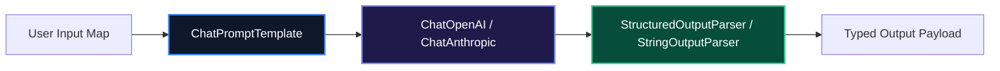

# LangChain v0.3+ Architectural Guide: LCEL Runnables, Tools, and Retrieval

In early versions of LangChain, applications were built using rigid, black-box classes like `LLMChain` and `ConversationalRetrievalChain`. Debugging prompt formatting and streaming intermediate outputs proved difficult in enterprise environments.

**LangChain v0.3+** replaced legacy abstractions with **LangChain Expression Language (LCEL)**—a composable, type-safe declarative interface where every component implements the standard `Runnable` protocol (supporting `invoke`, `stream`, `batch`, and `astream_events` out of the box).

---

## 1. Core Architecture & Mental Model

Every component in modern LangChain—prompt templates, chat models, retrievers, output parsers, and custom functions—is a `Runnable`. Runnables compose cleanly using standard pipe operators (`|` or `.pipe()`):



---

## 2. Installation & Quick Setup

```bash
# For TypeScript / Node.js
npm install @langchain/core @langchain/openai @langchain/community zod

# For Python
pip install langchain-core langchain-openai langchain-community pydantic
```

---

## 3. Production Folder Structure

```text
src/
├── chains/
│   ├── retrievalChain.ts    # Composed LCEL RAG pipelines
│   └── extractionChain.ts   # Structured Pydantic/Zod extractors
├── prompts/
│   └── systemTemplates.ts   # Versioned ChatPromptTemplates
├── retrievers/
│   └── vectorRetriever.ts   # Vector store retriever wrapper
└── index.ts                 # Entrypoint export
```

---

## 4. Complete, Runnable Starter Project in TypeScript

Below is a production-grade LCEL RAG retrieval pipeline implementing streaming, prompt formatting, and structured output parsing:

```typescript
import { ChatPromptTemplate } from "@langchain/core/prompts";
import { ChatOpenAI } from "@langchain/openai";
import { StringOutputParser } from "@langchain/core/output_parsers";
import { RunnableSequence, RunnablePassthrough } from "@langchain/core/runnables";

// 1. Initialize Prompt Template
const promptTemplate = ChatPromptTemplate.fromMessages([
  [
    "system",
    "You are an expert technical consultant. Answer the user query using only the provided context facts:\n\n{context}",
  ],
  ["human", "{question}"],
]);

// 2. Initialize Model
const model = new ChatOpenAI({
  model: "gpt-4o-mini",
  temperature: 0.0,
});

// 3. Mock Vector Retriever Function
async function mockRetriever(query: string): Promise<string> {
  // In production, connect to Pinecone, Qdrant, or LanceDB
  return `LanceDB is a serverless vector database that uses columnar Apache Arrow storage.`;
}

// 4. Compose Declarative LCEL Pipeline
export const ragChain = RunnableSequence.from([
  {
    context: async (input: { question: string }) => mockRetriever(input.question),
    question: new RunnablePassthrough<string>(),
  },
  promptTemplate,
  model,
  new StringOutputParser(),
]);

// 5. Execute Chain
async function run() {
  const stream = await ragChain.stream({
    question: "What storage format does LanceDB use?",
  });

  for await (const chunk of stream) {
    process.stdout.write(chunk);
  }
}
```

---

## 5. Architectural Tradeoffs Matrix

| Feature | Legacy LangChain (<v0.2) | Modern LangChain (v0.3+ LCEL) |
| :--- | :--- | :--- |
| **Composability** | Rigid predefined classes | **Declarative Pipe (`\|`) Syntax** |
| **Streaming** | Custom callback handlers | **Native `.stream()` & `.astream_events()`** |
| **Type Safety** | Loose dictionary maps | **Strict Generic Types with Zod / Pydantic** |
| **Debugging** | Deep nested stack traces | **Transparent Step-by-Step LangSmith Tracing** |

---

## 6. When to Use vs. When to Avoid

### Choose LangChain When:
- You need off-the-shelf integrations with hundreds of document loaders (PDF, Notion, S3), text splitters, and vector store adapters.
- You are constructing linear retrieval pipelines that benefit from declarative LCEL composability.

### Avoid LangChain When:
- You need complex cyclical state graphs or multi-agent autonomy (use **LangGraph** instead).
- You are building Next.js/React streaming UI components (use **Vercel AI SDK** instead).
