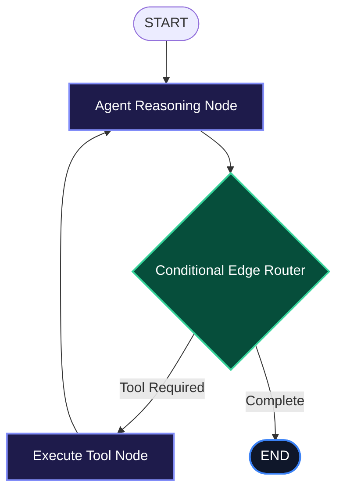

# LangGraph Deep Dive: Stateful Graph Orchestration for Autonomous Agents

When building production-grade autonomous agents, standard linear chains (Input -> Prompt -> LLM -> Output) break down rapidly. Complex workflows require **cycles, self-correcting retry loops, persistent state checkpointers**, and the ability to pause execution for human verification before executing state-mutating actions.

**LangGraph** is a specialized framework designed to build stateful, multi-actor applications with LLMs by modeling execution as a directed graph.

---

## 1. Core Architecture & Mental Model

In LangGraph, an application is represented as a `StateGraph` consisting of three foundational primitives:

1. **State Schema (`Annotation.Root`)**: An immutable, typed state object that flows through every node in the graph. State updates are combined deterministically using user-defined reducers.
2. **Nodes**: Pure JavaScript/TypeScript or Python functions that receive the current state, execute logic (such as invoking an LLM or running a tool), and return partial state updates.
3. **Edges (Standard & Conditional)**: Edges dictate execution flow. Conditional edges evaluate dynamic state properties to determine the next destination node or terminate at `END`.



---

## 2. Installation & Environment Setup

Install the official LangGraph packages alongside LangChain core:

```bash
# For TypeScript / Node.js
npm install @langchain/langgraph @langchain/core @langchain/openai zod

# For Python
pip install langgraph langchain-core langchain-openai pydantic
```

Set your OpenAI API key in your environment:

```bash
export OPENAI_API_KEY="sk-..."
```

---

## 3. Recommended Production Folder Structure

```text
src/agent/
├── state.ts           # State annotations and channel reducers
├── nodes/             # Graph node implementations
│   ├── reasoner.ts    # Primary LLM decision node
│   └── executor.ts    # Tool execution node
├── edges/             # Conditional edge routing functions
│   └── router.ts
├── tools/             # Typed Zod tool definitions
│   └── search.ts
└── graph.ts           # StateGraph compilation & checkpointer setup
```

---

## 4. Complete, Runnable Starter Project in TypeScript

Below is a complete, runnable LangGraph state machine implementing an agent with tools, conditional routing, and durable memory:

```typescript
import { Annotation, StateGraph, END, START, MemorySaver } from "@langchain/langgraph";
import { ChatOpenAI } from "@langchain/openai";
import { z } from "zod";

// 1. Define State Annotation and Reducers
export interface AgentMessage {
  role: "user" | "assistant" | "tool";
  content: string;
  toolCallId?: string;
}

export const AgentStateAnnotation = Annotation.Root({
  messages: Annotation<AgentMessage[]>({
    reducer: (current, update) => current.concat(update),
    default: () => [],
  }),
  pendingTool: Annotation<{ name: string; args: Record<string, unknown> } | null>({
    reducer: (_, update) => update,
    default: () => null,
  }),
  iterations: Annotation<number>({
    reducer: (curr, val) => curr + val,
    default: () => 0,
  }),
});

// 2. Initialize Model
const model = new ChatOpenAI({
  model: "gpt-4o-mini",
  temperature: 0.1,
});

// 3. Define Graph Nodes
async function reasonerNode(state: typeof AgentStateAnnotation.State) {
  const lastMessage = state.messages[state.messages.length - 1];
  
  // Model prompt format
  const response = await model.invoke([
    { role: "system", content: "You are a helpful research agent. If you need calculation, respond with 'CALCULATE: <json>'" },
    { role: "user", content: lastMessage.content },
  ]);

  const text = typeof response.content === "string" ? response.content : "";

  if (text.includes("CALCULATE:")) {
    const rawJson = text.split("CALCULATE:")[1].trim();
    return {
      messages: [{ role: "assistant" as const, content: text }],
      pendingTool: { name: "calculate", args: JSON.parse(rawJson) },
      iterations: 1,
    };
  }

  return {
    messages: [{ role: "assistant" as const, content: text }],
    pendingTool: null,
    iterations: 1,
  };
}

async function toolNode(state: typeof AgentStateAnnotation.State) {
  const tool = state.pendingTool;
  if (!tool) return { pendingTool: null };

  const result = `Calculation result for ${JSON.stringify(tool.args)} = 42`;
  return {
    messages: [{ role: "tool" as const, content: result }],
    pendingTool: null,
  };
}

// 4. Conditional Edge Function
function routeNext(state: typeof AgentStateAnnotation.State) {
  if (state.iterations >= 5) return END;
  if (state.pendingTool !== null) return "execute_tool";
  return END;
}

// 5. Compile the State Graph
const workflow = new StateGraph(AgentStateAnnotation)
  .addNode("reasoner", reasonerNode)
  .addNode("execute_tool", toolNode)
  .addEdge(START, "reasoner")
  .addConditionalEdges("reasoner", routeNext, {
    execute_tool: "execute_tool",
    [END]: END,
  })
  .addEdge("execute_tool", "reasoner");

export const agentApp = workflow.compile({
  checkpointer: new MemorySaver(),
});
```

---

## 5. Architectural Tradeoffs Matrix

| Feature / Dimension | Traditional Linear Chains | LangGraph |
| :--- | :--- | :--- |
| **Control Flow** | Unidirectional (DAG only) | **Cyclical Graphs with Conditional Loops** |
| **State Persistence** | Transient in memory | **Durable Checkpointing (Postgres / Redis)** |
| **Human-in-the-Loop** | Ad-hoc callback flags | **Native `interruptBefore` & `interruptAfter`** |
| **Fault Recovery** | Process crash | **Deterministic Retry & Error Handler Nodes** |
| **Multi-Agent Teams** | High glue code overhead | **First-Class Subgraph Composition** |

---

## 6. When to Use vs. When to Avoid

### Choose LangGraph When:
- Your application requires cyclical reasoning, such as plan-execute-verify loops.
- You need durable state checkpointing so long-running workflows can resume after server crashes or human reviews.
- You are coordinating specialized multi-agent swarms with distinct roles.

### Avoid LangGraph When:
- Your workflow is a simple single-turn query/response with no tool execution or state persistence requirements.
- You only need basic prompt formatting (use standard SDKs or Vercel AI SDK instead).
