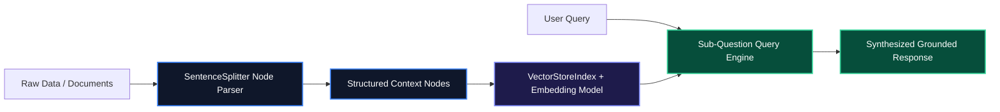

# LlamaIndex Architectural Guide: Data Ingestion, Indexing, and Query Engines

Connecting enterprise data stores (Notion, Google Drive, SQL databases, unstructured PDF repositories) to LLMs requires specialized data plumbing. While generic agent frameworks focus on cyclical control loops, **LlamaIndex** is purpose-built for the **Data Ingestion and Retrieval layer**.

LlamaIndex structures unstructured data into queryable indices, creates hierarchical node graphs, and provides high-level query engines capable of automated multi-document routing and sub-question decomposition.

---

## 1. Core Architecture & Mental Model

The LlamaIndex ingestion-to-query pipeline consists of five sequential primitives:

1. **Document Readers & Data Connectors (LlamaHub)**: Ingest raw files from 160+ data sources into standard `Document` objects.
2. **Node Parsers**: Splits documents into semantically coherent `Node` chunks preserving parent/child relationships and metadata.
3. **Index Stores (`VectorStoreIndex`, `SummaryIndex`)**: Generates vector embeddings for nodes and persists them to Qdrant, Pinecone, or LanceDB.
4. **Retriever**: Queries vector and keyword indices to retrieve the top-$K$ most relevant nodes.
5. **Response Synthesizer & Query Engine**: Augments prompts with retrieved context nodes to generate grounded answers.



---

## 2. Installation & Quick Setup

```bash
# For Python
pip install llama-index llama-index-llms-openai llama-index-embeddings-openai llama-index-vector-stores-qdrant

# For TypeScript / Node.js
npm install llamaindex
```

---

## 3. Recommended Production Folder Structure

```text
src/
├── data/              # Raw document inputs (.pdf, .md, .csv)
├── indexing/
│   ├── ingestion.py   # Document parsing & embedding generation
│   └── vectorStore.py # Qdrant / Pinecone store configuration
├── engines/
│   ├── routerEngine.py# Query intent router
│   └── queryEngine.py # Top-level RAG query engine
└── main.py
```

---

## 4. Complete, Runnable Starter Project in Python

Below is a complete Python production script setting up semantic node parsing, a vector store index, and a structured query engine:

```python
import os
from llama_index.core import Document, VectorStoreIndex, Settings
from llama_index.core.node_parser import SentenceSplitter
from llama_index.llms.openai import OpenAI
from llama_index.embeddings.openai import OpenAIEmbedding

# 1. Global Settings Configuration
Settings.llm = OpenAI(model="gpt-4o-mini", temperature=0.1)
Settings.embed_model = OpenAIEmbedding(model="text-embedding-3-small")
Settings.node_parser = SentenceSplitter(chunk_size=512, chunk_overlap=64)

# 2. Ingest Sample Technical Corpus
documents = [
    Document(
        text="LlamaIndex provides specialized data connectors via LlamaHub to ingest PDF, SQL, and Notion files.",
        metadata={"category": "ai-infra", "source": "docs.llamaindex.ai"}
    ),
    Document(
        text="Sub-question query engines break complex multi-part queries into sub-queries across distinct document indices.",
        metadata={"category": "rag-architecture", "source": "docs.llamaindex.ai"}
    )
]

# 3. Build VectorStoreIndex (In-memory for illustration, swap with Qdrant in production)
index = VectorStoreIndex.from_documents(documents)

# 4. Construct Query Engine with Similarity Top-K
query_engine = index.as_query_engine(
    similarity_top_k=2,
    response_mode="compact"
)

# 5. Query the Engine
def execute_query(query_str: str):
    response = query_engine.query(query_str)
    print(f"Query: {query_str}")
    print(f"Response: {response.response}\n")
    print("Source Nodes:")
    for node in response.source_nodes:
        print(f"- Score ({node.score:.3f}): {node.node.text[:80]}...")

if __name__ == "__main__":
    execute_query("How do sub-question query engines work in LlamaIndex?")
```

---

## 5. Architectural Tradeoffs Matrix

| Capability | LangChain | LlamaIndex |
| :--- | :--- | :--- |
| **Primary Specialty** | Agent orchestration & chains | **Data Ingestion, Indexing & Structured RAG** |
| **Index Strategies** | Basic Vector Store | **Hierarchical, Summary, Keyword, Knowledge Graph** |
| **Data Connectors** | Community Loaders | **160+ Enterprise Readers (LlamaHub)** |
| **Query Routing** | Manual Router Chains | **Built-in RouterQueryEngine & SubQuestionQueryEngine** |

---

## 6. When to Use vs. When to Avoid

### Choose LlamaIndex When:
- Your application's primary bottleneck is complex search, document chunking, multi-source ingestion, and RAG accuracy.
- You need structured evaluation metrics for retrieval precision and faithfulness.

### Avoid LlamaIndex When:
- You are building non-retrieval applications (e.g. coding agents or DevOps control planes that manipulate infrastructure tools).
