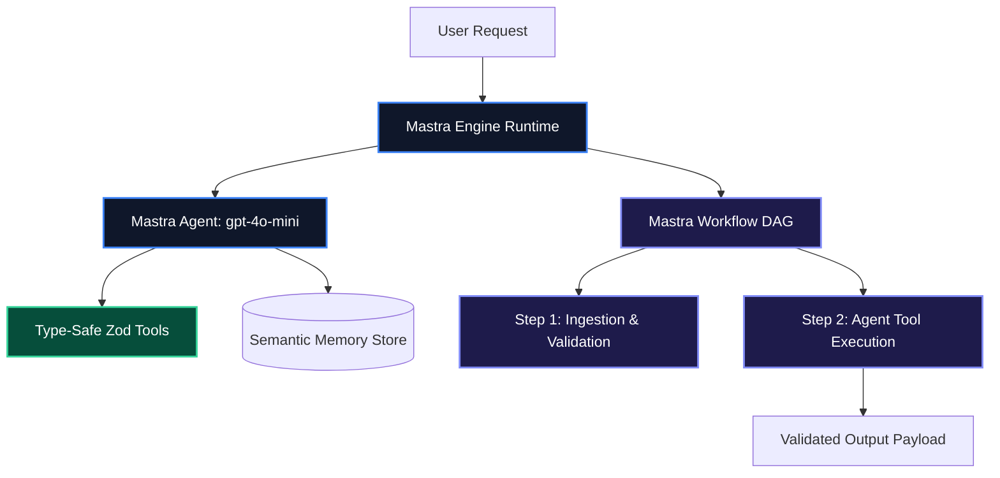

# Mastra Architectural Guide: The TypeScript-First AI Agent & Workflow Engine

For years, the majority of AI agent frameworks were built Python-first, treating TypeScript as an afterthought with lagging feature parity and weak type definitions.

**Mastra** (`@mastra/core`) is a production-grade, TypeScript-native framework designed specifically for JavaScript and TypeScript engineers. It provides first-class primitives for **Agents**, **Graph Workflows**, **Type-Safe Tools with Zod**, **Semantic Memory**, and **Automated Evals** with full IDE autocompletion and sub-millisecond Node.js execution.

---

## 1. Core Architecture & Mental Model

Mastra is structured around five cohesive primitives:

1. **`Agent`**: A self-contained entity configured with instructions, model providers (OpenAI, Anthropic, Groq), tools, and memory stores.
2. **`Workflow`**: A deterministic directed graph that chains steps, validates input/output schemas with Zod, and supports branching, parallel execution, and suspend/resume.
3. **`createTool`**: A utility for defining tools with strict input and output Zod schemas.
4. **`Memory`**: Built-in conversational and episodic memory with vector search integrations.
5. **`Mastra Engine`**: The centralized runtime orchestrating agents, workflows, and telemetry exports.



---

## 2. Installation & Quick Setup

Initialize Mastra in your TypeScript project:

```bash
npm install @mastra/core @mastra/evals zod
```

Set your OpenAI API key in your environment:

```bash
export OPENAI_API_KEY="sk-..."
```

---

## 3. Recommended Production Folder Structure

```text
src/mastra/
├── agents/
│   └── devopsAgent.ts      # Mastra Agent definitions
├── workflows/
│   └── deployWorkflow.ts   # Multi-step Workflow DAGs
├── tools/
│   └── k8sTools.ts         # Zod-validated Mastra tools
├── index.ts                # Mastra instance export
└── main.ts                 # CLI or server entrypoint
```

---

## 4. Complete, Runnable Starter Project in TypeScript

Below is a complete, standalone TypeScript script creating a Mastra Agent, a typed Zod tool, and an orchestrated multi-step Workflow:

```typescript
import { Mastra, Agent, createTool, Workflow, Step } from "@mastra/core";
import { z } from "zod";

// 1. Define Type-Safe Tool with Zod Input & Output Schemas
export const checkServerHealthTool = createTool({
  id: "check-server-health",
  description: "Checks CPU load and memory usage for a specific server instance.",
  inputSchema: z.object({
    serverId: z.string().describe("The unique ID of the server"),
  }),
  outputSchema: z.object({
    serverId: z.string(),
    cpuPercent: z.number(),
    memoryUsedGb: z.number(),
    status: z.enum(["HEALTHY", "WARNING", "CRITICAL"]),
  }),
  execute: async ({ context }) => {
    // Simulated live metrics check
    return {
      serverId: context.serverId,
      cpuPercent: 78.5,
      memoryUsedGb: 14.2,
      status: "WARNING" as const,
    };
  },
});

// 2. Define Autonomous Mastra Agent
export const devopsAgent = new Agent({
  name: "DevOps SRE Agent",
  instructions:
    "You are an automated Site Reliability Engineer. Inspect server health metrics and prescribe immediate remediation actions.",
  model: {
    provider: "OPEN_AI",
    name: "gpt-4o-mini",
  },
  tools: {
    checkServerHealth: checkServerHealthTool,
  },
});

// 3. Define Workflow Steps
const auditStep = new Step({
  id: "audit-infrastructure",
  inputSchema: z.object({ targetServer: z.string() }),
  outputSchema: z.object({ diagnosis: z.string() }),
  execute: async ({ context }) => {
    const response = await devopsAgent.generate(
      `Check server health for '${context.targetServer}' and summarize findings.`
    );
    return { diagnosis: response.text };
  },
});

// 4. Assemble Workflow DAG
export const infrastructureWorkflow = new Workflow({
  name: "Infrastructure Audit Workflow",
  triggerSchema: z.object({ targetServer: z.string() }),
})
  .step(auditStep)
  .commit();

// 5. Initialize Central Mastra Engine
export const mastra = new Mastra({
  agents: { devopsAgent },
  workflows: { infrastructureWorkflow },
});

// 6. Run Workflow
async function main() {
  const result = await infrastructureWorkflow.execute({
    triggerData: { targetServer: "srv-prod-us-east-1" },
  });

  console.log("Workflow Execution Status:", result.status);
  console.log("Agent Diagnosis:\n", result.results["audit-infrastructure"]?.output);
}

main().catch(console.error);
```

---

## 5. Architectural Tradeoffs Matrix

| Feature | Python Frameworks (LangGraph / CrewAI) | Mastra (TypeScript-Native) |
| :--- | :--- | :--- |
| **Language Runtime** | Python (GIL, heavier Docker containers) | **Native Node.js / Bun (Sub-millisecond execution)** |
| **Type Safety** | Runtime `typing` / Pydantic | **End-to-End Compile-Time TypeScript + Zod** |
| **Workflow Engine** | Graph code / State annotations | **Declarative `.step().then().commit()` Pipeline** |
| **Next.js Integration** | Separate microservice required | **Direct in-process imports inside Next.js Server Actions** |

---

## 6. When to Use vs. When to Avoid

### Choose Mastra When:
- You are building full-stack applications in TypeScript, Node.js, Bun, or Next.js and want zero Python backend dependencies.
- You need a unified TypeScript framework providing Agents, Workflows, and automated Evals in a single cohesive package.

### Avoid Mastra When:
- Your application relies on heavy Python ML scientific libraries (PyTorch, Hugging Face Transformers, Ray) that require a native Python environment.
